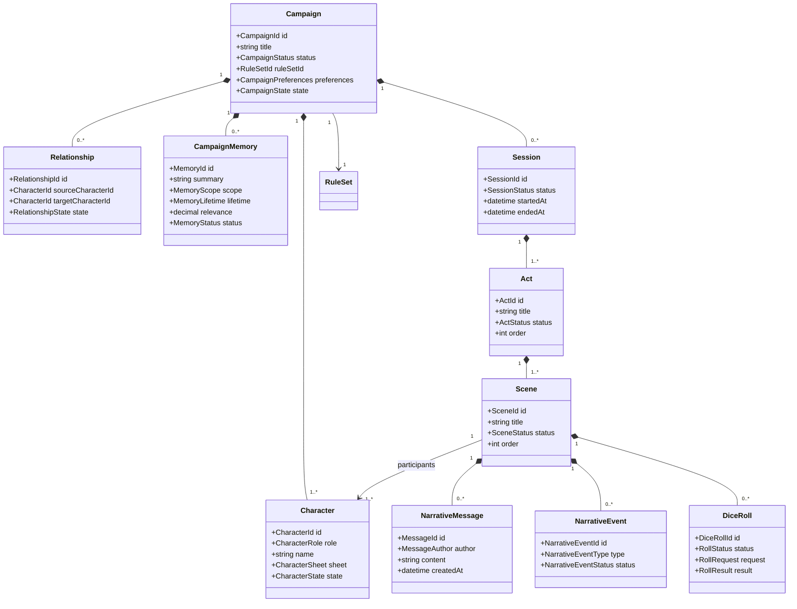

> **"A campaign is not a transcript. It is a living structure of people, choices, consequences, and memories."**

# Domain Model

## Abstract

This RFC defines the initial domain model of Chronicle.

It establishes the core entities, ownership boundaries, lifecycle rules, invariants, and relationships that represent a persistent tabletop role-playing campaign.

The model is intentionally implementation-agnostic. It does not define database tables, API routes, persistence technologies, serialization formats, or provider-specific behavior.

The purpose of this RFC is to define what exists in Chronicle before defining how it is implemented.

## 1. Scope

This RFC defines:

- the Campaign aggregate;
- the narrative hierarchy;
- characters and non-player characters;
- campaign memories;
- relationships;
- campaign state;
- dice rolls;
- narrative messages and structured narrative events;
- Rule Set association;
- entity ownership;
- entity lifecycle;
- domain invariants.

This RFC does not define:

- database schemas;
- persistence mechanisms;
- API contracts;
- prompt formats;
- retrieval architecture;
- AI provider integration;
- user interface components;
- multimedia generation;
- multiplayer behavior.

## 2. Domain Boundary

Chronicle models a persistent tabletop role-playing campaign.

The domain begins when a player creates a Campaign and ends when that Campaign is deleted or permanently archived.

The domain does not include:

- provider-specific AI concepts;
- vector databases;
- embeddings;
- document chunks;
- infrastructure-level caches;
- transport protocols;
- frontend rendering details.

The domain MAY reference abstractions such as `RuleSet` or `Narrator`, but MUST NOT depend on how those abstractions are implemented.

## 3. Aggregate Root

`Campaign` is the aggregate root of the initial domain model.

All persistent gameplay entities belong to exactly one Campaign.

```text
Campaign
├── Player Character
├── Non-Player Characters
├── Relationships
├── Campaign Memories
├── Campaign State
├── Narrative Plan
├── Sessions
│   └── Acts
│       └── Scenes
│           ├── Participants
│           ├── Messages
│           ├── Narrative Events
│           └── Dice Rolls
└── Rule Set Reference
```

A persistent gameplay entity MUST NOT exist without an owning Campaign.

Cross-campaign references are forbidden in the MVP.

## 4. Core Entity Map



## 5. Campaign

### 5.1 Definition

A Campaign is the complete persistent Chronicle experienced by the player.

It owns the player character, NPCs, relationships, memories, narrative structure, session history, current state, and Rule Set association.

### 5.2 Responsibilities

A Campaign MUST:

- have exactly one unique identifier;
- have exactly one active Rule Set;
- have exactly one player character in the MVP;
- own every persistent gameplay entity associated with it;
- preserve completed Sessions;
- preserve current progression;
- expose its current state to the Chronicle Director;
- support continuation after application restart.

### 5.3 Campaign Status

A Campaign has one of the following statuses:

```text
Draft
Ready
Active
Paused
Completed
Archived
```

#### Draft

The Campaign is being created and is not playable.

#### Ready

Creation is complete and the first Session may begin.

#### Active

A Session is currently in progress.

#### Paused

The Campaign has no active Session and may be continued later.

#### Completed

The campaign has reached a final narrative conclusion.

#### Archived

The Campaign is preserved but not available for normal play.

### 5.4 Invariants

- A Campaign MUST NOT have more than one active Session.
- A Campaign MUST NOT become `Ready` without a valid player character.
- A Campaign MUST NOT become `Ready` without a valid Rule Set.
- A Campaign MUST NOT become `Active` without an active Session.
- A completed Campaign MAY be reopened only through an explicit future workflow.
- Archiving MUST NOT delete campaign history.

## 6. Character

### 6.1 Definition

A Character is any persistent participant with an identity, character sheet, personal state, and narrative continuity.

A Character is not defined by current Scene presence.

Characters continue to exist when absent from the active narrative.

### 6.2 Character Roles

The initial model defines:

```text
Player
NonPlayer
```

The MVP supports exactly one `Player` Character per Campaign.

A Campaign MAY contain multiple `NonPlayer` Characters.

The model SHOULD avoid separate domain entities for Player Character and NPC unless their invariants diverge significantly.

### 6.3 Character Composition

A Character contains:

- identity;
- role;
- display name;
- character sheet;
- narrative profile;
- current state;
- visibility;
- progression;
- knowledge references;
- campaign participation status.

### 6.4 Character Sheet

`CharacterSheet` represents structured game-system data.

The MVP uses generic field-and-value entries.

```text
CharacterSheet
└── Fields
    ├── Key
    ├── Label
    ├── Value
    ├── Data Type
    ├── Section
    └── Metadata
```

The domain MUST NOT assume fixed attributes such as Strength, Dexterity, Class, Tribe, or Gnosis.

Those concepts belong to the active Rule Set.

### 6.5 Narrative Profile

The narrative profile MAY contain:

- personality traits;
- values;
- fears;
- objectives;
- beliefs;
- personal history;
- secrets;
- behavioral tendencies;
- meaningful personal memories.

### 6.6 Character State

The current character state MAY contain:

- physical conditions;
- emotional conditions;
- wounds;
- temporary effects;
- resources;
- location;
- current objective;
- availability;
- alive, missing, dead, or unknown status.

### 6.7 Visibility

A Character MAY be:

```text
Visible
Hidden
Discovered
Retired
```

A hidden NPC exists in the Campaign but is not yet known to the player.

### 6.8 Invariants

- Every Character belongs to exactly one Campaign.
- Character identity MUST remain stable across Sessions.
- A hidden NPC MUST NOT be exposed to the player without a domain-approved transition.
- A Character MUST NOT be removed because it is absent from a Scene.
- Permanent character changes MUST be persisted through validated domain operations.
- Narrative output MUST NOT directly overwrite a Character Sheet.

## 7. Relationship

### 7.1 Definition

A Relationship represents the directed state of one Character toward another Character.

Relationships are directional.

```text
A trusts B
```

does not imply:

```text
B trusts A
```

### 7.2 Relationship Composition

A Relationship MAY contain:

- trust;
- respect;
- fear;
- anger;
- affection;
- admiration;
- loyalty;
- suspicion;
- debt;
- custom Rule Set or campaign dimensions;
- narrative notes;
- last meaningful change;
- visibility to the player.

### 7.3 Invariants

- The source and target MUST belong to the same Campaign.
- The source and target MUST be different Characters.
- Only one active Relationship record SHOULD exist for each ordered Character pair.
- Relationship updates MUST be traceable to a Session, Scene, Memory, or explicit player action.
- Relationship values MUST NOT change solely because the Narrator produced emotionally suggestive prose.

## 8. Campaign Memory

### 8.1 Definition

A Campaign Memory is a persistent representation of something meaningful that was lived during the Campaign.

A Memory is not a raw chat message.

A Memory is not necessarily a complete historical event.

It is a curated consequence, truth, recollection, or meaningful experience retained for future play.

### 8.2 Memory Examples

```text
The Alpha discovered that the player lied during the council.
```

```text
The pack defeated the Black Spiral Dancer at the Northern Gate.
```

```text
The player promised to protect the spirit called Silent Rain.
```

```text
The player lost the ritual dagger.
```

### 8.3 Memory Scope

A Memory MAY have one of the following scopes:

```text
Campaign
Character
Relationship
Faction
Location
Object
```

The MVP MUST support at least:

```text
Campaign
Character
Relationship
```

### 8.4 Memory Lifetime

A Memory has either:

```text
Permanent
```

or:

```text
Temporary
```

A temporary Memory MUST define a lifetime policy.

The MVP uses remaining Sessions as the primary lifetime unit.

```text
remainingSessions: 3
```

A permanent Memory does not expire.

### 8.5 Relevance

A Memory has a relevance value representing its current usefulness to ongoing narrative context.

Relevance and lifetime are related but distinct.

A permanent Memory MAY have low immediate relevance.

A temporary Memory MAY have high immediate relevance.

### 8.6 Memory Age

A Memory tracks age independently from relevance.

Permanent Memories gain age as Sessions pass.

Temporary Memories MAY gain age while losing lifetime and relevance.

### 8.7 Memory Status

```text
Active
Dormant
Archived
Superseded
```

#### Active

Eligible for normal context selection.

#### Dormant

Preserved but normally excluded from context.

#### Archived

Retained for history and auditability.

#### Superseded

Replaced by a newer or more accurate Memory.

### 8.8 Remembered By

A Memory MAY be known by one or more Characters.

This does not mean that every Character knows every Campaign Memory.

Character knowledge MUST remain explicit when relevant to narrative consistency.

### 8.9 Invariants

- A Memory MUST belong to exactly one Campaign.
- A Memory SHOULD reference its origin Session.
- A Memory MAY reference its origin Act and Scene.
- Temporary Memory aging MUST occur through deterministic logic.
- The player MAY adjust relevance through an explicit product workflow.
- Player relevance adjustments MUST NOT silently rewrite the historical meaning of the Memory.
- Expiration SHOULD archive rather than destroy the Memory.
- A Memory MUST NOT be created from raw Narrator output without validation.

## 9. Campaign State

### 9.1 Definition

Campaign State is the authoritative current snapshot required to continue play.

It answers:

```text
What is true now?
```

Campaign Memories answer:

```text
What remains meaningful from what was lived?
```

These concepts MUST remain separate.

### 9.2 Campaign State May Include

- active Session;
- active Act;
- active Scene;
- current in-world time;
- current world conditions;
- active threats;
- active objectives;
- current locations;
- character locations;
- current Scene participants;
- unresolved roll request;
- pending narrative continuation;
- campaign completion status.

### 9.3 Invariants

- Campaign State MUST be reconstructable or persisted safely.
- Campaign State MUST reference only entities belonging to its Campaign.
- Exactly one Scene MAY be active in the MVP.
- An unresolved roll request MUST block normal narrative progression.
- Campaign State MUST NOT rely on the Narrator conversation history as its only source.

## 10. Session

### 10.1 Definition

A Session is a player-controlled period of play.

A Session begins when the player starts or resumes gameplay and ends when the player explicitly finalizes it.

### 10.2 Session Status

```text
Planned
Active
AwaitingRoll
Finalizing
Completed
Interrupted
```

### 10.3 Responsibilities

A Session owns:

- Acts;
- player and Narrator messages;
- narrative events;
- dice rolls;
- session-local progression;
- finalization result;
- session summary.

### 10.4 Invariants

- A Campaign MUST NOT have more than one active Session.
- A Session MUST contain at least one Act before normal play.
- A completed Session is immutable except for explicit correction workflows.
- An interrupted Session MUST remain resumable.
- Session finalization MUST be idempotent.
- A Session awaiting a roll MUST NOT accept normal narrative continuation.

## 11. Act

### 11.1 Definition

An Act is a major dramatic division of a Session.

It groups Scenes that contribute to one broad narrative movement, conflict, objective, or dramatic phase.

Example:

```text
Act: The Desert War
```

### 11.2 Act Composition

An Act MAY contain:

- title;
- description;
- dramatic objective;
- planned role in the Campaign;
- order;
- status;
- start and end conditions;
- Scenes;
- relevant planned NPC participation;
- known possible outcomes.

### 11.3 Act Status

```text
Planned
Active
Completed
Interrupted
Skipped
```

### 11.4 Invariants

- Every Act belongs to exactly one Session.
- An Act MUST contain at least one Scene before completion.
- Only one Act MAY be active in the MVP.
- Scene order MUST be explicit even when execution diverges from the plan.
- Completing an Act MUST NOT imply completing the Session.

## 12. Scene

### 12.1 Definition

A Scene is the smallest directed unit of active narrative context.

A Scene isolates what is happening now.

It defines:

- location;
- participants;
- immediate objective;
- active conflict;
- local state;
- relevant Memories;
- relevant Rule Set knowledge;
- narrative continuity.

### 12.2 Example

```text
Act: The Desert War
├── Scene: Battle at the Northern Gate
├── Scene: Defense of the Fortress
└── Scene: Assault on the Hill
```

Characters participating in `Battle at the Northern Gate` MUST NOT be assumed to participate in `Defense of the Fortress`.

### 12.3 Scene Status

```text
Planned
Active
AwaitingRoll
Completed
Interrupted
Skipped
```

### 12.4 Scene Participants

Participants MUST be explicit.

A participant reference MAY include:

- Character identifier;
- participation role;
- current Scene state;
- visibility;
- local objective;
- entry point;
- exit point.

### 12.5 Invariants

- Every Scene belongs to exactly one Act.
- Only one Scene MAY be active in the MVP.
- Every active Scene MUST define at least one participant.
- The player character MUST be a participant in every playable MVP Scene.
- Scene participants MUST NOT leak automatically into sibling Scenes.
- A Scene awaiting a roll MUST block narrative continuation.
- Scene completion MUST be explicit or validated by the Chronicle Director.

## 13. Narrative Message

### 13.1 Definition

A Narrative Message is a persisted conversational entry associated with a Session and Scene.

### 13.2 Message Authors

```text
Player
Narrator
System
```

### 13.3 Responsibilities

Messages preserve the playable transcript.

They are not the authoritative source of campaign truth.

### 13.4 Invariants

- Every Message belongs to one Session.
- Every gameplay Message SHOULD belong to one Scene.
- Messages MUST be append-only in normal operation.
- Editing Messages MUST require an explicit correction workflow.
- Campaign State MUST NOT be derived only from Messages during normal play.

## 14. Narrative Event

### 14.1 Definition

A Narrative Event is a structured instruction returned by the Narrator or generated by Chronicle for presentation and orchestration.

Examples:

```text
Narration
RollRequested
SceneTransitionProposed
NpcEntered
NpcExited
CombatStarted
CombatEnded
ItemPresented
AmbientStateChanged
```

### 14.2 Domain Position

A Narrative Event is not automatically a Campaign Memory.

A Narrative Event represents what the interface or orchestration layer should process now.

A Campaign Memory represents what should remain meaningful later.

### 14.3 Invariants

- Narrative Events MUST use structured contracts.
- A Narrative Event MUST be validated before execution.
- Invalid Narrative Events MUST NOT alter Campaign State.
- Narrative prose MAY be free-form only inside an approved narrative field.
- State-changing Narrative Events MUST map to explicit application operations.

## 15. Dice Roll

### 15.1 Definition

A Dice Roll represents one deterministic request and result executed by Chronicle.

### 15.2 Dice Roll Lifecycle

```text
Requested
Presented
Executed
Resolved
Cancelled
```

### 15.3 Roll Request

A Roll Request MAY include:

- reason;
- acting Character;
- Rule Set operation;
- dice pool;
- difficulty;
- modifiers;
- stakes;
- dramatic importance;
- source Scene.

### 15.4 Roll Result

A Roll Result MAY include:

- raw dice;
- calculated successes;
- failures;
- critical result;
- botch or equivalent result;
- applied modifiers;
- Rule Set interpretation;
- timestamp.

### 15.5 Invariants

- The Narrator MUST NOT generate the random result.
- A Roll MUST belong to one Scene.
- A Roll MUST reference the active Rule Set operation.
- A Roll MUST be persisted before narrative continuation.
- A resolved Roll MUST be immutable.
- Narrative continuation MUST use the validated Roll Result.

## 16. Narrative Plan

### 16.1 Definition

The Narrative Plan is the planned dramatic structure created during Campaign initialization and evolved during play.

It may define:

- Campaign premise;
- planned Acts;
- planned Scenes;
- NPC roles;
- mysteries;
- conflicts;
- revelations;
- possible outcomes;
- pacing guidance.

### 16.2 Relationship to Play

The Narrative Plan is guidance, not immutable truth.

Player action MAY cause:

- Scene reordering;
- Scene replacement;
- skipped Scenes;
- interrupted Acts;
- new Acts;
- alternative outcomes.

### 16.3 Invariants

- The Narrative Plan MUST NOT override validated player action.
- Hidden plan information MUST NOT be exposed to the player.
- Changes to the Narrative Plan MUST preserve completed history.
- The Chronicle Director MAY select from the plan but MUST NOT fabricate persistent state without validation.

## 17. Rule Set

### 17.1 Definition

A Rule Set identifies the game-system contract used by a Campaign.

It provides access to system-specific concepts without exposing infrastructure details to the domain.

### 17.2 Rule Set Responsibilities

A Rule Set SHOULD define:

- character sheet schema;
- validation rules;
- dice mechanics;
- named game concepts;
- supported actions;
- system terminology;
- rule retrieval boundaries;
- progression rules;
- default campaign guidance.

### 17.3 Invariants

- Every Campaign MUST reference exactly one Rule Set.
- A Campaign MUST NOT change Rule Set during normal MVP operation.
- Rule Set identity MUST be versioned.
- RAG is not a domain entity.
- Retrieval implementation MUST remain outside the domain model.

## 18. Chronicle Director

### 18.1 Classification

The Chronicle Director is a domain service and orchestration role.

It is not a persistent entity.

### 18.2 Responsibilities

The Chronicle Director coordinates:

- Campaign State;
- active Session;
- active Act;
- active Scene;
- participant selection;
- relevant Memory selection;
- Rule Set context requests;
- Narrator invocation;
- Narrative Event validation;
- pending Dice Rolls;
- post-roll continuation;
- Scene transitions;
- Act transitions.

### 18.3 Prohibited Responsibilities

The Chronicle Director MUST NOT:

- generate narrative prose;
- generate random results;
- directly modify Character Sheets;
- become the persistence layer;
- replace the Archivist;
- become the Rule Set implementation;
- expose hidden Campaign data to the player.

## 19. Archivist

### 19.1 Classification

The Archivist is a domain service responsible for proposing and validating persistent meaning derived from completed play.

It is not a persistent entity.

### 19.2 Responsibilities

The Archivist MAY propose:

- new Memories;
- Memory updates;
- Memory relevance changes;
- Relationship changes;
- Character State changes;
- progression;
- newly known information;
- Session summary.

### 19.3 Invariants

- Archivist output MUST be structured.
- Archivist proposals MUST be validated.
- Session finalization MUST be idempotent.
- The Archivist MUST NOT rewrite completed Messages.
- The Archivist MUST NOT alter random outcomes.
- The Archivist MUST NOT create facts contradicted by authoritative state.

## 20. Narrator

### 20.1 Classification

The Narrator is an external or replaceable service abstraction.

It is not part of the persistent domain model.

### 20.2 Responsibilities

The Narrator MAY:

- produce narrative prose;
- portray Characters;
- propose Narrative Events;
- request Dice Rolls;
- continue narration after a Roll Result;
- describe sensory and dramatic details.

### 20.3 Prohibited Responsibilities

The Narrator MUST NOT:

- own memory;
- own Campaign State;
- roll dice;
- directly persist entities;
- independently query the database;
- redefine Character Sheets;
- become the authority on Rule Set truth.

## 21. Entity Ownership Matrix

| Entity | Owner | Lifetime | Mutable During Play | Source of Truth |
|---|---|---:|---:|---|
| Campaign | Campaign Aggregate | Campaign | Yes | Chronicle Core |
| Character | Campaign | Campaign | Yes | Chronicle Core |
| Character Sheet | Character | Campaign | Yes, validated | Chronicle Core |
| Relationship | Campaign | Campaign | Yes, validated | Chronicle Core |
| Campaign Memory | Campaign | Campaign | Yes, validated | Chronicle Core |
| Campaign State | Campaign | Campaign | Yes | Chronicle Core |
| Session | Campaign | Permanent history | Yes until completed | Chronicle Core |
| Act | Session | Permanent history | Yes until completed | Chronicle Core |
| Scene | Act | Permanent history | Yes until completed | Chronicle Core |
| Narrative Message | Session/Scene | Permanent history | Append-only | Chronicle Core |
| Narrative Event | Scene | Session history | Yes until processed | Chronicle Core |
| Dice Roll | Scene | Permanent history | Until resolved | Chronicle Core |
| Narrative Plan | Campaign | Campaign | Yes, controlled | Chronicle Core |
| Rule Set Reference | Campaign | Campaign | No in MVP | Chronicle Core |

## 22. Lifecycle Summary

| Entity | Created | Updated | Completed or Archived |
|---|---|---|---|
| Campaign | New Campaign flow | Throughout campaign | Completed or archived |
| Character | Campaign creation or approved narrative flow | Validated progression and state changes | Retired, dead, missing, or archived |
| Relationship | First meaningful interaction or initialization | Validated consequences | Archived with Campaign |
| Campaign Memory | Session play or finalization | Relevance, lifetime, correction, supersession | Dormant, archived, or superseded |
| Session | Start or resume flow | Throughout play | Explicit finalization |
| Act | Campaign plan or directed play | Scene progression | Objective resolved or interrupted |
| Scene | Campaign plan or directed play | Interaction and roll processing | Explicit transition |
| Dice Roll | Narrator request | Presentation and execution | Resolution or cancellation |
| Message | Player, Narrator, or System output | Append-only | Preserved with Session |
| Narrative Event | Structured output | Validation and processing | Processed, rejected, or cancelled |

## 23. Domain Invariants Summary

The initial model establishes the following mandatory rules:

1. Every persistent gameplay entity belongs to exactly one Campaign.
2. A Campaign has exactly one player character in the MVP.
3. A Campaign has no more than one active Session.
4. A Session has no more than one active Act.
5. An Act has no more than one active Scene.
6. Scene participants are explicit and isolated from sibling Scenes.
7. Narrative Messages are not the source of campaign truth.
8. Narrative Events are not automatically Campaign Memories.
9. Narrative Intelligence does not persist state.
10. Narrative Intelligence does not generate random results.
11. Campaign Memory aging is deterministic.
12. Rule Set infrastructure does not enter the domain model.
13. Completed history is preserved.
14. Session finalization is idempotent.
15. An unresolved Dice Roll blocks narrative continuation.
16. Hidden NPCs exist independently from player knowledge.
17. Permanent changes require validation.
18. The Chronicle Director orchestrates but does not own other modules' responsibilities.

## 24. Open Questions

The following questions remain intentionally open for later RFCs:

- Should Character-specific memories and Campaign Memories be separate entities or scoped variants of one entity?
- Should Campaign State be persisted as a snapshot, reconstructed from domain events, or use a hybrid model?
- Should one Session always contain at least one Act, or may the system create the first Act lazily?
- Should completed Scenes be strictly immutable, or may administrators correct them?
- Should Narrative Events be persisted permanently or only when relevant for audit and replay?
- How should conflicting Archivist proposals be resolved?
- Which Relationship dimensions belong to the generic framework and which belong to the Rule Set?
- How should in-world time be represented?
- How should hidden knowledge be represented for each Character?
- Should the Narrative Plan be modeled as entities or as a versioned structured document?

These questions do not block the initial architecture.

They MUST be resolved before their respective implementation areas are frozen.

## 25. Final Principle

Campaign State preserves what is true now.

Campaign Memory preserves what remains meaningful.

The Chronicle Director decides what is relevant now.

The Narrator tells what the player experiences.

The Archivist preserves what was lived.
