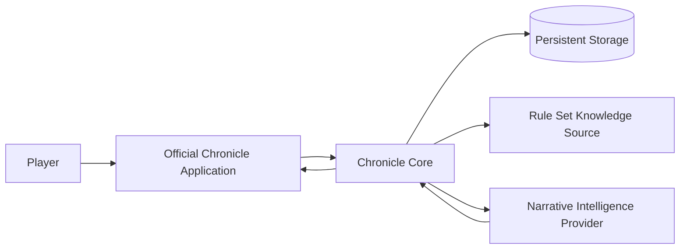
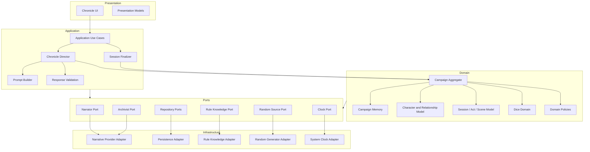
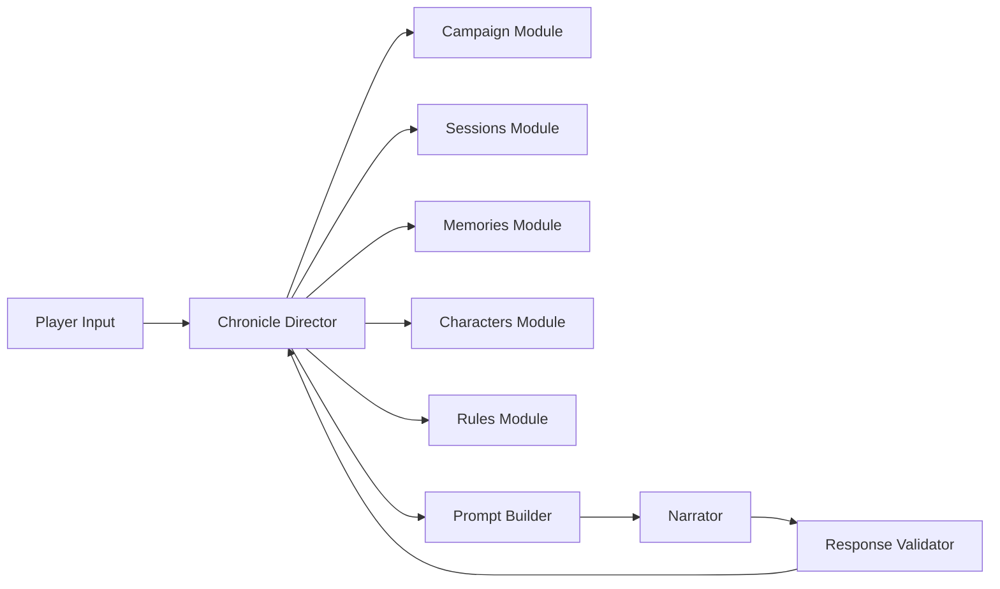
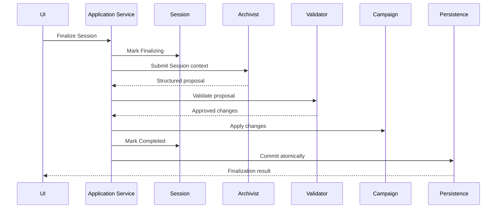
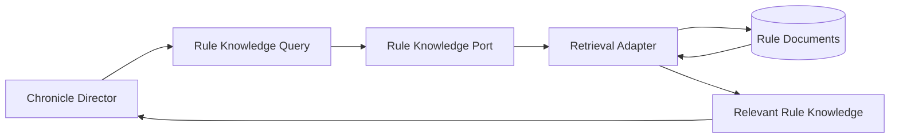
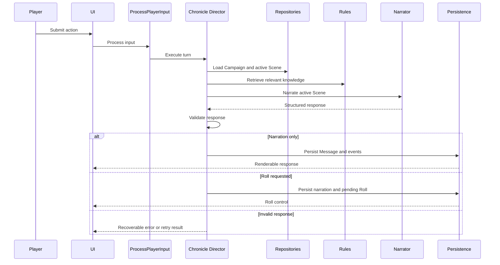
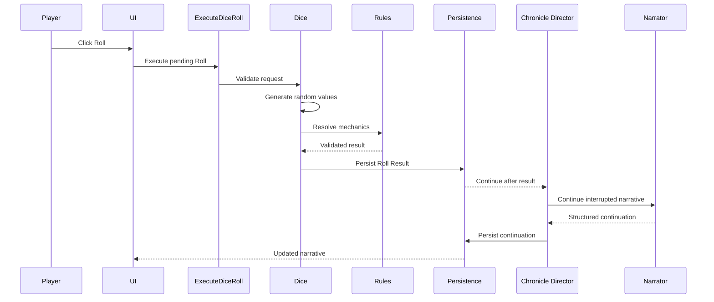
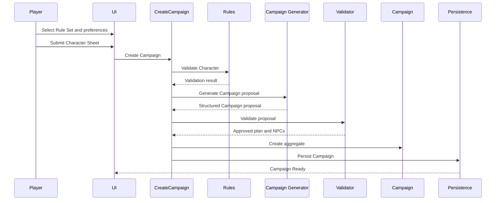

> **"The Narrator tells the story. Chronicle keeps the world coherent enough for that story to matter."**

# Architecture Overview

## Abstract

This RFC defines the initial high-level architecture of Chronicle.

It describes the major architectural layers, components, responsibilities, data flow, boundaries, dependency direction, orchestration model, and the relationship between deterministic Chronicle behavior and replaceable Narrative Intelligence.

This document is intentionally technology-neutral.

It does not select a programming language, UI framework, persistence engine, provider SDK, vector store, deployment platform, or transport protocol.

## 1. Architectural Objective

Chronicle MUST support persistent tabletop role-playing Campaigns without delegating truth, memory, rules, or randomness to Narrative Intelligence.

The architecture MUST:

- preserve Campaign continuity across Sessions;
- isolate Scene context;
- execute deterministic game mechanics;
- support structured communication with nondeterministic services;
- allow Narrative Intelligence replacement;
- keep infrastructure replaceable;
- support one complete MVP without prematurely implementing future platform breadth;
- remain understandable by human contributors and code-generation tools.

## 2. Architectural Style

Chronicle adopts a modular, layered architecture with ports and adapters.

The architecture combines:

- domain-driven design;
- application use-case orchestration;
- explicit module boundaries;
- dependency inversion;
- structured integration contracts;
- deterministic state transitions;
- replaceable external services.

The initial implementation SHOULD be a modular monolith.

The architecture MUST NOT begin as distributed microservices unless a later RFC demonstrates a concrete delivery need.

### 2.1 Why a Modular Monolith

The MVP contains significant domain complexity but limited operational scale.

A modular monolith provides:

- simple local development;
- straightforward transactions;
- easier debugging;
- lower deployment complexity;
- simpler testing;
- explicit module boundaries without network overhead;
- a practical base for vibe-coded implementation;
- future extraction paths when justified.

The codebase MUST preserve boundaries strongly enough that modules MAY be extracted later.

Extraction is an Architecture Horizon capability.

It is not an MVP task.

## 3. System Context



The Player interacts only with the official application.

The official application invokes Chronicle use cases.

Chronicle Core coordinates domain behavior.

External Narrative Intelligence and Rule Set knowledge services are accessed through ports.

Persistent Storage remains behind repository interfaces.

## 4. Top-Level Architecture



## 5. Dependency Rule

Dependencies MUST point inward.

```text
Presentation
      ↓
Application
      ↓
Domain
```

Infrastructure implements ports defined by inner layers.

```text
Infrastructure
      ↓ implements
Application or Domain Ports
```

The Domain MUST NOT depend on:

- Presentation;
- Infrastructure;
- provider SDKs;
- database clients;
- web frameworks;
- serialization libraries;
- operating system APIs.

The Application layer MAY depend on Domain abstractions and application ports.

The Presentation layer MAY depend on Application contracts.

Infrastructure MAY depend on all layers required to implement ports, but inner layers MUST NOT depend back on Infrastructure.

## 6. Architectural Layers

## 6.1 Domain Layer

The Domain layer contains Chronicle's business meaning.

It includes:

- Campaign aggregate;
- Character;
- Character Sheet;
- Character State;
- Relationship;
- Campaign Memory;
- Campaign State;
- Session;
- Act;
- Scene;
- Narrative Plan;
- Dice Roll;
- domain policies;
- domain events;
- invariants;
- value objects;
- domain services.

The Domain layer MUST be testable without:

- a database;
- a UI;
- internet access;
- an AI provider;
- a retrieval service.

The Domain layer MUST NOT generate player-facing narrative prose.

## 6.2 Application Layer

The Application layer coordinates use cases.

It includes:

- create Campaign;
- prepare Campaign;
- start Session;
- resume Session;
- process player input;
- execute Dice Roll;
- continue after Dice Roll;
- finalize Session;
- adjust Memory relevance;
- archive Campaign;
- query Campaign views.

The Application layer contains the Chronicle Director orchestration.

It MAY define application-level DTOs and ports.

It MUST NOT redefine domain invariants.

## 6.3 Presentation Layer

The Presentation layer exposes Chronicle to users.

The official MVP Presentation layer includes the desktop-first application.

It is responsible for:

- screens;
- navigation;
- forms;
- Character Sheet display;
- narrative rendering;
- Dice Roll controls;
- loading and error states;
- localization;
- product-friendly role messaging.

It MUST NOT:

- apply game rules;
- calculate authoritative Dice Roll outcomes;
- mutate persistence directly;
- parse provider responses;
- become the source of Campaign State.

## 6.4 Infrastructure Layer

The Infrastructure layer provides technical implementations for Chronicle ports.

It MAY include:

- database access;
- file storage;
- provider SDK integration;
- RAG retrieval;
- embeddings;
- vector storage;
- random number generation;
- system clock;
- logging;
- metrics;
- configuration;
- migrations.

Infrastructure details MUST remain replaceable.

## 7. Major Modules

The initial modular monolith SHOULD contain the following logical modules.

```text
Chronicle
├── Campaign
├── Characters
├── Memories
├── Sessions
├── Rules
├── Narrative
├── Dice
├── Persistence
└── Presentation
```

These are logical ownership boundaries.

They do not require separate deployable services.

## 8. Campaign Module

### Responsibilities

The Campaign module owns:

- Campaign lifecycle;
- Campaign metadata;
- Campaign preferences;
- Campaign State;
- Narrative Plan;
- active Rule Set reference;
- Campaign status;
- aggregate-level invariants.

### Provides

- create Campaign;
- activate Campaign;
- pause Campaign;
- complete Campaign;
- archive Campaign;
- retrieve Campaign snapshot;
- apply validated aggregate transitions.

### Must Not

- narrate;
- execute provider calls directly;
- implement Rule Set-specific mechanics;
- render UI.

## 9. Characters Module

### Responsibilities

The Characters module owns:

- Character identity;
- Player and NonPlayer roles;
- Character Sheet;
- Narrative Profile;
- Character State;
- visibility;
- progression;
- Character lifecycle;
- Relationships.

### Provides

- create Player Character;
- create NPC;
- update Character Sheet through validated operations;
- update Character State;
- reveal hidden NPC;
- retire Character;
- update Relationship.

### Must Not

- infer permanent changes from prose alone;
- expose hidden information without authorization;
- implement generic Session orchestration.

## 10. Memories Module

### Responsibilities

The Memories module owns:

- Campaign Memory creation;
- Memory scope;
- Memory importance;
- Memory relevance;
- Memory lifetime;
- Memory age;
- remembered-by references;
- supersession;
- dormancy;
- archival;
- deterministic aging.

### Provides

- add validated Memory;
- update Memory;
- age temporary Memories;
- increase or decrease relevance;
- archive expired Memory;
- select relevant Memories.

### Must Not

- treat every Message as a Memory;
- use provider conversation history as persistence;
- destroy historical Memories by default.

## 11. Sessions Module

### Responsibilities

The Sessions module owns:

- Session lifecycle;
- Act lifecycle;
- Scene lifecycle;
- active hierarchy;
- Messages;
- Narrative Events;
- pending interaction state;
- finalization state.

### Provides

- start Session;
- resume Session;
- create or activate Act;
- create or activate Scene;
- append Message;
- register Narrative Event;
- mark awaiting Dice Roll;
- complete Scene;
- complete Act;
- finalize Session.

### Must Not

- calculate Rule Set mechanics independently;
- select provider-specific prompt formats;
- merge sibling Scene participants.

## 12. Rules Module

### Responsibilities

The Rules module owns the Rule Set abstraction and system-specific behavior.

It provides access to:

- Character Sheet schema;
- Character Sheet validation;
- dice mechanics;
- progression rules;
- game terminology;
- supported actions;
- Rule Set version;
- Rule Set knowledge retrieval.

### Internal Separation

The module SHOULD separate:

```text
Rule Set Domain Contract
        ↓
Rule Set Application Adapter
        ↓
Rule Knowledge Infrastructure
```

RAG belongs to infrastructure.

The Domain sees `RuleSet`, not vector search concepts.

## 13. Narrative Module

### Responsibilities

The Narrative module coordinates nondeterministic narrative work.

It includes:

- Chronicle Director;
- Prompt Builder;
- Narrator port;
- Archivist port;
- structured contracts;
- response validation;
- narrative continuation;
- Campaign generation workflows.

### Must Not

- persist directly;
- own Campaign truth;
- execute Dice Rolls;
- bypass Domain validation.

## 14. Dice Module

### Responsibilities

The Dice module owns:

- Roll Request validation;
- random execution;
- Rule Set resolution;
- Roll Result;
- Roll persistence workflow;
- unresolved roll blocking;
- replay protection.

### Provides

- create Roll Request;
- present pending Roll;
- execute Roll;
- resolve Roll;
- cancel Roll when valid;
- continue narrative after resolution.

### Must Not

- accept random results generated by the Narrator;
- resolve a Roll twice;
- continue narrative before persistence.

## 15. Persistence Module

### Responsibilities

The Persistence module implements repositories and transactions.

It stores:

- Campaign aggregate data;
- Characters;
- Relationships;
- Memories;
- Sessions;
- Acts;
- Scenes;
- Messages;
- Narrative Events;
- Dice Rolls;
- Narrative Plans;
- Rule Set references;
- operation idempotency data.

### Requirements

Persistence MUST support:

- atomic state transitions where required;
- concurrency protection;
- schema migration;
- recovery after interruption;
- idempotent Session finalization;
- safe resume of pending Dice Rolls.

The exact database technology will be defined later.

## 16. Presentation Module

### Responsibilities

The Presentation module implements the official Chronicle application experience.

Initial screens SHOULD include:

- Campaign list;
- new Campaign flow;
- Character creation;
- Campaign dashboard;
- Character Sheet view;
- Session narrative screen;
- Campaign Memories view;
- Session history;
- finalization feedback.

The UI communicates with Application use cases.

It MUST NOT couple directly to provider contracts.

## 17. Chronicle Director

The Chronicle Director is the central application orchestration role.

It coordinates modules without replacing them.



### Director Responsibilities

The Chronicle Director:

- loads the active Campaign;
- verifies active Session state;
- identifies the active Act and Scene;
- obtains explicit Scene participants;
- obtains relevant Character state;
- requests relevant Campaign Memories;
- requests relevant Rule Set knowledge;
- builds the narrative operation;
- invokes the Narrator;
- validates the structured response;
- routes approved Narrative Events;
- creates pending Roll Requests;
- coordinates valid Scene or Act transitions;
- persists through application repositories and units of work.

### Director Non-Responsibilities

The Chronicle Director does not:

- write narrative prose;
- decide random outcomes;
- implement persistence;
- define Rule Set mechanics;
- own Memory aging;
- mutate state outside domain operations;
- become a generic service locator.

## 18. Narrator Integration

Chronicle integrates with the Narrator through a port.

```text
Narrator
```

The port MUST be provider-neutral.

A narrative request SHOULD contain:

- operation identifier;
- contract version;
- Campaign summary;
- Campaign preferences;
- active Session;
- active Act;
- active Scene;
- explicit participants;
- relevant Character snapshots;
- relevant Campaign Memories;
- relevant Rule Set knowledge;
- recent Scene Messages;
- unresolved or resolved Roll information;
- narrative instructions;
- hidden-information boundaries.

The response MUST be structured.

It MAY contain:

- narrative blocks;
- Roll Request;
- Character portrayal;
- proposed Narrative Events;
- ambient metadata;
- transition proposals.

It MUST NOT be persisted without validation.

## 19. Archivist Integration

The Archivist is invoked during Session finalization.



The finalization operation MUST be idempotent.

The applied result MUST be associated with a unique finalization operation identifier.

## 20. Rule Knowledge Retrieval

Chronicle MUST retrieve only Rule Set knowledge relevant to the active operation.



The retrieval adapter MAY use:

- vector search;
- keyword search;
- hybrid search;
- structured rule indexes;
- local documents;
- external services.

The Application and Domain MUST remain unaware of the chosen retrieval technique.

## 21. Player Input Flow



## 22. Dice Roll Flow



The Roll Result MUST be committed before continuation is accepted.

## 23. Campaign Creation Flow



The Campaign Generator is a Narrative Intelligence role or use case.

It MUST NOT persist directly.

## 24. State Mutation Model

Persistent changes MUST follow this pattern:

```text
Command
   ↓
Application Use Case
   ↓
Load Aggregate
   ↓
Validate Preconditions
   ↓
Execute Domain Operation
   ↓
Produce Domain Changes
   ↓
Persist Atomically
   ↓
Return Result
```

Direct repository mutation from UI, provider adapters, or prompt handlers is forbidden.

## 25. Read Model Strategy

The write model is governed by the Campaign aggregate and module invariants.

The UI MAY use dedicated read models optimized for presentation.

Examples:

- Campaign list item;
- Campaign dashboard;
- Character Sheet view;
- active Session view;
- Campaign Memories list;
- Session history view.

Read models MAY be denormalized.

They MUST NOT become authoritative write paths.

A full CQRS architecture is not required for the MVP.

The implementation MAY use lightweight separation between commands and queries.

## 26. Transaction Boundaries

Transactions SHOULD align with use-case consistency requirements.

Operations requiring atomic persistence include:

- Campaign creation;
- starting a Session;
- creating a pending Dice Roll;
- resolving a Dice Roll;
- applying Session finalization;
- transitioning active Scene;
- applying Character progression;
- updating related Memory and Relationship state.

Long-running provider calls MUST NOT hold database transactions open.

The recommended pattern is:

1. load required state;
2. record operation intent where necessary;
3. call external service;
4. validate response;
5. open a short transaction;
6. revalidate concurrency;
7. persist accepted changes.

## 27. Concurrency

The MVP is single-user, but the architecture MUST protect against accidental concurrent operations.

Possible causes include:

- repeated button clicks;
- retry logic;
- application restart;
- duplicate provider callbacks;
- simultaneous UI commands;
- future background processing.

The persistence model SHOULD use optimistic concurrency.

Campaign writes SHOULD include a version or equivalent concurrency token.

## 28. Idempotency

The following operations MUST support idempotency:

- Campaign generation submission;
- Dice Roll execution request;
- post-roll narrative continuation;
- Session finalization;
- external response processing.

Each operation SHOULD include a unique operation identifier.

Repeated execution MUST return the existing result or fail safely without duplication.

## 29. Error Handling

Errors MUST be classified.

Recommended categories:

```text
ValidationError
ConflictError
NotFoundError
InvalidStateError
ProviderError
ContractError
PersistenceError
RuleSetError
RecoverableOperationError
```

The UI SHOULD receive safe, product-oriented errors.

Technical diagnostics SHOULD be recorded separately.

Provider output MUST be treated as untrusted input.

## 30. Retry Policy

Retries MAY be applied to transient infrastructure failures.

Retries MUST NOT duplicate state transitions.

Provider retries SHOULD reuse the same logical operation identifier.

Dice randomness MUST NOT be regenerated automatically after a persisted result.

Session finalization retries MUST reuse the existing finalization operation.

## 31. Observability

Chronicle SHOULD record structured operational information for:

- use-case execution;
- provider calls;
- contract validation failures;
- retrieval queries;
- Dice Rolls;
- persistence failures;
- concurrency conflicts;
- Session finalization;
- token usage;
- latency;
- retries.

Logs MUST NOT expose:

- provider credentials;
- unrelated hidden Campaign data;
- full sensitive prompts by default;
- private user data without need.

Observability MUST support debugging without becoming a second source of truth.

## 32. Configuration

Configuration MAY include:

- provider endpoint;
- provider credentials;
- model selection;
- context limits;
- retrieval settings;
- persistence location;
- logging level;
- feature flags.

Configuration MUST NOT define domain truth.

Campaign-specific behavior belongs to Campaign Preferences or the Rule Set.

Secrets MUST remain outside source control.

## 33. Security Boundaries

The architecture MUST enforce:

- least-privilege provider access;
- strict input validation;
- structured output validation;
- prompt-data minimization;
- hidden-information filtering;
- safe secret storage;
- no direct client database access;
- no provider access to repositories;
- no unvalidated dynamic code execution.

RAG documents and retrieved text MUST be treated as untrusted content for prompt construction.

## 34. Testing Architecture

Chronicle SHOULD use a layered test strategy.

### 34.1 Domain Tests

Test:

- invariants;
- lifecycle transitions;
- Memory aging;
- Scene isolation;
- Dice Roll state;
- Relationship rules;
- Campaign status.

No external services are required.

### 34.2 Application Tests

Test:

- use-case orchestration;
- Chronicle Director decisions;
- idempotency;
- concurrency;
- transaction boundaries;
- error mapping.

Use test doubles for ports.

### 34.3 Contract Tests

Test:

- Narrator contracts;
- Archivist contracts;
- Rule Set adapters;
- provider structured output;
- persistence mappings.

### 34.4 Integration Tests

Test:

- database implementation;
- provider adapter;
- retrieval adapter;
- migrations;
- end-to-end use cases.

### 34.5 UI Tests

Test:

- Campaign creation;
- Session flow;
- Dice Roll interruption;
- Session finalization;
- resume behavior;
- error recovery.

## 35. Package and Module Boundary Guidance

The exact code layout depends on the selected language.

A technology-neutral logical structure is:

```text
src/
├── Chronicle.Domain/
│   ├── Campaigns/
│   ├── Characters/
│   ├── Memories/
│   ├── Sessions/
│   ├── Rules/
│   └── Dice/
│
├── Chronicle.Application/
│   ├── Campaigns/
│   ├── Sessions/
│   ├── Narrative/
│   ├── Finalization/
│   └── Common/
│
├── Chronicle.Infrastructure/
│   ├── Persistence/
│   ├── NarrativeProviders/
│   ├── RuleKnowledge/
│   ├── Randomness/
│   └── Observability/
│
└── Chronicle.Presentation/
    └── OfficialApp/
```

This is illustrative.

The final layout will be defined after the technology stack is selected.

## 36. Prohibited Architectural Patterns

The MVP MUST NOT use:

### 36.1 God Prompt Architecture

A single prompt MUST NOT control:

- Campaign generation;
- Session narration;
- rules;
- memory;
- progression;
- finalization;
- state mutation.

### 36.2 Provider-Centric Domain

Provider SDK types MUST NOT appear in Domain entities or public domain contracts.

### 36.3 Database-as-Domain

Tables or documents MUST NOT define domain behavior merely because they are convenient to store.

### 36.4 UI-Driven State Mutation

The UI MUST NOT directly update persistent Campaign data.

### 36.5 Transcript-as-State

The transcript MUST NOT be the only representation of Campaign truth.

### 36.6 Speculative Microservices

Modules MUST NOT be deployed separately without demonstrated operational need.

### 36.7 Generic Manager Proliferation

Names such as `Manager`, `Helper`, `Util`, or `Service` MUST NOT replace explicit responsibilities.

## 37. Architecture Horizon

The architecture SHOULD allow future evolution toward:

- additional Rule Sets;
- additional clients;
- mobile and web applications;
- multiplayer orchestration;
- remote persistence;
- local Narrative Intelligence;
- streaming integrations;
- voice;
- images;
- music;
- modular extensions.

The MVP MUST NOT implement these capabilities unless they are required by a later approved milestone.

## 38. Current Delivery Architecture

The MVP architecture is:

```text
One official desktop-first application
        ↓
One Chronicle Core process
        ↓
One local persistent store
        ↓
One Rule Set implementation
        ↓
One Narrative Intelligence provider adapter
```

This is sufficient to validate the product.

The architecture remains modular inside that deployment.

## 39. Architecture Decision Boundaries

This RFC defines high-level architecture.

The following topics require dedicated RFCs or ADRs:

- technology stack;
- persistence model;
- API style;
- desktop framework;
- provider abstraction;
- structured contract format;
- RAG strategy;
- prompt construction;
- Dice Roll algorithms;
- Rule Set packaging;
- Session finalization details;
- security model;
- testing standards;
- deployment.

Implementation MUST NOT silently decide these topics without documentation.

## 40. Open Questions

The following remain open:

- Which language and runtime best fit the Chronicle Core?
- Should the official application communicate with the Core in-process or through a local API?
- Which persistence technology best supports local-first MVP delivery?
- Should domain events be persisted or remain in-process?
- How granular should repositories be?
- Should read models be built synchronously or projected?
- Which structured contract format will be canonical?
- How should provider retries and response repair be implemented?
- Which operations require explicit background jobs?
- Should Rule Set packages be loaded dynamically in the MVP or statically registered?
- How should local Campaign export and backup work?
- What is the minimum observability required for the first public release?

These questions MUST be resolved before the relevant implementation areas are frozen.

## 41. Architectural Compliance Checklist

A component complies with this architecture when:

- its responsibility is explicit;
- its owner is explicit;
- dependencies point inward;
- provider types do not enter the Domain;
- state changes pass through use cases;
- persistent changes are validated;
- Scene isolation is preserved;
- external responses are structured and validated;
- deterministic behavior is independently testable;
- retries are idempotent;
- future flexibility does not expand Current Delivery.

## 42. Final Principle

Chronicle is one product today, but it is not one undivided block.

Its architecture must be simple enough to deliver now, clear enough to understand, and disciplined enough to grow only when growth is earned.
