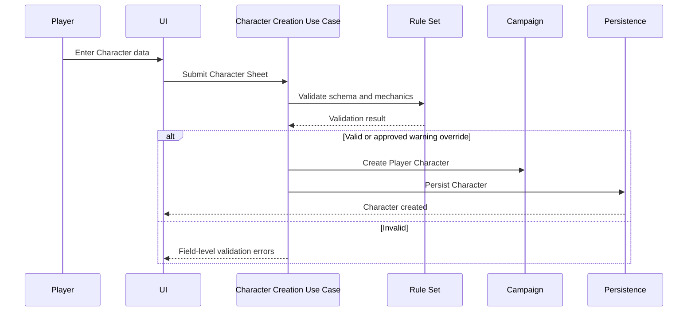
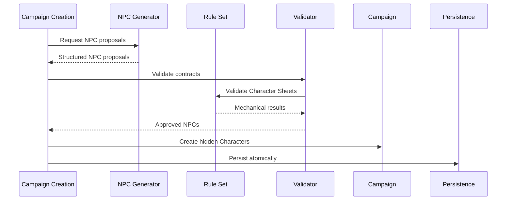

> **"A Character is not a collection of numbers. It is a persistent identity interpreted through rules, memory, and consequence."**

# Character Model and Character Sheet System

## Abstract

This RFC defines the Character model of Chronicle.

It specifies how Player Characters and Non-Player Characters are represented, persisted, validated, revealed, updated, and exposed to the Chronicle Director and Narrator.

It also defines the generic Character Sheet system used by the MVP, including field schemas, values, Rule Set ownership, validation behavior, progression boundaries, Character State, Narrative Profile, visibility, and lifecycle.

The model is system-agnostic.

Werewolf: The Apocalypse is the first Rule Set implementation, not the shape of the generic domain.

## 1. Purpose

Characters are among the most persistent and sensitive entities in Chronicle.

A Character may exist for the entire life of a Campaign.

Chronicle MUST ensure that a Character:

- retains one stable identity;
- preserves mechanical and narrative continuity;
- remains consistent across Sessions;
- can be hidden without ceasing to exist;
- can evolve without being arbitrarily rewritten;
- can be portrayed by the Narrator without giving the Narrator ownership;
- can support multiple RPG systems through one generic model;
- can be validated according to the active Rule Set;
- can be resumed reliably after interruption.

## 2. Scope

This RFC defines:

- Character as a persistent entity;
- Character roles;
- Player Character and NPC behavior;
- Character identity;
- Character Sheet schema;
- Character Sheet values;
- Character State;
- Narrative Profile;
- Character visibility;
- Character lifecycle;
- progression;
- Character knowledge;
- Character snapshots;
- validation;
- creation flows;
- update flows;
- invariants;
- ownership and access boundaries.

This RFC does not define:

- a specific Werewolf character sheet;
- a UI layout for sheets;
- exact database tables;
- exact JSON contracts;
- multiplayer ownership;
- avatar generation;
- voice generation;
- combat turn order;
- inventory systems beyond generic sheet support.

## 3. Character as a Domain Entity

A `Character` is a persistent Campaign entity identified by a stable `CharacterId`.

Two Characters with identical names and data remain different Characters when their identifiers differ.

A Character MUST NOT be recreated merely because it reappears after several Sessions.

A Character MAY be:

- visible;
- hidden;
- discovered;
- absent;
- retired;
- missing;
- dead.

None of these states remove its identity.

## 4. Character Roles

The initial model defines two roles:

```text
Player
NonPlayer
```

### 4.1 Player Character

A Player Character is controlled by the player.

The MVP supports exactly one Player Character per Campaign.

### 4.2 Non-Player Character

A Non-Player Character is not controlled by the player.

An NPC MAY be:

- generated during Campaign creation;
- introduced during play;
- hidden from the player;
- assigned to future Acts or Scenes;
- stronger, weaker, or similar in power to the Player Character;
- temporarily absent;
- permanently retired from active play.

### 4.3 Unified Entity Decision

Player Character and NPC SHOULD use one `Character` entity with a `CharacterRole`.

This avoids duplicated concepts for:

- identity;
- Character Sheet;
- Character State;
- Narrative Profile;
- Relationships;
- Memories;
- lifecycle;
- persistence.

Separate entities SHOULD be introduced only if future invariants prove materially different.

## 5. Character Composition

A Character is composed of the following concerns:

```text
Character
├── Identity
├── Role
├── Character Sheet
├── Narrative Profile
├── Character State
├── Progression
├── Visibility
├── Knowledge
├── Lifecycle Status
└── Metadata
```

Each concern has distinct ownership and mutation rules.

## 6. Character Identity

Character Identity SHOULD include:

- Character identifier;
- Campaign identifier;
- role;
- canonical name;
- optional display name;
- optional aliases;
- creation source;
- creation timestamp;
- stable Rule Set reference;
- stable identity metadata.

### Invariants

- CharacterId is immutable.
- CampaignId is immutable.
- Character role MUST NOT change during normal MVP operation.
- canonical identity MUST survive display name changes.
- aliases MUST NOT create new Characters.

## 7. Character Creation Sources

A Character MAY be created by:

```text
PlayerInput
CampaignGeneration
ApprovedNarrativeCreation
Import
AdministrativeCorrection
```

The MVP MUST support:

```text
PlayerInput
CampaignGeneration
```

Creation source SHOULD be persisted.

This supports auditability and future correction workflows.

## 8. Character Sheet Model

The Character Sheet represents Rule Set-specific mechanical data.

The generic Character Sheet MUST NOT hard-code terms from one RPG system.

Chronicle MUST NOT assume that every Rule Set has:

- Strength;
- Dexterity;
- Class;
- Race;
- Level;
- Tribe;
- Gnosis;
- Humanity;
- Armor Class.

The Rule Set defines the available fields.

## 9. Character Sheet Structure

A Character Sheet consists of:

```text
CharacterSheet
├── RuleSetId
├── RuleSetVersion
├── SchemaVersion
├── Sections
└── Fields
```

### 9.1 Section

A section groups related fields.

Example:

```text
Attributes
Abilities
Backgrounds
Advantages
Health
Biography
```

These examples are Rule Set-specific.

### 9.2 Field

A Character Sheet field SHOULD include:

- stable field key;
- display label;
- section key;
- data type;
- value;
- display order;
- required status;
- read-only status;
- hidden status;
- validation metadata;
- Rule Set metadata;
- localization key;
- current version.

## 10. Stable Field Keys

Field keys MUST be stable across:

- localization;
- UI labels;
- schema rendering;
- persistence;
- validation;
- prompt construction.

Example:

```text
attributes.strength
```

The displayed label MAY change by language.

The key MUST NOT.

## 11. Supported Field Types

The generic MVP SHOULD support at least:

```text
Text
LongText
Integer
Decimal
Boolean
SingleChoice
MultipleChoice
Reference
List
Object
```

The final implementation MAY use a smaller initial subset if field-and-value entry remains possible.

### 11.1 Text

Used for short string values.

### 11.2 LongText

Used for biographies, notes, descriptions, and histories.

### 11.3 Integer

Used for whole-number mechanical values.

### 11.4 Decimal

Used when a Rule Set requires noninteger values.

### 11.5 Boolean

Used for yes/no values.

### 11.6 SingleChoice

Used when exactly one allowed option is selected.

### 11.7 MultipleChoice

Used when multiple allowed options may be selected.

### 11.8 Reference

Used to reference another approved entity or Rule Set item.

### 11.9 List

Used for repeatable values.

### 11.10 Object

Used for bounded nested structures.

The MVP SHOULD avoid arbitrary deeply nested custom objects.

## 12. Character Sheet Schema

A Rule Set MUST provide a Character Sheet schema.

The schema SHOULD define:

- field keys;
- field types;
- sections;
- labels;
- defaults;
- required fields;
- validation rules;
- display order;
- editable state;
- hidden fields;
- derived fields;
- progression behavior.

The schema is not a Character.

It is the definition used to create and validate Character Sheets.

## 13. Generic Field-and-Value MVP

The initial official application MAY render the Character Sheet as generic field-and-value inputs.

This is an intentional MVP decision.

The MVP does not require:

- custom visual sheet layouts;
- drag-and-drop sections;
- system-themed sheet art;
- advanced derived-field UI;
- complete client-side validation;
- sheet builders.

The generic representation MUST still preserve:

- stable keys;
- data types;
- Rule Set metadata;
- validation results;
- ordering.

Future visual layouts MUST be able to use the same underlying schema and values.

## 14. Validation Levels

Character Sheet validation SHOULD support three conceptual levels:

```text
Strict
Advisory
Disabled
```

### 14.1 Strict

Invalid values prevent the operation.

### 14.2 Advisory

Invalid or unusual values generate warnings but may be accepted.

### 14.3 Disabled

Chronicle stores the values without Rule Set validation.

### MVP Decision

The MVP MAY initially support only:

```text
Strict
Advisory
```

or:

```text
Advisory
```

depending on Rule Set readiness.

The architecture MUST preserve the concept of configurable validation.

## 15. Validation Ownership

The Rule Set owns mechanical validation.

Chronicle owns structural and domain validation.

### Chronicle Structural Validation

Examples:

- required Character identity;
- valid field data type;
- stable field key;
- no duplicate field key;
- valid Campaign ownership;
- valid Character role.

### Rule Set Mechanical Validation

Examples:

- allowed value range;
- prerequisite;
- point allocation;
- mutually exclusive options;
- derived value;
- starting Character limits.

The Narrator MUST NOT validate authoritative Character Sheet mechanics.

## 16. Validation Result

A validation result SHOULD contain:

- overall status;
- errors;
- warnings;
- affected field keys;
- Rule Set rule reference;
- user-facing message;
- machine-readable code;
- whether override is allowed.

Validation MUST be deterministic where the Rule Set defines deterministic behavior.

## 17. Derived Fields

A derived field is calculated from other Character Sheet values.

Examples may include:

- total health;
- initiative;
- carrying capacity;
- dice pool modifier.

Derived fields SHOULD be calculated by the Rule Set or Chronicle-controlled logic.

Narrative Intelligence MUST NOT become the authoritative calculator.

Derived fields SHOULD be either:

- calculated on demand;
- persisted with a derivation version;
- recalculated after relevant changes.

The exact strategy will be defined in the Rule Set RFC.

## 18. Character State

Character State represents current mutable conditions not necessarily identical to the Character Sheet definition.

It MAY include:

- physical condition;
- emotional condition;
- wounds;
- temporary effects;
- current resources;
- current location;
- current objective;
- availability;
- transformation or form;
- alive, dead, missing, or unknown status.

### Distinction

Character Sheet answers:

```text
What mechanically defines this Character?
```

Character State answers:

```text
What is currently happening to this Character?
```

## 19. Temporary Effects

Temporary effects SHOULD include:

- effect identifier;
- source;
- description;
- start Session;
- optional start Scene;
- duration;
- expiration policy;
- mechanical modifiers;
- narrative modifiers;
- visibility.

Temporary effects MUST expire deterministically.

The Narrator MAY describe effects.

Chronicle MUST own their authoritative duration.

## 20. Narrative Profile

The Narrative Profile provides nonmechanical information used to portray the Character.

It MAY include:

- personality traits;
- values;
- fears;
- desires;
- goals;
- beliefs;
- flaws;
- virtues;
- habits;
- speech style;
- personal history;
- secrets;
- boundaries;
- behavioral guidance.

### Invariants

- the Narrative Profile belongs to the Character;
- hidden elements MUST respect visibility;
- Narrator portrayal SHOULD use the profile;
- prose MUST NOT overwrite profile values automatically;
- changes require validated operations.

## 21. Character Secrets

A Character secret SHOULD include:

- secret identifier;
- description;
- owner Character;
- Characters who know it;
- player visibility;
- reveal status;
- origin;
- importance;
- associated Memories.

A secret existing in Campaign truth does not mean the player knows it.

The Chronicle Director MUST filter secrets before context construction.

## 22. Character Knowledge

Character knowledge represents what one Character knows.

It MAY reference:

- Campaign Memories;
- secrets;
- locations;
- other Characters;
- Rule Set concepts;
- objects;
- factions;
- plans.

The MVP MUST support explicit knowledge when required to prevent narrative leakage.

Character knowledge MUST NOT be inferred solely from global Campaign truth.

## 23. Character Visibility

Character visibility defines whether the player is aware of the Character.

Canonical states:

```text
Hidden
Discovered
Visible
Retired
```

### Hidden

The Character exists but is unknown to the player.

### Discovered

The player has become aware of the Character, but complete information may remain hidden.

### Visible

The Character is available in normal player-facing views.

### Retired

The Character remains historical but is no longer expected in normal active play.

Visibility is not lifecycle status.

A dead Character may remain visible.

A living antagonist may remain hidden.

## 24. Character Lifecycle Status

Canonical lifecycle states SHOULD include:

```text
Active
Inactive
Missing
Dead
Retired
Archived
```

### Active

May participate in planned or current play.

### Inactive

Exists but is not currently available.

### Missing

Location or fate is unresolved.

### Dead

Death is authoritative Campaign truth.

### Retired

No longer participates normally.

### Archived

Preserved for history.

Lifecycle transitions MUST be explicit.

## 25. Player Character Constraints

For the MVP:

- exactly one Player Character exists per Campaign;
- the Player Character MUST be visible;
- the Player Character MUST have a valid Character Sheet before Campaign readiness;
- the Player Character MUST participate in every playable Scene;
- the Player Character MUST NOT be deleted during normal play;
- death MUST NOT silently create a replacement Character.

A future Player Character replacement workflow requires a dedicated RFC or approved extension.

## 26. NPC Generation

During Campaign creation, Chronicle MAY request structured NPC generation.

The initial target distribution MAY include:

- approximately three NPCs with power comparable to the Player Character;
- approximately two NPCs at varied power levels;
- approximately two clearly stronger NPCs.

These numbers are guidance, not a domain invariant.

The generator SHOULD consider:

- Rule Set;
- Player Character;
- Campaign Preferences;
- intended Campaign tone;
- Narrative Plan;
- role diversity;
- power diversity.

NPC generation output MUST be validated before persistence.

## 27. NPC Generation Contract Requirements

A generated NPC proposal SHOULD include:

- name;
- role;
- Character Sheet values;
- Narrative Profile;
- goals;
- fears;
- motivations;
- secrets;
- power classification;
- planned narrative role;
- visibility;
- initial Relationships;
- optional planned Act or Scene references.

The provider MUST NOT assign persistent identifiers.

Chronicle creates identifiers after validation.

## 28. Hidden NPCs

Generated NPCs MAY remain hidden until introduced.

A hidden NPC:

- exists in persistence;
- may be referenced by the Narrative Plan;
- may have Relationships;
- may possess secrets;
- may evolve only through approved workflows;
- MUST NOT be exposed to player-facing queries.

The Narrator MAY receive hidden NPC data only when the active operation requires it.

## 29. Character Power Classification

Chronicle MAY store a nonmechanical power classification for planning.

Example:

```text
BelowPlayer
Comparable
AbovePlayer
Overwhelming
```

This classification supports Campaign generation and Chronicle Director planning.

It MUST NOT replace Rule Set mechanics.

It SHOULD NOT be displayed as authoritative numerical balance to the player unless the Rule Set supports such disclosure.

## 30. Character Progression

Progression represents lasting Character advancement.

It MAY include:

- experience awarded;
- unspent experience;
- spent experience;
- increased fields;
- learned abilities;
- unlocked options;
- narrative milestones.

Progression MUST be validated by the Rule Set.

The Archivist MAY propose progression.

Chronicle applies accepted progression.

## 31. Experience

The MVP SHOULD distinguish:

```text
Earned Experience
Available Experience
Spent Experience
```

Experience changes MUST be traceable to:

- Session;
- finalization operation;
- explicit correction.

Repeated Session finalization MUST NOT award experience twice.

## 32. Character Update Categories

Character updates SHOULD be classified.

```text
IdentityUpdate
SheetUpdate
StateUpdate
NarrativeProfileUpdate
VisibilityUpdate
LifecycleUpdate
ProgressionUpdate
KnowledgeUpdate
```

Each category SHOULD have separate validation.

A generic unrestricted `UpdateCharacter` operation SHOULD be avoided.

## 33. Character Update Sources

A Character update MAY originate from:

```text
PlayerAction
RuleResolution
SessionFinalization
CampaignCreation
AdministrativeCorrection
ApprovedNarrativeTransition
```

The update source SHOULD be persisted for auditability.

## 34. Update Validation Flow


Any failure prevents persistence.

Warnings MAY permit an override according to Campaign validation mode.

## 35. Character Snapshot

A Character Snapshot is a read-only, operation-specific representation of a Character.

It MAY be used by:

- Chronicle Director;
- Narrator context;
- Archivist context;
- UI read models;
- Rule Set evaluation.

A snapshot SHOULD contain only required fields.

Examples:

```text
NarratorCharacterSnapshot
ArchivistCharacterSnapshot
PlayerCharacterSheetView
SceneParticipantSnapshot
```

The complete Character entity MUST NOT be exposed automatically.

## 36. Narrator Character Context

The Narrator SHOULD receive only Character information relevant to the active Scene.

For each Scene participant, context MAY include:

- identity;
- visible appearance;
- relevant Narrative Profile;
- current Character State;
- local objective;
- relevant Relationships;
- relevant Campaign Memories;
- speech guidance;
- known information.

The Narrator MUST NOT receive unrelated hidden Character data.

## 37. Archivist Character Context

The Archivist MAY receive broader Character context at Session finalization.

It SHOULD include:

- pre-Session Character snapshot;
- accepted Session Messages;
- resolved Dice Rolls;
- existing relevant Memories;
- current Relationships;
- current progression;
- Rule Set progression guidance.

The Archivist still MUST NOT own persistence.

## 38. Character and Campaign Memory

A Character MAY be associated with Campaign Memories through:

- origin;
- participation;
- scope;
- remembered-by relation;
- consequence;
- emotional meaning.

Character-specific Memory SHOULD remain a scoped Campaign Memory unless later requirements justify a separate entity.

This preserves one Memory model while allowing Character-specific retrieval.

## 39. Character and Relationship

Relationships are separate entities.

A Character MUST NOT embed all Relationship truth inside an unstructured narrative field.

A Character snapshot MAY include selected Relationship values.

Relationship ownership remains with the Campaign.

## 40. Character and Scene Participation

Scene participation is explicit.

A Character MAY be:

- a Campaign Character;
- active in an Act plan;
- absent from the current Scene;
- participating in a sibling Scene;
- hidden from the player.

Only `SceneParticipant` membership places a Character in the active Scene.

The Narrator MUST NOT infer attendance from prior Messages alone.

## 41. Character Creation Flow



## 42. NPC Creation Flow



## 43. Character Editing

The MVP SHOULD allow the player to edit the Player Character outside active narrative operations when permitted.

Editing rules MAY depend on Campaign status.

Recommended behavior:

### Before Campaign Ready

Broad editing is allowed.

### Between Sessions

Approved Character Sheet and Narrative Profile editing MAY be allowed.

### During Active Session

Mechanical edits SHOULD be restricted to Chronicle-controlled operations.

The player SHOULD NOT directly change values that bypass consequences or Rule Set mechanics.

## 44. Custom Game Support

Chronicle MAY support Campaigns with validation disabled or reduced.

This capability belongs to the Rule Set and Campaign Preferences.

A custom Campaign MUST still preserve structural invariants:

- valid identifiers;
- valid field types;
- stable ownership;
- no duplicate keys;
- valid lifecycle;
- persistence consistency.

Disabling mechanical validation does not disable domain integrity.

## 45. Character Sheet Migration

A Rule Set schema change MAY require Character Sheet migration.

Migration SHOULD preserve:

- original values;
- old schema version;
- migration result;
- warnings;
- unmapped fields;
- audit metadata.

Automatic destructive field removal is forbidden.

Unmapped data SHOULD be preserved in a recoverable form.

## 46. Character Sheet Versioning

Each Character Sheet SHOULD track:

- Rule Set identifier;
- Rule Set version;
- schema version;
- sheet revision;
- last validated version;
- last update timestamp.

A sheet revision increments on accepted authoritative change.

## 47. Concurrency

Character writes SHOULD use optimistic concurrency.

A Character update MUST include the observed Character revision.

Stale updates MUST fail explicitly.

Examples:

- player editing while Session finalization applies progression;
- retrying an old Character update;
- provider proposal based on outdated Character State.

## 48. Idempotency

Character-changing operations that may be retried MUST be idempotent.

Examples:

- Campaign creation;
- NPC generation application;
- Session progression;
- Experience award;
- visibility reveal;
- Character death transition.

The same operation MUST NOT apply twice.

## 49. Auditability

Chronicle SHOULD preserve enough metadata to answer:

- who or what created the Character;
- which Session changed the Character;
- which operation changed a field;
- which Rule Set version validated the change;
- whether the change came from player action, Rule resolution, or finalization;
- which values changed.

The MVP does not require a full user-visible audit log.

The architecture SHOULD not prevent one.

## 50. Security and Hidden Information

Character data may contain secrets.

Chronicle MUST prevent accidental exposure through:

- UI queries;
- logs;
- prompts;
- debug output;
- provider retries;
- exports;
- error messages.

Hidden data MUST be filtered before crossing presentation or provider boundaries.

## 51. Read Models

Recommended Character read models include:

```text
PlayerCharacterSummary
PlayerCharacterSheetView
CharacterDetailView
NpcPublicSummary
SceneParticipantView
CharacterProgressionView
CharacterRelationshipView
```

A public NPC view MUST exclude hidden fields.

## 52. Performance

Chronicle SHOULD avoid loading every Character in the Campaign for each turn.

The Chronicle Director SHOULD load:

- active Scene participants;
- directly referenced Characters;
- Characters relevant through selected Memories or Relationships;
- planned Character entries when required.

Hidden unrelated NPCs SHOULD remain unloaded.

## 53. Prohibited Patterns

### 53.1 Hard-Coded Werewolf Domain

Generic Character code MUST NOT assume Werewolf-specific fields.

### 53.2 Separate NPC Data Model Without Need

NPCs MUST NOT become a parallel incompatible entity merely for convenience.

### 53.3 Unstructured Sheet Blob as the Only Representation

The Character Sheet MUST preserve field identity and type.

A raw prose description is insufficient.

### 53.4 Narrator-Owned Character Mutation

The Narrator MUST NOT directly update Character Sheet or State.

### 53.5 Visibility by Absence

A Character MUST NOT be considered hidden merely because it was not returned by a query.

Visibility is explicit.

### 53.6 Scene Presence by Recent Mention

A Character MUST NOT become a Scene participant merely because the Narrator mentioned it.

### 53.7 Duplicate Experience Award

Progression MUST NOT be reapplied on retry.

### 53.8 Silent Schema Data Loss

Rule Set migrations MUST NOT discard unknown Character data silently.

## 54. Current Delivery Decision

The MVP adopts:

- one Character entity for Player and NonPlayer roles;
- one Player Character per Campaign;
- multiple persistent NPCs;
- generic field-and-value Character Sheets;
- Rule Set-provided schema;
- deterministic validation where implemented;
- explicit Character State;
- explicit Narrative Profile;
- explicit visibility;
- explicit Scene participation;
- structured NPC generation;
- no custom visual sheet designer;
- no multiplayer Character ownership;
- no avatar generation.

## 55. Architecture Horizon

Future evolution MAY include:

- multiple Player Characters;
- multiplayer ownership;
- collaborative sheet editing;
- custom sheet designers;
- community Rule Set schemas;
- visual sheet skins;
- avatars;
- voice profiles;
- advanced inventories;
- combat-specific state;
- Character import and export;
- cross-Campaign Character templates.

The MVP MUST NOT implement these capabilities solely because the model can support them.

## 56. Open Questions

The following remain open:

- Which field types are strictly required for the first Werewolf Rule Set?
- Should Character Sheet fields be stored individually or as a versioned structured document?
- Which validation mode will be enabled by default?
- How much Player Character editing is allowed between Sessions?
- Should Narrative Profile fields be schema-driven by the Rule Set or generic?
- Should Character secrets use a dedicated entity or structured value object?
- Which knowledge relations are required in the MVP?
- How should Character death affect Campaign continuation?
- Should Relationship initialization be part of NPC generation?
- How should derived fields be persisted?
- How should custom disabled-validation Campaigns be represented in the UI?
- Which Character data may the player manually override after generation?
- Should NPC power classification be persisted or calculated?
- How should Character Sheet localization be packaged with a Rule Set?

These questions require refinement in the Rule Set, UI, and contract RFCs.

## 57. Compliance Checklist

A Character implementation complies when:

- Character identity is stable;
- Player and NPC use the approved unified model;
- exactly one Player Character exists in the MVP;
- Character Sheet keys are stable;
- Character Sheet mechanics are Rule Set-owned;
- Character State is separate from the sheet;
- Narrative Profile is explicit;
- visibility is explicit;
- Scene participation is explicit;
- hidden Character data is protected;
- permanent changes are validated;
- retries do not duplicate progression;
- Character updates are concurrency-protected;
- provider output cannot mutate Characters directly;
- Werewolf concepts do not leak into the generic domain.

## 58. Final Principle

The Narrator may portray a Character.

The Rule Set may define a Character.

The player may guide a Character.

Only Chronicle preserves who that Character truly is.
