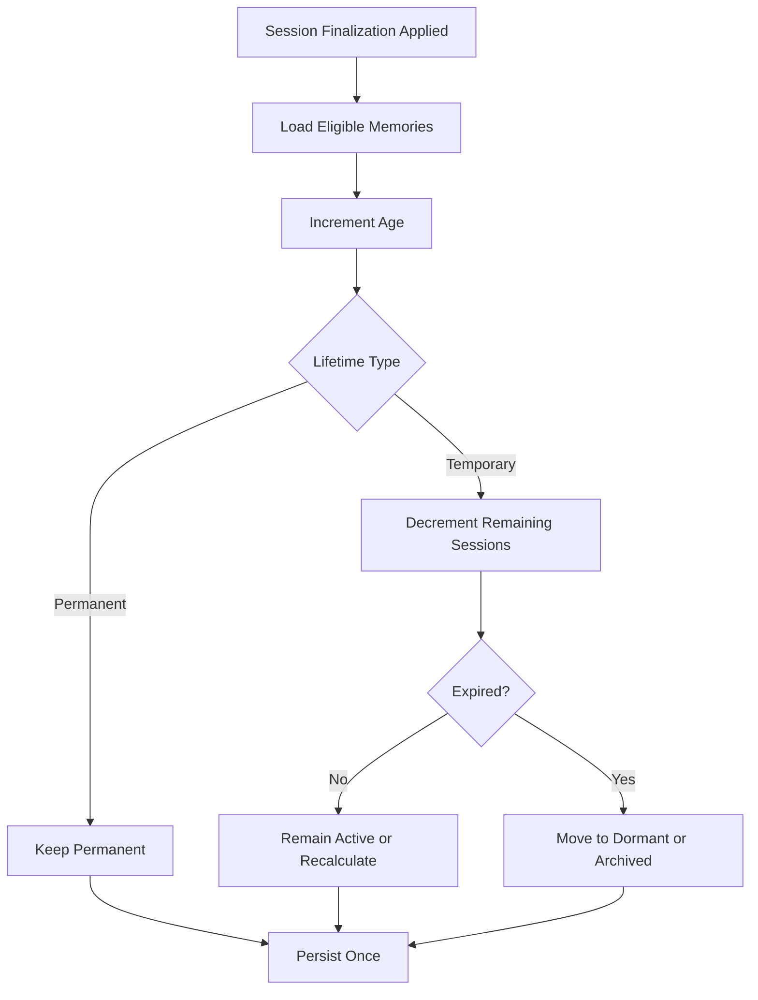

> **"As crônicas não são relatos do que aconteceu, são memórias do que foi vivido."**

# Campaign Memory System

## Abstract

This RFC defines the Campaign Memory System of Chronicle.

It specifies what a Campaign Memory is, how it differs from transcripts and current state, how Memories are created, validated, aged, selected, archived, superseded, associated with Characters, and exposed to the Chronicle Director, Narrator, Archivist, and player.

The Memory System is a core domain capability.

It is not an AI conversation memory layer.

## 1. Purpose

Chronicle is intended to support Campaigns that last for many Sessions.

To preserve continuity, Chronicle MUST distinguish between:

- raw historical records;
- current authoritative state;
- information that remains narratively meaningful.

The Campaign Memory System exists to preserve the third category.

A Campaign Memory answers:

```text
What from what was lived should continue to matter?
```

## 2. Scope

This RFC defines:

- Campaign Memory as a persistent entity;
- Memory scope;
- Memory importance;
- Memory relevance;
- Memory lifetime;
- Memory age;
- Memory status;
- remembered-by knowledge;
- origin references;
- Memory creation;
- Memory validation;
- deterministic aging;
- Memory selection;
- player relevance adjustment;
- supersession;
- dormancy;
- archival;
- retrieval boundaries;
- Narrator and Archivist access.

This RFC does not define:

- exact database tables;
- embedding models;
- vector search;
- prompt syntax;
- user interface layout;
- full Character knowledge modeling;
- cross-Campaign memory;
- multiplayer-specific memory conflicts.

## 3. Campaign Memory Definition

A `CampaignMemory` is a persistent representation of something meaningful that was lived during a Campaign and may influence future play.

A Memory is curated.

It is not automatically every event, message, action, or roll.

Examples:

```text
The Alpha discovered the player's lie during the council.
```

```text
The pack promised to protect the spirit Silent Rain.
```

```text
The player lost the ritual dagger in the Umbra.
```

```text
The player defeated the Black Spiral Dancer at the Northern Gate.
```

## 4. Memory Is Not Transcript

A Session transcript preserves what was said and narrated.

A Campaign Memory preserves what should remain meaningful.

```text
NarrativeMessage
    = what was communicated

CampaignMemory
    = what should continue shaping the Campaign
```

A transcript MAY be used to propose Memories.

It MUST NOT replace them.

## 5. Memory Is Not Campaign State

Campaign State answers:

```text
What is true now?
```

Campaign Memory answers:

```text
What remains meaningful from before?
```

Example:

```text
Campaign State:
The ritual dagger is currently missing.
```

```text
Campaign Memory:
The player lost the ritual dagger while fleeing the Umbra.
```

The same lived occurrence MAY affect both State and Memory.

The concepts MUST remain distinct.

## 6. Memory Entity Structure

A Campaign Memory SHOULD contain:

- Memory identifier;
- Campaign identifier;
- summary;
- optional detailed description;
- scope;
- type;
- importance;
- relevance;
- lifetime;
- age;
- status;
- origin Session;
- origin Act;
- origin Scene;
- involved Characters;
- remembered-by relations;
- emotional tags;
- consequence references;
- creation source;
- supersession reference;
- timestamps;
- concurrency version.

## 7. Memory Summary

The summary is the canonical concise representation of the Memory.

It SHOULD be:

- specific;
- unambiguous;
- written as a persistent fact or recollection;
- understandable without the full transcript;
- short enough for context selection;
- free of unnecessary dramatic prose.

Good:

```text
The Alpha learned that the player lied during the council.
```

Avoid:

```text
A tense and unforgettable moment happened in the dark hall.
```

## 8. Memory Description

The optional description MAY preserve additional context.

It MAY include:

- circumstances;
- motivation;
- emotional meaning;
- exact consequence;
- relevant details omitted from the summary.

The description SHOULD NOT become a transcript copy.

## 9. Memory Scope

Canonical scopes are:

```text
Campaign
Character
Relationship
Faction
Location
Object
```

The MVP MUST support at least:

```text
Campaign
Character
Relationship
```

### 9.1 Campaign Scope

Relevant to the Campaign broadly.

### 9.2 Character Scope

Primarily associated with one Character.

### 9.3 Relationship Scope

Primarily associated with a directed Relationship.

### 9.4 Faction Scope

Associated with a group, pack, tribe, organization, or faction.

### 9.5 Location Scope

Associated with a place.

### 9.6 Object Scope

Associated with an item, artifact, or meaningful object.

## 10. Memory Type

Memory type classifies the narrative function.

Initial canonical types SHOULD include:

```text
Event
Promise
Discovery
Loss
Victory
Defeat
Betrayal
RelationshipChange
Identity
Secret
Obligation
Threat
Goal
Consequence
```

The type supports filtering and selection.

It MUST NOT replace scope.

## 11. Memory Importance

`importance` represents intrinsic narrative significance.

It answers:

```text
How significant is this Memory to the Campaign?
```

Importance SHOULD remain relatively stable.

Recommended conceptual scale:

```text
0 to 100
```

Examples:

```text
10:
The player misplaced an ordinary backpack.
```

```text
60:
The player publicly insulted a respected elder.
```

```text
95:
The player caused the death of the pack leader.
```

The exact numeric representation will be defined later.

## 12. Memory Relevance

`relevance` represents current usefulness to ongoing play.

It answers:

```text
How useful is this Memory right now?
```

Relevance MAY change frequently.

A highly important Memory may have low relevance in an unrelated Scene.

A minor Memory may become highly relevant when a related Character returns.

Recommended conceptual scale:

```text
0 to 100
```

## 13. Importance and Relevance Are Distinct

Chronicle MUST NOT collapse importance and relevance into one field.

Example:

```text
Memory:
The player's mentor died ten Sessions ago.

Importance:
100

Current relevance:
20
```

If the active Scene involves the mentor's killer:

```text
Current relevance:
95
```

Importance remains unchanged.

## 14. Memory Lifetime

Memory lifetime determines whether the Memory expires from normal active use.

Canonical lifetime types:

```text
Permanent
Temporary
```

### 14.1 Permanent

A permanent Memory MUST NOT expire through normal aging.

### 14.2 Temporary

A temporary Memory defines remaining lifetime.

The MVP uses completed Sessions as the primary lifetime unit.

Example:

```text
remainingSessions: 3
```

## 15. Memory Age

Memory age represents how many completed Sessions have passed since creation.

Age MUST increment at most once per completed Session.

Permanent Memories gain age.

Temporary Memories gain age while remaining lifetime decreases.

## 16. Memory Status

Canonical statuses:

```text
Active
Dormant
Archived
Superseded
Rejected
```

### 16.1 Active

Eligible for normal context selection.

### 16.2 Dormant

Preserved but normally excluded unless strongly relevant.

### 16.3 Archived

Preserved for history and auditability.

### 16.4 Superseded

Replaced by a newer or more accurate Memory.

### 16.5 Rejected

A proposed Memory that was not accepted.

Rejected proposals MAY be retained operationally, but they are not Campaign truth.

## 17. Creation Sources

A Memory MAY originate from:

```text
SessionFinalization
ValidatedNarrativeTransition
PlayerCuration
RuleResolution
CampaignInitialization
AdministrativeCorrection
```

The MVP MUST support:

```text
SessionFinalization
ValidatedNarrativeTransition
PlayerCuration
```

Creation source SHOULD be persisted.

## 18. Memory Origin

A Memory SHOULD reference:

- origin Session;
- origin Act;
- origin Scene.

A Campaign initialization Memory MAY lack a Session origin.

Origin references support:

- auditability;
- transcript navigation;
- relevance calculation;
- player review;
- correction.

## 19. Involved Characters

A Memory MAY reference one or more involved Characters.

Involvement does not imply knowledge.

Example:

```text
The antagonist framed the player.
```

The player may be involved without knowing the antagonist's identity.

## 20. Remembered By

`rememberedBy` defines which Characters know or remember the Memory.

This relation SHOULD be explicit when knowledge affects consistency.

Possible knowledge states:

```text
Knows
Suspects
Believes
Misremembers
Forgotten
```

The MVP MAY initially support:

```text
Knows
Suspects
Forgotten
```

## 21. Memory Confidence

A Character-specific Memory relation MAY include confidence.

Example:

```text
The player suspects that the elder betrayed the pack.
```

This is not equivalent to:

```text
The elder betrayed the pack.
```

Chronicle MUST preserve the difference between:

- Campaign truth;
- Character belief;
- Character suspicion.

## 22. Emotional Meaning

A Memory MAY include emotional tags.

Examples:

```text
Fear
Grief
Shame
Pride
Anger
Affection
Suspicion
Hope
```

Emotional tags support Character portrayal and Relationship evolution.

They MUST NOT replace explicit Relationship values.

## 23. Consequences

A Memory MAY reference accepted consequences.

Examples:

- Character State change;
- Relationship change;
- lost object;
- new obligation;
- active threat;
- Narrative Plan change;
- new objective.

Memory and consequence are not the same entity.

The Memory explains what remains meaningful.

The consequence changes authoritative state.

## 24. Memory Proposal

A `MemoryProposal` is structured output suggesting a new or updated Memory.

A proposal is not Campaign truth.

It SHOULD include:

- proposed summary;
- description;
- scope;
- type;
- importance;
- initial relevance;
- lifetime;
- involved Characters;
- remembered-by suggestions;
- origin references;
- evidence references;
- confidence;
- proposed consequences.

## 25. Memory Validation

Every proposal MUST be validated before acceptance.

Validation SHOULD verify:

- Campaign ownership;
- valid origin;
- valid Character references;
- no contradiction with authoritative state;
- no duplication;
- clear summary;
- valid scope;
- valid lifetime;
- valid importance and relevance ranges;
- hidden-information boundaries;
- evidence in the Session or accepted state.

## 26. Duplicate Detection

Chronicle SHOULD detect duplicate or near-duplicate Memories.

Examples:

```text
The Alpha discovered the player's lie.
```

and:

```text
The pack leader learned that the player lied.
```

Possible outcomes:

```text
CreateNew
Merge
UpdateExisting
RejectDuplicate
Supersede
```

Duplicate detection MAY use deterministic and semantic techniques.

Final acceptance MUST remain Chronicle-controlled.

## 27. Contradiction Handling

A proposed Memory that contradicts authoritative state MUST NOT be accepted silently.

Possible outcomes:

- reject proposal;
- request repair;
- classify as Character belief;
- supersede an outdated Memory;
- require explicit correction workflow.

Example:

```text
Campaign truth:
The mentor is dead.

Proposal:
The mentor secretly met the player yesterday.
```

This requires explicit explanation or rejection.

## 28. Memory Supersession

A Memory MAY supersede another Memory when:

- more accurate information becomes known;
- a suspicion becomes confirmed;
- a Character learns the truth;
- a temporary interpretation becomes obsolete.

Example:

```text
Old Memory:
The player suspects that Jonas betrayed the pack.
```

```text
New Memory:
The player discovered that Jonas was framed.
```

The old Memory SHOULD become `Superseded`, not deleted.

## 29. Memory Merging

Chronicle MAY merge Memories when multiple records represent one continuing meaning.

Merged Memories SHOULD preserve:

- origin references;
- involved Characters;
- prior summaries;
- importance history;
- source records.

Merging MUST NOT erase important distinctions.

## 30. Memory Aging

Memory aging occurs during successful Session finalization.



## 31. Aging Idempotency

A Memory MUST NOT age twice for the same Session.

The finalization operation MUST record whether Memory aging was applied.

Retries MUST reuse the same result.

## 32. Relevance Decay

Chronicle MAY apply deterministic relevance decay.

A simple MVP policy MAY be:

```text
relevance = max(minimum, relevance - decay)
```

The final formula is not defined by this RFC.

Decay MAY depend on:

- lifetime type;
- age;
- Memory type;
- importance;
- active objectives;
- involved Characters;
- recent references.

Narrative Intelligence MUST NOT control authoritative decay.

## 33. Relevance Increase

Relevance MAY increase when:

- the Memory is referenced in a new Scene;
- an involved Character returns;
- an associated objective becomes active;
- a related consequence occurs;
- the player explicitly raises relevance;
- the Archivist proposes and Chronicle validates an update.

## 34. Player Relevance Adjustment

The player MAY adjust Memory relevance through an explicit product workflow.

The adjustment MUST:

- preserve historical truth;
- record source as player curation;
- avoid changing importance automatically;
- avoid changing lifetime automatically unless explicitly allowed;
- record the previous value;
- be concurrency-protected.

This feature represents player emphasis, not retroactive reality editing.

## 35. Memory Selection

The Chronicle Director requests relevant Memories for the active operation.

Selection SHOULD consider:

- active Scene;
- participants;
- immediate objective;
- location;
- active conflict;
- current Character State;
- Relationships;
- Memory relevance;
- Memory importance;
- Memory age;
- Memory scope;
- remembered-by constraints;
- hidden-information boundaries;
- context budget.

## 36. Selection Pipeline


### 36.1 Hard Filters

Examples:

- same Campaign;
- valid status;
- allowed visibility;
- required Character knowledge;
- compatible scope.

### 36.2 Ranking

Ranking MAY use:

- relevance;
- importance;
- recency;
- participant match;
- objective match;
- semantic similarity;
- explicit player emphasis.

### 36.3 Budget

Selection MUST respect context limits.

### 36.4 Redaction

Hidden details MUST be removed before provider exposure.

## 37. Narrator Memory Context

The Narrator SHOULD receive only Memories relevant to the active Scene.

Each selected Memory MAY include:

- concise summary;
- involved Characters;
- relevance;
- importance;
- emotional tags;
- allowed consequences;
- knowledge perspective.

The Narrator SHOULD NOT receive internal persistence metadata unless needed.

## 38. Archivist Memory Context

The Archivist MAY receive:

- active Memories relevant to the Session;
- pre-Session relevance and lifetime;
- Session transcript;
- Dice Rolls;
- Character changes;
- Relationship changes;
- existing duplicate candidates.

The Archivist proposes.

Chronicle validates.

## 39. Player Memory View

The player SHOULD be able to review accepted Campaign Memories.

The view MAY show:

- summary;
- origin Session;
- age;
- relevance;
- permanent or temporary status;
- involved visible Characters;
- player notes;
- relevance adjustment.

The UI MUST NOT expose hidden Memories or hidden details.

## 40. Memory Visibility

A Memory MAY have:

```text
PlayerVisible
PlayerHidden
PartiallyVisible
```

Partial visibility MAY reveal:

- that something matters;
- a redacted summary;
- known Characters;
- incomplete certainty.

Visibility MUST be explicit.

## 41. Character-Specific Memory

The MVP SHOULD model Character-specific Memory as a Campaign Memory with:

```text
scope = Character
```

and explicit:

```text
rememberedBy
```

A separate Character Memory entity SHOULD NOT be introduced until needed.

## 42. Relationship Memory

Relationship Memories SHOULD use:

```text
scope = Relationship
```

and reference:

- source Character;
- target Character.

Example:

```text
Jonas remembers that the player abandoned him during the attack.
```

This may influence trust, anger, or loyalty.

The Memory does not replace the Relationship entity.

## 43. False and Subjective Memories

Chronicle MAY support subjective or false Memories when explicitly modeled as Character belief.

A false Memory MUST NOT be stored as global Campaign truth.

Example:

```text
Character belief:
The player believes that Helena stole the fetish.
```

This is valid even if the actual thief was someone else.

The distinction MUST be structured.

## 44. Memory Evidence

A Memory proposal SHOULD reference evidence.

Evidence MAY include:

- Message identifiers;
- Dice Roll identifiers;
- accepted Narrative Events;
- state transitions;
- player actions;
- finalization context.

Evidence supports validation and debugging.

Evidence is not required to be shown to the player.

## 45. Memory Correction

The MVP does not require a complete correction UI.

The architecture SHOULD support future correction.

Correction MUST:

- preserve prior value;
- record reason;
- record source;
- update or supersede;
- avoid silent history rewriting.

## 46. Memory Archival

Archived Memories remain persisted.

They SHOULD be excluded from normal selection.

They MAY be retrieved for:

- player history;
- audit;
- Campaign summary;
- correction;
- future relevance restoration.

## 47. Dormant Memories

Dormant Memories remain semantically available but are not normally selected.

A dormant Memory MAY become active again when:

- a related Character returns;
- a related location becomes active;
- a related objective resumes;
- the player raises relevance;
- the Chronicle Director requests deeper history.

## 48. Permanent Memories

Permanent Memories MUST never expire through normal lifetime aging.

They MAY become dormant due to low relevance.

They MUST remain retrievable.

Examples:

- death of a major Character;
- revelation of true identity;
- permanent oath;
- destruction of a Caern;
- defining betrayal.

## 49. Temporary Memories

Temporary Memories represent context expected to fade.

Examples:

- minor social embarrassment;
- short-lived suspicion;
- temporary rumor;
- lost common item;
- local inconvenience.

Expiration SHOULD transition to `Dormant` or `Archived`.

It SHOULD NOT physically delete the record.

## 50. Memory Importance Guidelines

Suggested bands:

```text
0–19:
Incidental

20–39:
Minor

40–59:
Meaningful

60–79:
Major

80–94:
Critical

95–100:
Defining
```

These labels are guidance.

The exact UI representation remains open.

## 51. Memory Relevance Guidelines

Suggested bands:

```text
0–19:
Normally excluded

20–39:
Low priority

40–59:
Contextual

60–79:
Strong candidate

80–100:
Primary context
```

Relevance selection MUST still consider Scene fit.

## 52. Memory Retrieval Strategy

The Memory System MAY use:

- structured filters;
- ranking formulas;
- semantic search;
- keyword search;
- graph relationships;
- hybrid retrieval.

The Domain sees Memory selection behavior.

It MUST NOT depend on embeddings or vector databases.

## 53. Memory Selection Port

The Application layer MAY define:

```text
CampaignMemorySelector
```

Possible request:

```text
SelectMemoriesRequest
```

Possible response:

```text
SelectedMemorySet
```

The final contract will be defined later.

## 54. Memory Budget

Memory context MUST have an explicit budget.

The budget MAY be expressed in:

- maximum count;
- token estimate;
- weighted size;
- operation profile.

The system SHOULD prefer fewer high-value Memories over broad low-value history.

## 55. Context Profiles

Different operations SHOULD use different Memory selection profiles.

Examples:

```text
NarrateScene
ContinueAfterRoll
FinalizeSession
GenerateCampaignRevision
PortrayCharacter
ResolveRelationship
```

The Narrator and Archivist SHOULD NOT receive identical Memory sets by default.

## 56. Memory and Narrative Plan

Campaign Memories MAY cause Narrative Plan revision.

Examples:

- a planned ally became an enemy;
- an antagonist died early;
- the player abandoned the expected objective;
- a promise created a new obligation.

The Memory itself does not mutate the plan.

A validated application workflow applies the change.

## 57. Memory and Campaign State

A Memory MAY be created from a State transition.

A State transition MAY be caused by an accepted Memory consequence.

Circular mutation MUST be controlled.

Recommended order:

```text
Validated Occurrence
      ↓
Apply State Change
      ↓
Create or Update Memory
      ↓
Persist Atomically
```

## 58. Memory and Relationships

A Memory MAY support a Relationship update.

Example:

```text
Memory:
The player saved Jonas during the attack.

Relationship consequence:
Jonas trust +20.
```

The Relationship change MUST be explicit and validated.

It MUST NOT be inferred repeatedly every time the Memory is retrieved.

## 59. Concurrency

Memory updates SHOULD use optimistic concurrency.

Conflicting updates MUST fail explicitly.

Examples:

- player raises relevance while Session finalization updates the same Memory;
- two proposals supersede one Memory;
- retry applies aging to an outdated version.

## 60. Idempotency

The following MUST be idempotent:

- Memory creation from finalization;
- Memory aging;
- relevance updates from one accepted operation;
- supersession;
- duplicate merge.

The same operation MUST NOT create duplicate Memories.

## 61. Auditability

Chronicle SHOULD preserve:

- creation source;
- origin;
- previous importance;
- previous relevance;
- previous lifetime;
- status transitions;
- supersession;
- player adjustments;
- validation result;
- operation identifier.

A full player-visible audit log is not required for the MVP.

## 62. Privacy and Hidden Information

Memory content may contain secrets.

Chronicle MUST filter Memories before:

- UI display;
- Narrator context;
- logs;
- exports;
- error messages.

A Memory summary MAY require a player-visible redacted version.

## 63. Testing Requirements

Tests MUST cover:

- permanent Memory aging;
- temporary Memory aging;
- aging exactly once;
- expiration;
- dormancy;
- archival;
- relevance adjustment;
- player relevance override;
- duplicate detection;
- supersession;
- contradiction rejection;
- remembered-by filtering;
- hidden Memory filtering;
- Scene-specific selection;
- context budget enforcement;
- stale update conflict;
- retry idempotency.

## 64. Prohibited Patterns

### 64.1 Every Message Becomes a Memory

Chronicle MUST NOT persist every Message as a Campaign Memory.

### 64.2 Provider Conversation Memory

Provider-side memory MUST NOT replace Campaign Memory.

### 64.3 One Score for Everything

Importance, relevance, lifetime, and age MUST NOT be collapsed into one field.

### 64.4 Global Knowledge Leakage

Every Character MUST NOT automatically know every Memory.

### 64.5 Physical Deletion on Expiration

Expired Memories SHOULD NOT be destroyed by default.

### 64.6 Narrator-Controlled Aging

The Narrator MUST NOT decide authoritative lifetime decrement.

### 64.7 Repeated Relationship Effects

Retrieving a Memory MUST NOT reapply its consequence.

### 64.8 Hidden Memory Exposure

Hidden Memories MUST NOT enter player-visible output accidentally.

## 65. Current Delivery Decision

The MVP adopts:

- one Campaign Memory entity;
- scoped Memories;
- permanent and temporary lifetime;
- lifetime measured in completed Sessions;
- separate importance and relevance;
- deterministic aging;
- explicit status;
- origin references;
- explicit involved Characters;
- basic remembered-by support;
- Archivist proposals;
- Chronicle validation;
- player relevance adjustment;
- archival instead of deletion;
- no full knowledge graph;
- no cross-Campaign memory;
- no autonomous provider memory.

## 66. Architecture Horizon

Future evolution MAY include:

- richer Character beliefs;
- false Memories;
- Memory confidence;
- faction Memory;
- location Memory;
- emotional Memory graphs;
- multiplayer conflicting recollections;
- semantic clustering;
- cross-Campaign templates;
- advanced memory visualization;
- player-authored journals;
- adaptive relevance models.

The MVP MUST NOT implement these capabilities unless required by a later milestone.

## 67. Open Questions

The following remain open:

- What exact numeric types should importance and relevance use?
- What is the default temporary lifetime?
- Which Memory types are required for the MVP?
- Should relevance decay be linear, stepped, or rule-based?
- Should player relevance adjustments have upper limits?
- How should duplicate detection combine deterministic and semantic methods?
- Should the player see importance, relevance, or both?
- Should the UI use `Campaign Memory`, `Chronicle Memory`, or `Past Fact`?
- How much remembered-by behavior is required in the first release?
- Should false Character beliefs be included in the MVP?
- Should Memory descriptions be editable by the player?
- Should Memory creation occur during play, at finalization, or both?
- What context budget should the Narrator receive?
- Should dormant Memories automatically reactivate?
- How should Memory selection be evaluated for quality?

These questions require later ADRs and implementation RFCs.

## 68. Compliance Checklist

A Memory implementation complies when:

- Memories are distinct from Messages;
- Memories are distinct from Campaign State;
- importance and relevance are separate;
- lifetime and age are separate;
- permanent Memories do not expire;
- temporary Memories age deterministically;
- aging is idempotent;
- origin is traceable;
- Character knowledge is not assumed globally;
- hidden Memories are filtered;
- provider output is validated;
- player relevance adjustment preserves truth;
- expired Memories are archived or dormant;
- selection respects Scene context and budget;
- retrieval technology does not leak into the Domain.

## 69. Final Principle

Chronicle does not preserve everything equally.

It preserves what deserves to continue shaping the story.
