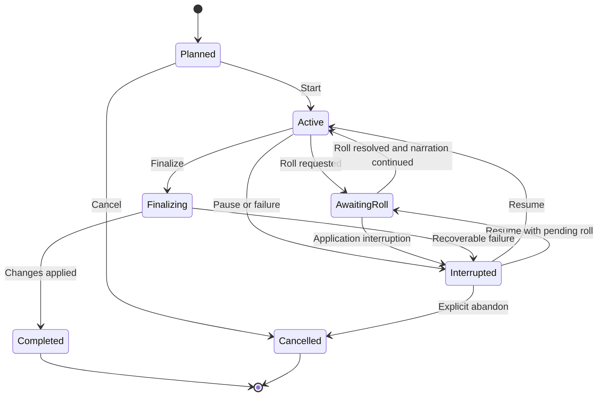
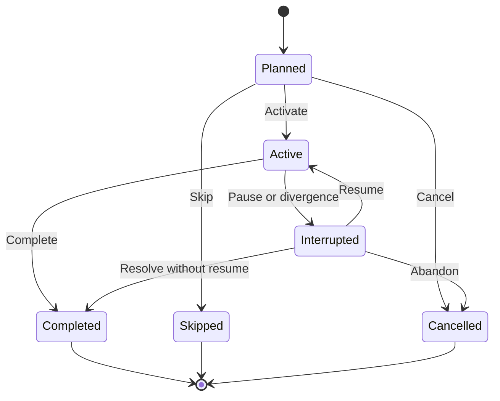
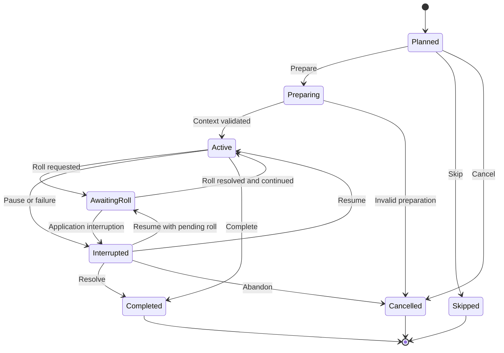

> **"A Campaign persists. A Session is lived. An Act moves it. A Scene defines what is happening now."**

# Session, Act and Scene Lifecycle

## Abstract

This RFC defines the lifecycle of Session, Act, and Scene in Chronicle.

It establishes their states, transitions, ownership rules, activation constraints, interruption behavior, resumption semantics, completion conditions, relationship with Dice Rolls, and the responsibilities of the Chronicle Director throughout the playable narrative hierarchy.

The canonical hierarchy is:

```text
Campaign
└── Session
    └── Act
        └── Scene
```

## 1. Purpose

Chronicle requires a narrative structure that is both dramatic and operationally precise.

The hierarchy MUST:

- support long-running Campaigns;
- allow Sessions to be interrupted and resumed;
- group broad dramatic movements into Acts;
- isolate immediate context through Scenes;
- prevent participant leakage;
- preserve history;
- block narration while a Dice Roll is unresolved;
- allow player choices to alter the planned structure;
- provide explicit state for recovery after failure.

## 2. Scope

This RFC defines:

- Session lifecycle;
- Act lifecycle;
- Scene lifecycle;
- activation and completion;
- interruption and resumption;
- planned versus executed structure;
- active hierarchy constraints;
- Scene participants;
- Scene objectives;
- Scene transitions;
- Act transitions;
- Session finalization;
- Dice Roll interaction;
- Chronicle Director responsibilities;
- persistence and idempotency requirements.

This RFC does not define:

- exact UI layout;
- provider prompt contracts;
- detailed Dice Roll mechanics;
- Campaign generation algorithms;
- multiplayer turn management;
- combat rounds;
- scheduling of real-world play sessions.

## 3. Canonical Hierarchy

```text
Campaign
└── Session
    └── Act
        └── Scene
```

### 3.1 Campaign

The complete persistent role-playing experience.

### 3.2 Session

A player-controlled period of play.

### 3.3 Act

A major dramatic division within a Session.

### 3.4 Scene

The smallest directed unit of active narrative context.

## 4. Ownership

Ownership is strict:

- a Session belongs to exactly one Campaign;
- an Act belongs to exactly one Session;
- a Scene belongs to exactly one Act;
- a Scene participant references a Character from the same Campaign;
- a Dice Roll belongs to one Scene;
- a Narrative Message belongs to one Session and SHOULD belong to one Scene;
- a completed child remains historically owned by its original parent.

Moving completed Acts or Scenes between parents is forbidden in normal operation.

## 5. Active Hierarchy Invariant

The MVP permits:

- at most one active Session per Campaign;
- at most one active Act per active Session;
- at most one active Scene per active Act.

Therefore, the active narrative path is always unambiguous:

```text
Active Campaign
    ↓
Active Session
    ↓
Active Act
    ↓
Active Scene
```

Chronicle MUST NOT ask Narrative Intelligence to infer the active hierarchy.

## 6. Planned and Executed Structure

Chronicle distinguishes between:

```text
Planned Structure
Executed Structure
```

The Narrative Plan MAY contain future Acts and Scenes.

The executed hierarchy records what actually became part of play.

A planned Scene MAY be:

- activated;
- revised;
- replaced;
- skipped;
- split;
- merged with another planned concept;
- made obsolete by player choice.

Completed executed history MUST NOT be rewritten merely to match the original plan.

## 7. Session Definition

A Session is a player-controlled period of play that begins when the player starts or resumes play and ends through explicit finalization.

A Session is not identical to:

- one provider conversation;
- one application process lifetime;
- one Scene;
- one real-world calendar day.

A Session MAY survive application restart.

## 8. Session States

Canonical Session states are:

```text
Planned
Active
AwaitingRoll
Interrupted
Finalizing
Completed
Cancelled
```

### 8.1 Planned

The Session exists but has not begun.

### 8.2 Active

The Session accepts normal player input.

### 8.3 AwaitingRoll

The Session is blocked by an unresolved Dice Roll in its active Scene.

### 8.4 Interrupted

The Session stopped unexpectedly or was deliberately paused without finalization.

It remains resumable.

### 8.5 Finalizing

The Session no longer accepts normal narrative input while the Archivist workflow is processed.

### 8.6 Completed

Finalization was successfully applied.

The Session becomes historical.

### 8.7 Cancelled

The Session was abandoned before meaningful completion through an explicit workflow.

Cancellation MUST NOT silently discard persisted play.

## 9. Session State Transitions



## 10. Session Start Preconditions

A Session MAY begin only when:

- Campaign status permits play;
- no other Session is active;
- the Player Character is valid;
- the Rule Set is available;
- Campaign State is internally consistent;
- no unresolved finalization blocks play;
- an initial or resumable Act can be activated;
- an initial or resumable Scene can be activated.

Starting a Session MUST be atomic.

## 11. Session Resume

Resuming a Session MUST restore the last consistent state.

Chronicle MUST restore:

- Session status;
- active Act;
- active Scene;
- Scene participants;
- recent Messages;
- current objectives;
- pending Dice Roll;
- pending continuation;
- relevant Character State;
- relevant Campaign Memories.

If a pending Roll exists, the Session resumes as `AwaitingRoll`.

Chronicle MUST NOT restart narration before the pending Roll is resolved.

## 12. Session Interruption

A Session becomes `Interrupted` when:

- the player explicitly pauses;
- the application closes during active play;
- persistence or provider failure prevents continuation;
- a recovery workflow is required;
- finalization fails before application.

Interruption preserves all committed state.

Uncommitted provider output MUST NOT be treated as accepted history.

## 13. Session Finalization

Session finalization begins only through an explicit player or controlled application action.

The transition is:

```text
Active
    ↓
Finalizing
    ↓
Completed
```

Finalization SHOULD:

- stop normal narrative input;
- close or interrupt the active Scene;
- close or interrupt the active Act;
- invoke the Archivist;
- validate proposed changes;
- create or update Campaign Memories;
- apply Character progression;
- apply Relationship changes;
- age Memories;
- create Session summary;
- persist all accepted changes atomically.

Finalization MUST be idempotent.

## 14. Session Completion

A Session becomes `Completed` only after:

- finalization changes are validated;
- accepted changes are persisted;
- Memory aging is applied once;
- progression is applied once;
- summary is persisted;
- Campaign State no longer references the Session as active.

A provider response alone cannot complete a Session.

## 15. Act Definition

An Act is a major dramatic division of a Session.

An Act groups Scenes contributing to a broad dramatic movement.

Example:

```text
Act: The Desert War
```

Its Scenes may include:

```text
Battle at the Northern Gate
Defense of the Fortress
Assault on the Hill
```

## 16. Act States

Canonical Act states are:

```text
Planned
Active
Interrupted
Completed
Skipped
Cancelled
```

### Planned

Exists in the Session plan but has not begun.

### Active

Contains the active Scene or is preparing one.

### Interrupted

Started but stopped before normal completion.

### Completed

Its dramatic purpose was concluded.

### Skipped

Deliberately not executed because the Campaign diverged.

### Cancelled

Invalidated before meaningful execution.

## 17. Act State Transitions



## 18. Act Activation Preconditions

An Act MAY become active only when:

- its Session is active or awaiting a valid transition;
- no sibling Act is active;
- its Campaign ownership is valid;
- at least one playable or creatable Scene exists;
- activation does not contradict completed history.

## 19. Act Objective

An Act SHOULD define a dramatic objective.

Examples:

- survive the desert war;
- expose the traitor;
- recover the stolen fetish;
- defend the Caern;
- negotiate an alliance.

The objective guides Scene selection.

It does not force one outcome.

## 20. Act Completion

An Act MAY complete when:

- its dramatic objective is resolved;
- the central conflict is concluded;
- player action makes further Scenes unnecessary;
- the Chronicle Director validates a transition;
- the Session is being finalized and the Act has reached a valid stopping point.

Completing an Act MUST NOT automatically complete the Session.

## 21. Act Interruption

An Act MAY be interrupted when:

- the Session pauses;
- the Campaign changes direction;
- the player leaves the current conflict;
- an external failure interrupts play;
- the Act will resume in a later Session.

An interrupted Act MAY resume in the same Session or a later Session only if the domain model permits the chosen ownership approach.

### MVP Decision

In the MVP, an Act belongs to exactly one Session.

If a dramatic movement continues into another Session, Chronicle SHOULD create a continuation Act in the new Session linked narratively to the prior Act.

This keeps Session ownership simple and history explicit.

## 22. Scene Definition

A Scene is the smallest directed unit of active narrative context.

A Scene defines:

- where the action occurs;
- who is present;
- what is happening;
- what the immediate objective is;
- which conflict is active;
- what local state matters;
- which Memories and rules are relevant.

## 23. Scene States

Canonical Scene states are:

```text
Planned
Preparing
Active
AwaitingRoll
Interrupted
Completed
Skipped
Cancelled
```

### 23.1 Planned

Exists in the Narrative Plan or Session structure.

### 23.2 Preparing

Chronicle is validating participants and assembling initial context.

### 23.3 Active

Accepts normal player input and narration.

### 23.4 AwaitingRoll

Narration is blocked by a pending Dice Roll.

### 23.5 Interrupted

The Scene stopped without normal completion.

### 23.6 Completed

Its immediate objective or conflict reached a valid end.

### 23.7 Skipped

The Scene was deliberately bypassed before activation.

### 23.8 Cancelled

The Scene became invalid before meaningful execution.

## 24. Scene State Transitions



## 25. Scene Preparation

Before activation, Chronicle MUST validate:

- Scene ownership;
- active Session and Act;
- participant references;
- Player Character participation;
- participant visibility;
- location;
- immediate objective;
- hidden-information boundaries;
- relevant Campaign State;
- absence of conflicting pending Roll;
- context version.

The Scene becomes `Active` only after preparation succeeds.

## 26. Scene Participants

Participants MUST be explicit.

Each Scene Participant SHOULD define:

- Character identifier;
- participation role;
- visibility;
- local objective;
- entry state;
- exit state;
- Scene-local conditions.

A Character participating in one Scene MUST NOT automatically participate in a sibling Scene.

## 27. Player Character Participation

The MVP requires the Player Character to participate in every playable Scene.

Noninteractive cutaway Scenes are outside the MVP unless later approved.

The system MAY describe off-screen events through summaries or discovered Memories without creating a playable Scene.

## 28. Scene Objective

Every active Scene SHOULD define an immediate objective.

Examples:

- convince the elder;
- escape the burning building;
- defeat the attacker;
- discover the hidden entrance;
- survive until dawn.

A Scene MAY end without achieving its objective.

Failure is a valid outcome.

## 29. Scene Conflict

A Scene MAY define an active conflict.

Conflict is broader than combat.

Examples:

- physical threat;
- social disagreement;
- investigation;
- moral choice;
- pursuit;
- environmental danger;
- ritual challenge.

## 30. Scene Local State

Scene-local state MAY include:

- local conditions;
- temporary hazards;
- current positions;
- immediate resources;
- active conversational topic;
- local objectives;
- unresolved choices.

Scene-local state MUST NOT silently become Campaign-wide State.

Promotion to Campaign State requires an explicit validated operation.

## 31. Scene Context Version

Each Scene SHOULD maintain a context version.

It increments when authoritative context changes.

Examples:

- participant set changed;
- objective changed;
- location changed;
- pending Roll changed;
- Character State changed materially;
- hidden-information permissions changed.

Narrator responses based on an older context version MUST be rejected or repaired.

## 32. Scene Messages

Narrative Messages SHOULD be associated with the active Scene.

Messages are append-only during normal operation.

A Scene transcript supports:

- immediate continuity;
- Session history;
- Archivist evidence;
- player review.

It does not replace Campaign State or Campaign Memory.

## 33. Scene Completion Conditions

A Scene MAY complete when:

- immediate objective is resolved;
- active conflict ends;
- participants leave;
- the player chooses a meaningful exit;
- the Chronicle Director validates a transition;
- the Session is finalizing at a valid boundary.

The Narrator MAY propose completion.

Chronicle decides whether the transition is valid.

## 34. Scene Transition

A Scene transition is:

```text
Current Scene
    ↓
Validated Completion or Interruption
    ↓
Next Scene Preparation
    ↓
Next Scene Activation
```

The transition SHOULD persist:

- closing state;
- participant exits;
- unresolved consequences;
- resulting Campaign State changes;
- next Scene reference;
- context version.

## 35. Dynamic Scene Creation

Player action MAY require a Scene not present in the Narrative Plan.

The Chronicle Director MAY request or create a structured Scene proposal.

The proposal MUST define:

- title;
- location;
- objective;
- participants;
- active conflict;
- relationship to the current Act;
- hidden information;
- reason for creation.

Chronicle validates and persists the Scene before activation.

## 36. Scene Skipping

A planned Scene MAY be skipped when:

- player choice makes it unnecessary;
- its objective was resolved elsewhere;
- it contradicts accepted history;
- the Act changes direction;
- pacing requires removal.

Skipping MUST preserve the plan record or reason where applicable.

## 37. Scene Splitting

A Scene MAY need to be split when:

- participants divide into separate groups;
- two conflicts require isolated context;
- location changes create a new immediate objective;
- one Scene becomes too broad.

Example:

```text
Scene: Battle at the Fortress
```

may become:

```text
Scene: Defense of the Main Gate
Scene: Rescue in the Lower Tunnels
```

Each resulting Scene MUST have explicit participants.

## 38. Scene Merging

Planned Scenes MAY be merged before execution when they serve one immediate context.

Completed Scenes MUST NOT be retroactively merged in normal operation.

## 39. Dice Roll Interaction

When the Narrator requests a Dice Roll:

1. the Scene becomes `AwaitingRoll`;
2. the Session becomes `AwaitingRoll`;
3. the Roll Request is persisted;
4. normal player narrative input is blocked;
5. the UI presents the Roll;
6. the player triggers execution;
7. Chronicle resolves and persists the result;
8. the Narrator continues from the interruption;
9. the Scene returns to `Active` or transitions based on the result.

## 40. Multiple Dice Rolls

The MVP SHOULD allow at most one unresolved Dice Roll per active Scene.

A follow-up Roll MAY be requested after the first is resolved and continuation is processed.

Parallel unresolved Rolls are outside the MVP.

## 41. Roll Cancellation

A pending Roll MAY be cancelled only through a validated workflow.

Examples:

- invalid Narrator request;
- Scene cancellation;
- administrative recovery;
- player action removed the test before execution, when allowed.

Cancellation MUST be persisted.

It MUST NOT be used to reroll an unfavorable result.

## 42. Narrative Input While Awaiting Roll

Normal narrative input MUST be blocked while awaiting a Roll.

The UI MAY permit:

- viewing Character Sheet;
- viewing Roll details;
- viewing prior Messages;
- pausing the Session;
- recovery actions.

The UI MUST NOT accept a new fictional action that bypasses the unresolved test.

## 43. Chronicle Director Responsibilities

The Chronicle Director coordinates:

- active hierarchy resolution;
- Session start and resume;
- Act activation;
- Scene preparation;
- participant validation;
- context selection;
- Narrator invocation;
- response validation;
- Roll interruption;
- continuation;
- Scene transition;
- Act transition;
- Session finalization initiation.

## 44. Chronicle Director Prohibitions

The Chronicle Director MUST NOT:

- narrate prose;
- invent random outcomes;
- persist directly outside application abstractions;
- ignore active hierarchy invariants;
- place Characters in a Scene through textual inference;
- complete a Scene solely because the provider says so;
- force the Narrative Plan over player action.

## 45. Narrator Responsibilities

The Narrator MAY:

- portray the active Scene;
- describe participants;
- react to player input;
- request Dice Rolls;
- propose Narrative Events;
- propose Scene completion;
- suggest a transition.

The Narrator MUST NOT:

- activate entities directly;
- persist transitions;
- choose authoritative participants;
- continue past an unresolved Roll;
- expose hidden information.

## 46. Archivist Relationship

The Archivist operates on the completed or finalizing Session.

It SHOULD receive the executed Session structure:

```text
Session
├── Acts
│   └── Scenes
├── Messages
├── Dice Rolls
└── Accepted State Changes
```

It MUST distinguish planned Scenes from executed Scenes.

## 47. Persistence Requirements

Chronicle MUST persist enough state to restore:

- Session lifecycle state;
- Act lifecycle state;
- Scene lifecycle state;
- active hierarchy;
- participant membership;
- context version;
- pending Roll;
- Message ordering;
- transition operation;
- finalization state.

## 48. Atomic Transitions

The following SHOULD be atomic:

- Session start;
- Scene activation;
- Roll request creation;
- Roll resolution;
- Scene completion and next Scene activation;
- Act completion and next Act activation;
- Session finalization.

A transition MUST NOT leave two active sibling entities.

## 49. Optimistic Concurrency

Session, Act, and Scene updates SHOULD use version tokens.

A transition based on stale state MUST fail.

Examples:

- applying a Narrator response after the Scene changed;
- resolving a Roll already cancelled;
- completing an Act after another transition;
- finalizing a Session that already completed.

## 50. Idempotency

The following MUST be idempotent:

- start Session;
- resume Session;
- activate Scene;
- apply Narrator response;
- create pending Roll;
- resolve Roll;
- continue after Roll;
- complete Scene;
- complete Act;
- finalize Session.

Repeated commands MUST return the existing accepted result or fail safely.

## 51. Sequence Ordering

Sessions SHOULD have a Campaign-scoped sequence number.

Acts SHOULD have a Session-scoped order.

Scenes SHOULD have an Act-scoped order.

Messages SHOULD have a Session-scoped sequence.

Executed order MAY differ from planned order.

Chronicle SHOULD preserve both when useful.

## 52. Session Summary

A completed Session SHOULD have a summary.

The summary SHOULD describe:

- major Acts;
- executed Scenes;
- important choices;
- resolved Rolls;
- consequences;
- unresolved threads;
- resulting Memories.

The summary is not the authoritative source of individual changes.

## 53. Cancellation and Data Preservation

Cancelling a planned entity MAY remove it from future execution.

Cancelling an entity with persisted play MUST preserve its history.

The status and reason MUST remain visible to internal recovery and audit workflows.

## 54. Failure Recovery

### 54.1 Failure During Scene Preparation

The Scene remains `Planned` or becomes `Cancelled`.

It MUST NOT become active partially.

### 54.2 Failure During Narration Request

The Scene remains at its prior consistent version.

The player input MAY be retained as pending according to operation design.

### 54.3 Failure After Narration Commit

Retry returns the committed result.

Messages MUST NOT duplicate.

### 54.4 Failure During Roll

A committed Roll Result is reused.

A noncommitted attempt may be retried safely according to the Dice RFC.

### 54.5 Failure During Transition

Chronicle restores the last consistent active hierarchy.

### 54.6 Failure During Finalization

The Session remains `Finalizing` or becomes `Interrupted` based on recoverability.

Applied changes MUST NOT duplicate.

## 55. Read Models

Recommended read models include:

```text
ActiveSessionView
ActiveActView
ActiveSceneView
SceneParticipantView
PendingDiceRollView
SessionHistoryItem
SessionSummaryView
NarrativeTimelineView
```

Read models MUST reflect committed state.

## 56. UI Behavioral Requirements

The official application SHOULD make lifecycle state visible through behavior.

Examples:

- `Active`: player input enabled;
- `AwaitingRoll`: Roll control shown, narrative input disabled;
- `Interrupted`: resume action shown;
- `Finalizing`: progress and recovery state shown;
- `Completed`: read-only history shown.

Internal state names need not always be displayed literally.

## 57. Testing Requirements

Tests MUST cover:

- one active Session invariant;
- one active Act invariant;
- one active Scene invariant;
- Scene participant isolation;
- Session start;
- Session resume;
- resume with pending Roll;
- Scene preparation failure;
- stale Narrator response;
- Scene transition atomicity;
- Act completion;
- Session finalization;
- finalization retry;
- duplicate activation;
- participant leakage prevention;
- dynamic Scene creation;
- skipped planned Scene;
- interruption recovery.

## 58. Prohibited Patterns

### 58.1 Scene as Unstructured Prompt State

Scene truth MUST NOT exist only inside prompt text.

### 58.2 Participant Inference from Transcript

Characters MUST NOT become participants merely because they were mentioned.

### 58.3 Provider-Controlled Transition

A provider response MUST NOT directly complete or activate entities.

### 58.4 Two Active Siblings

Two sibling Sessions, Acts, or Scenes MUST NOT be active simultaneously in the MVP.

### 58.5 Continue Before Roll

Narration MUST NOT continue while a Roll is unresolved.

### 58.6 Plan Rewrites History

Narrative Plan changes MUST NOT rewrite executed history.

### 58.7 Session Equals Application Process

Closing the application MUST NOT automatically complete the Session.

## 59. Current Delivery Decision

The MVP adopts:

- one active Session per Campaign;
- one active Act per Session;
- one active Scene per Act;
- explicit participant membership;
- Player Character in every playable Scene;
- one unresolved Roll at a time;
- resumable interrupted Sessions;
- explicit Session finalization;
- Acts owned by one Session;
- continuation Acts across Sessions when needed;
- dynamic Scene creation when player action requires it;
- no parallel playable Scenes;
- no multiplayer turns;
- no combat round model in the generic core.

## 60. Architecture Horizon

Future evolution MAY include:

- multiple simultaneous Scenes;
- split-party multiplayer play;
- background Scenes;
- spectator Scenes;
- asynchronous participants;
- cross-Session Act entities;
- real-time collaboration;
- combat-specific sub-lifecycles;
- scheduled Sessions;
- streaming overlays.

The MVP MUST NOT implement these capabilities without a later approved milestone.

## 61. Open Questions

The following remain open:

- Should an Act ever span multiple Sessions as one entity?
- How much Scene planning should occur during Campaign creation?
- Can a player manually end a Scene?
- Can a player manually skip an Act?
- Should Session interruption be explicit or inferred on application restart?
- How long should recent Scene Message context remain?
- Should cutaway Scenes exist after the MVP?
- How should Scene-local state be structured?
- Which Scene transition proposals should the Narrator be allowed to emit?
- Should Scene splitting be automatic or operator-controlled?
- How should in-world time advance across Scene transitions?
- Should a Session be allowed to finalize with a pending Roll?
- How should partially completed Acts appear in Session summaries?

These questions require later workflow, UI, and contract RFCs.

## 62. Compliance Checklist

An implementation complies when:

- the canonical hierarchy is preserved;
- active entities are unambiguous;
- participants are explicit;
- sibling Scene participants do not leak;
- pending Rolls block narration;
- Sessions survive application restart;
- finalization is explicit and idempotent;
- planned structure does not overwrite executed history;
- provider responses cannot activate or complete entities directly;
- stale context is rejected;
- transitions are atomic;
- current state is recoverable.

## 63. Final Principle

A Campaign may contain an entire world.

The Narrator should never need the entire world at once.

It needs the right Scene.
