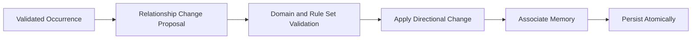

> **"Characters do not react to everything that is true. They react to what they know, believe, fear, remember, and misunderstand."**

# Relationship and Character Knowledge Model

## Abstract

This RFC defines how Chronicle represents Relationships and Character Knowledge.

It establishes directional Relationships, explicit knowledge boundaries, secrets, beliefs, suspicions, misconceptions, confidence, revelation, and the interaction between Characters, Campaign Memories, Scenes, the Chronicle Director, Narrator, and Archivist.

The purpose of this model is to prevent one of the most common failures in persistent narrative systems:

> A Character acting on information they should not possess.

## 1. Purpose

Chronicle preserves one authoritative Campaign truth.

Characters do not automatically know that truth.

Each Character experiences the Campaign from a limited perspective shaped by:

- what they witnessed;
- what they were told;
- what they inferred;
- what they believe;
- what they suspect;
- what they remember;
- what they misunderstand;
- how they feel about other Characters.

The system MUST distinguish between:

```text
What is true
```

and:

```text
What a Character believes is true
```

Relationships and Character Knowledge provide that distinction.

## 2. Scope

This RFC defines:

- directional Relationships;
- Relationship dimensions;
- Relationship state;
- Relationship change;
- Character Knowledge;
- knowledge subjects;
- knowledge certainty;
- knowledge sources;
- secrets;
- beliefs;
- suspicions;
- misconceptions;
- revelation;
- remembered-by behavior;
- knowledge visibility;
- Scene-based knowledge acquisition;
- context filtering;
- persistence;
- concurrency;
- idempotency;
- validation;
- Narrator and Archivist access.

This RFC does not define:

- exact database schema;
- exact UI layout;
- dialogue trees;
- faction reputation algorithms;
- social combat systems;
- multiplayer private knowledge;
- advanced probabilistic reasoning;
- autonomous NPC planning.

## 3. Core Distinctions

Chronicle MUST preserve the distinction between:

```text
Campaign Truth
Character Knowledge
Character Belief
Character Suspicion
Character Misconception
Relationship State
```

These concepts may influence each other.

They MUST NOT be collapsed into one unstructured text field.

## 4. Campaign Truth

Campaign Truth is authoritative state owned by Chronicle.

Examples:

```text
Jonas betrayed the pack.
```

```text
Helena stole the ritual dagger.
```

```text
The mentor is dead.
```

Campaign Truth exists independently from Character awareness.

## 5. Character Knowledge

Character Knowledge represents information a Character is considered to know with sufficient certainty.

Example:

```text
The Player Character knows that the mentor is dead.
```

Knowledge SHOULD be supported by:

- witnessed occurrence;
- direct communication;
- accepted Campaign Memory;
- explicit discovery;
- validated inference;
- Rule Set effect;
- Campaign initialization.

Knowledge is Character-scoped.

## 6. Character Belief

A Character Belief represents information the Character accepts as true, whether or not it matches Campaign Truth.

Example:

```text
The Player Character believes Jonas betrayed the pack.
```

The actual Campaign Truth may differ.

Belief MUST NOT overwrite Campaign Truth.

## 7. Character Suspicion

A Character Suspicion represents an uncertain hypothesis.

Example:

```text
The Player Character suspects Helena stole the dagger.
```

Suspicion is weaker than belief and knowledge.

It MAY become:

- confirmed;
- rejected;
- strengthened;
- weakened;
- replaced;
- forgotten.

## 8. Character Misconception

A Character Misconception is a belief that conflicts with authoritative Campaign Truth.

Example:

```text
Campaign Truth:
Jonas was framed.

Character Misconception:
The Player Character believes Jonas betrayed the pack.
```

Misconceptions are valid narrative state.

They MUST be represented explicitly and MUST NOT be treated as data corruption.

## 9. Relationship Definition

A `Relationship` is the directional state of one Character toward another Character.

```text
Source Character
      ↓
Relationship
      ↓
Target Character
```

Example:

```text
Jonas trusts the Player Character.
```

This does not imply:

```text
The Player Character trusts Jonas.
```

## 10. Relationship Directionality

Relationships MUST be directional.

A pair of Characters MAY have two different Relationship records:

```text
A → B
B → A
```

Each may contain different:

- trust;
- fear;
- respect;
- affection;
- anger;
- loyalty;
- suspicion;
- obligation;
- narrative interpretation.

## 11. Relationship Entity Structure

A Relationship SHOULD contain:

- Relationship identifier;
- Campaign identifier;
- source Character identifier;
- target Character identifier;
- dimensions;
- status;
- visibility;
- summary;
- origin;
- last meaningful change;
- associated Memories;
- timestamps;
- concurrency version.

## 12. Relationship Dimensions

The generic model SHOULD support structured dimensions.

Initial canonical dimensions MAY include:

```text
Trust
Respect
Fear
Affection
Anger
Loyalty
Suspicion
Admiration
Debt
Authority
```

A Rule Set MAY add or reinterpret dimensions.

The generic domain MUST NOT hard-code one social system.

## 13. Relationship Dimension Value

A dimension value SHOULD have:

- key;
- numeric or ordinal value;
- optional label;
- visibility;
- last change source;
- last change amount;
- last change reason.

The exact numeric scale is not defined by this RFC.

A conceptual range MAY be:

```text
-100 to 100
```

The selected representation requires a later ADR or Rule Set decision.

## 14. Relationship Summary

A Relationship MAY include a concise narrative summary.

Example:

```text
Jonas respects the Player Character's courage but no longer trusts their promises.
```

The summary supports portrayal.

It MUST NOT replace structured dimensions.

## 15. Relationship Status

Canonical statuses SHOULD include:

```text
Active
Dormant
Ended
Archived
```

### Active

Relevant to normal play.

### Dormant

Preserved but not normally selected.

### Ended

The active relationship has concluded through death, separation, or irreversible change.

### Archived

Preserved for history.

An ended Relationship MAY remain narratively meaningful.

## 16. Relationship Visibility

Relationship visibility MAY be:

```text
PlayerVisible
PlayerHidden
PartiallyVisible
```

A Character's private feelings do not automatically belong in player-facing UI.

The Narrator MAY portray visible evidence without revealing hidden numeric state.

## 17. Relationship Origin

A Relationship SHOULD record its origin.

Possible sources:

```text
CampaignInitialization
FirstInteraction
CampaignGeneration
SessionFinalization
ApprovedNarrativeTransition
AdministrativeCorrection
```

Origin supports auditability and narrative explanation.

## 18. Relationship Creation

A Relationship MAY be created when:

- Campaign generation defines an initial bond;
- Characters meaningfully interact;
- a Character learns of another Character;
- the Archivist proposes a lasting social connection;
- an explicit domain workflow creates it.

A Relationship MUST NOT be created merely because two Character names appear in the same Message.

## 19. Relationship Update

A Relationship update MUST be traceable to:

- Session;
- Act;
- Scene;
- Campaign Memory;
- Dice Roll;
- player action;
- Rule Set resolution;
- finalization operation.

An update SHOULD include:

- affected dimensions;
- prior values;
- new values;
- reason;
- source;
- operation identifier.

## 20. Relationship Update Flow



## 21. Relationship Consequences

One occurrence MAY affect both directions differently.

Example:

```text
The Player Character saves Jonas.
```

Possible changes:

```text
Jonas → Player:
Trust +20
Respect +15
Debt +30
```

```text
Player → Jonas:
No automatic change
```

Chronicle MUST NOT assume symmetry.

## 22. Relationship and Memory

A Relationship change SHOULD reference the Campaign Memory that explains it when one exists.

Example:

```text
Memory:
The Player Character abandoned Jonas during the attack.

Relationship:
Jonas → Player
Trust -30
Anger +25
```

Retrieving the Memory MUST NOT reapply the Relationship change.

Consequences are applied once.

## 23. Relationship and Current State

Relationship is persistent social state.

Temporary Scene emotions MAY exist separately.

Example:

```text
Relationship:
Jonas generally trusts the Player Character.
```

```text
Scene-local state:
Jonas is currently furious.
```

Temporary emotion MUST NOT automatically rewrite the persistent Relationship.

## 24. Character Knowledge Entity

A `CharacterKnowledge` record represents one Character's relationship to one subject.

It SHOULD contain:

- Knowledge identifier;
- Campaign identifier;
- Character identifier;
- subject type;
- subject identifier or canonical statement;
- knowledge state;
- confidence;
- source;
- origin Session;
- origin Scene;
- visibility;
- status;
- timestamps;
- concurrency version.

## 25. Knowledge Subjects

Character Knowledge MAY concern:

```text
Character
CampaignMemory
Secret
Location
Object
Faction
Relationship
Objective
Event
RuleConcept
CustomFact
```

The MVP SHOULD support at least:

```text
Character
CampaignMemory
Secret
Location
Object
CustomFact
```

## 26. Knowledge State

Canonical knowledge states SHOULD include:

```text
Known
Believed
Suspected
Misunderstood
Forgotten
Disproven
```

### Known

Accepted by Chronicle as reliably known by the Character.

### Believed

Accepted by the Character, but not necessarily confirmed.

### Suspected

Considered possible.

### Misunderstood

Based on incomplete or incorrect interpretation.

### Forgotten

No longer available for normal Character reasoning.

### Disproven

The Character has learned that a prior belief or suspicion is false.

## 27. Knowledge Confidence

Knowledge MAY include confidence.

A conceptual scale MAY be:

```text
0 to 100
```

Example:

```text
Suspected, confidence 30
Believed, confidence 75
Known, confidence 100
```

State and confidence are related but distinct.

A high-confidence belief may still be false.

## 28. Knowledge Source

A Character may acquire knowledge through:

```text
Witnessed
ToldByCharacter
Discovered
Inferred
Remembered
RuleEffect
CampaignInitialization
NarrativePlan
AdministrativeCorrection
```

`NarrativePlan` knowledge is normally hidden system knowledge and MUST NOT be assigned to Characters automatically.

## 29. Witnessed Knowledge

A Character MAY acquire knowledge when:

- they are an explicit Scene participant;
- the relevant occurrence is visible to them;
- no concealment rule prevents perception;
- the occurrence is validated.

Scene participation alone does not guarantee complete knowledge.

Perception, concealment, distance, or Rule Set mechanics MAY limit acquisition.

## 30. Told Knowledge

A Character MAY learn information from another Character.

The system SHOULD preserve:

- speaker;
- listener;
- statement;
- whether the statement matches Campaign Truth;
- whether the listener accepts it;
- confidence;
- source Scene.

A lie may create a false belief.

The spoken statement MUST NOT become Campaign Truth merely because it was said.

## 31. Inferred Knowledge

A Character MAY infer information from evidence.

Inference SHOULD initially be represented as:

```text
Suspected
```

or:

```text
Believed
```

unless Chronicle has validated certainty.

Narrative Intelligence MAY propose an inference.

Chronicle MUST classify and persist it explicitly.

## 32. Forgotten Knowledge

Character Knowledge MAY become forgotten.

Forgetting MAY be caused by:

- Memory lifetime;
- Rule Set effect;
- trauma;
- magical influence;
- deliberate correction;
- low relevance policy.

A forgotten Character fact remains part of Campaign history.

It is excluded from normal Character reasoning.

## 33. Secrets

A `Secret` is a piece of Campaign truth or sensitive Character information with restricted knowledge.

A Secret SHOULD include:

- Secret identifier;
- Campaign identifier;
- subject;
- canonical truth;
- owner or associated entity;
- known-by Characters;
- suspected-by Characters;
- player visibility;
- reveal status;
- importance;
- origin;
- status.

## 34. Secret Status

Canonical statuses SHOULD include:

```text
Hidden
PartiallyRevealed
Revealed
Obsolete
Archived
```

### Hidden

Not known by the player and not broadly known by Characters.

### Partially Revealed

Some information is known, but important details remain hidden.

### Revealed

The intended audience has learned the truth.

### Obsolete

No longer narratively active, though historically preserved.

### Archived

Preserved for history.

## 35. Secret Ownership

A Secret MAY be associated with:

- Character;
- Relationship;
- Faction;
- Location;
- Object;
- Campaign;
- Narrative Plan.

Association does not define who knows it.

Knowledge remains explicit.

## 36. Secret Revelation

A Secret MAY be revealed through:

- witnessed occurrence;
- direct confession;
- investigation;
- Dice Roll result;
- Campaign Memory;
- validated narrative transition;
- Session finalization.

Revelation MUST update:

- Secret status;
- Character Knowledge;
- player visibility where applicable;
- related Campaign Memories;
- possible Relationship consequences;
- Narrative Plan where needed.

## 37. Partial Revelation

Chronicle SHOULD support partial revelation.

Example:

```text
Secret truth:
Helena stole the dagger for the elder.
```

Partial knowledge:

```text
The Player Character knows Helena stole the dagger.
```

Still hidden:

```text
The elder ordered the theft.
```

The data model MUST avoid revealing the full secret when only part is known.

## 38. Player Knowledge

Player knowledge and Player Character knowledge SHOULD be aligned in the MVP unless the product explicitly introduces out-of-character information.

The official application MUST NOT expose hidden Campaign truth through:

- debug labels;
- NPC lists;
- Memory views;
- Relationship values;
- error messages;
- generated summaries.

## 39. Character Knowledge and Campaign Memory

A Campaign Memory MAY be linked to Character Knowledge.

Example:

```text
Campaign Memory:
Jonas was framed by Helena.
```

Possible knowledge:

```text
Helena: Known
Jonas: Suspected
Player Character: Unknown
```

The Memory exists at Campaign level.

Each Character's awareness remains separate.

## 40. Character Knowledge and Scene Context

The Chronicle Director MUST construct Character-specific context.

For an NPC portrayal, the Narrator SHOULD receive:

- what that NPC knows;
- what that NPC believes;
- what that NPC suspects;
- relevant misconceptions;
- relevant Relationships;
- relevant visible Scene information.

The Narrator MUST NOT receive unrelated hidden truth when portraying limited knowledge.

## 41. Perspective-Specific Context

A future or advanced operation MAY require separate perspectives.

Example:

```text
Narrate from Player Perspective
Portray Jonas
Evaluate Helena's Decision
```

Each perspective SHOULD receive a filtered knowledge set.

The MVP MAY begin with Scene-wide narration plus Character-specific portrayal context.

## 42. Knowledge Leakage Prevention

Chronicle MUST prevent knowledge leakage through:

- global Campaign summaries;
- unfiltered Memory retrieval;
- Character snapshots;
- provider prompt reuse;
- Session summaries;
- Relationship explanations;
- UI read models.

A Character MUST NOT act on hidden data merely because the Narrator received it for another purpose.

## 43. Narrator Context Rules

The Narrator MAY receive:

- authoritative visible Scene facts;
- Character-specific knowledge;
- Character-specific beliefs;
- relevant Relationships;
- allowed secrets;
- portrayal guidance.

The request SHOULD distinguish fields such as:

```text
campaignTruthVisibleToNarrator
characterKnowledge
characterBeliefs
characterSuspicions
hiddenFromPlayer
mustNotReveal
```

The exact contract will be defined later.

## 44. Archivist Responsibilities

The Archivist MAY propose:

- new Relationship;
- Relationship updates;
- new Character Knowledge;
- knowledge state changes;
- Secret revelation;
- belief correction;
- suspicion increase or decrease.

The Archivist MUST provide evidence from completed play.

Chronicle validates and applies accepted changes.

## 45. Knowledge Proposal

A structured knowledge proposal SHOULD include:

- Character;
- subject;
- proposed state;
- confidence;
- source;
- evidence;
- origin;
- player visibility;
- relation to Campaign Truth;
- whether an existing record is updated.

## 46. Relationship Proposal

A structured Relationship proposal SHOULD include:

- source Character;
- target Character;
- changed dimensions;
- prior expected values;
- proposed delta or result;
- reason;
- evidence;
- associated Memory;
- visibility;
- confidence.

## 47. Proposal Validation

Validation MUST verify:

- same Campaign ownership;
- valid Character references;
- directional semantics;
- valid dimensions;
- allowed numeric ranges;
- evidence;
- no duplicate application;
- hidden-information boundaries;
- compatibility with Rule Set;
- consistency with current versions.

## 48. Knowledge Transition Rules

Recommended transitions include:

```text
Suspected → Believed
Suspected → Disproven
Believed → Known
Believed → Disproven
Known → Forgotten
Misunderstood → Known
Misunderstood → Disproven
Forgotten → Known
```

Transitions MUST be explicit.

A status change SHOULD preserve prior history.

## 49. Belief Correction

When a Character learns that a belief was false:

- the old belief becomes `Disproven` or `Misunderstood`;
- a new Knowledge record MAY become `Known`;
- associated Memories MAY be superseded;
- Relationship consequences MAY occur;
- the correction origin MUST be recorded.

The old belief SHOULD NOT be silently deleted.

## 50. Knowledge Contradiction

A Character MAY hold conflicting suspicions.

A Character SHOULD NOT hold two active `Known` records that directly contradict each other without an explicit unresolved-condition model.

Chronicle SHOULD detect contradictions.

Possible outcomes:

- reject;
- downgrade one to belief;
- mark misunderstanding;
- supersede;
- require correction workflow.

## 51. Relationship Initialization

Campaign generation MAY initialize Relationships.

Initial Relationships SHOULD include:

- source;
- target;
- dimensions;
- summary;
- visibility;
- reason;
- associated Narrative Plan role.

Initial values MUST be validated before persistence.

## 52. Relationship Discovery

The player MAY not initially know a Relationship exists.

Example:

```text
Helena secretly fears the elder.
```

The Relationship exists in Campaign truth.

Its player visibility remains hidden.

The Narrator MAY portray indirect evidence without revealing the structured value.

## 53. Rule Set Integration

A Rule Set MAY define:

- social dimensions;
- allowed ranges;
- derived Relationship effects;
- perception mechanics;
- memory-altering effects;
- knowledge tests;
- supernatural concealment;
- social conflict resolution.

The generic domain defines ownership and transitions.

The Rule Set defines system-specific mechanics.

## 54. Relationship Mechanics

Mechanical Relationship values MUST be resolved through Chronicle-controlled Rule Set logic.

The Narrator MAY propose narrative consequences.

It MUST NOT authoritatively calculate mechanical social state.

## 55. Perception and Discovery Rolls

A Dice Roll MAY determine:

- whether information is noticed;
- whether a lie is detected;
- whether a secret is uncovered;
- whether confidence changes;
- whether partial knowledge is gained.

The Roll Result MUST be resolved before knowledge mutation.

## 56. Scene Completion and Knowledge

At Scene completion, Chronicle MAY evaluate:

- what each participant witnessed;
- what was communicated;
- what was concealed;
- which beliefs changed;
- which secrets were revealed;
- which Relationships changed.

This evaluation MAY occur immediately or during Session finalization.

The MVP SHOULD prioritize finalization for durable changes while permitting immediate critical updates.

## 57. Immediate Knowledge Updates

Some updates MUST occur during play.

Examples:

- Character learns a door code needed in the same Scene;
- Character discovers an NPC identity;
- Character detects a lie before responding;
- Secret revelation changes the next action.

Immediate updates MUST be validated and persisted before subsequent narration depends on them.

## 58. Deferred Knowledge Updates

Some updates MAY wait for Session finalization.

Examples:

- gradual trust change;
- long-term resentment;
- interpretation of repeated behavior;
- noncritical suspicion adjustment.

The system MUST avoid depending on deferred knowledge before it is applied.

## 59. Persistence Requirements

Chronicle MUST persist:

- directional Relationship state;
- dimension values;
- Relationship status;
- Relationship visibility;
- Character Knowledge state;
- confidence;
- knowledge source;
- Secret state;
- revelation;
- origin references;
- associated Memories;
- operation identifiers;
- versions.

## 60. Concurrency

Relationship and Knowledge updates SHOULD use optimistic concurrency.

Stale updates MUST fail explicitly.

Examples:

- finalization updates trust while immediate play already changed it;
- Secret is revealed twice from different operations;
- an old provider response applies obsolete suspicion.

## 61. Idempotency

The following MUST be idempotent:

- Relationship initialization;
- Relationship update;
- knowledge acquisition;
- Secret revelation;
- belief correction;
- Session finalization proposals.

One occurrence MUST NOT apply the same delta twice.

## 62. Auditability

Chronicle SHOULD preserve enough metadata to answer:

- why one Character trusts another;
- when a Secret was revealed;
- what evidence produced a belief;
- what changed a suspicion;
- which Session altered a Relationship;
- whether the player knows the information;
- whether the Character's belief matches Campaign Truth.

## 63. Read Models

Recommended read models include:

```text
CharacterRelationshipView
NpcPublicRelationshipHint
CharacterKnowledgeView
SecretSummaryView
PlayerKnownFactView
RelationshipHistoryItem
KnowledgeHistoryItem
```

Player-facing views MUST filter hidden information.

## 64. Player-Facing Relationship Presentation

The MVP MAY avoid exposing raw numeric values.

Possible UI presentation:

```text
Trusted
Wary
Hostile
Indebted
Afraid
Respectful
```

These labels MAY be derived from structured dimensions.

The authoritative values remain in Chronicle.

## 65. Player-Facing Knowledge Presentation

The player MAY see:

- known facts;
- suspicions;
- discovered secrets;
- uncertain clues;
- disproven beliefs.

The UI MUST distinguish certainty.

Example:

```text
Known
Suspected
Unconfirmed
Disproven
```

## 66. Performance

Chronicle SHOULD load only Relationships and Knowledge relevant to:

- active Scene participants;
- selected Memories;
- active objectives;
- current secrets;
- current portrayal task.

The complete social graph MUST NOT be loaded for every turn.

## 67. Testing Requirements

Tests MUST cover:

- directional Relationship behavior;
- asymmetric updates;
- duplicate update prevention;
- hidden Relationship filtering;
- knowledge acquisition;
- false belief preservation;
- suspicion transitions;
- belief correction;
- Secret partial revelation;
- Scene participant witness filtering;
- Narrator context leakage prevention;
- immediate update persistence;
- finalization idempotency;
- stale update rejection;
- Rule Set validation;
- player-facing redaction.

## 68. Prohibited Patterns

### 68.1 Global Omniscience

Characters MUST NOT automatically know Campaign Truth.

### 68.2 Relationship Symmetry Assumption

A Relationship MUST NOT be mirrored automatically.

### 68.3 One Social Score

Relationship meaning MUST NOT be reduced to one generic score unless a Rule Set explicitly requires it.

### 68.4 Dialogue Equals Truth

A statement made by a Character MUST NOT become Campaign Truth automatically.

### 68.5 Secret by Prompt Convention

Secrets MUST NOT exist only as text instructions in prompts.

### 68.6 Unstructured Knowledge Blob

Character Knowledge MUST NOT be represented only as free-form biography text.

### 68.7 Reapply Consequence on Retrieval

Reading a Memory or Relationship MUST NOT reapply its effect.

### 68.8 Hidden Values in UI Models

Player-facing read models MUST NOT include hidden Relationship or Secret data.

## 69. Current Delivery Decision

The MVP adopts:

- directional Relationships;
- structured Relationship dimensions;
- explicit Relationship visibility;
- explicit Character Knowledge;
- Known, Believed, Suspected, Misunderstood, Forgotten, and Disproven states;
- explicit Secrets;
- partial revelation support;
- knowledge linked to Campaign Memories;
- Character-specific Narrator context;
- immediate critical updates;
- deferred long-term updates during finalization;
- no autonomous social simulation;
- no multiplayer private knowledge;
- no advanced probabilistic belief engine.

## 70. Architecture Horizon

Future evolution MAY include:

- faction Relationships;
- group reputation;
- multiplayer private knowledge;
- conflicting player perspectives;
- social graph visualization;
- autonomous NPC reasoning;
- probabilistic beliefs;
- rumor propagation;
- deception networks;
- influence systems;
- memory corruption;
- supernatural mind effects;
- knowledge inheritance.

The MVP MUST NOT implement these capabilities without a later milestone.

## 71. Open Questions

The following remain open:

- Which Relationship dimensions belong to the generic framework?
- What numeric scale should dimensions use?
- Should one Relationship record contain all dimensions or use separate dimension records?
- How much Character Knowledge should be visible to the player?
- Should secrets be a dedicated entity in the MVP?
- How should partial Secret revelation be represented structurally?
- Should Character belief use statement records or references to Campaign Memories?
- How should witnessed knowledge be inferred from Scene Events?
- Which knowledge updates occur immediately versus at finalization?
- Should the Narrator receive Campaign Truth that a portrayed NPC does not know?
- How should lies be represented?
- How should a Character remember a false statement after the speaker admits the truth?
- Should Relationship summaries be generated or curated?
- Which Rule Set mechanics affect Relationship and Knowledge?
- How should dormant Relationships reactivate?

These questions require later Rule Set, contract, and UI RFCs.

## 72. Compliance Checklist

An implementation complies when:

- Campaign Truth and Character Knowledge are separate;
- Relationships are directional;
- symmetry is never assumed;
- knowledge certainty is explicit;
- false beliefs do not overwrite truth;
- secrets are explicit and protected;
- partial revelation is supported;
- Scene participation influences but does not guarantee knowledge;
- provider output cannot mutate state directly;
- hidden information is filtered;
- updates are traceable;
- consequences are applied once;
- retries are idempotent;
- stale proposals are rejected;
- Rule Set mechanics remain Rule Set-owned.

## 73. Final Principle

Chronicle knows what is true.

Characters know only what they have lived, learned, believed, or misunderstood.

The story becomes meaningful in the distance between those two things.
