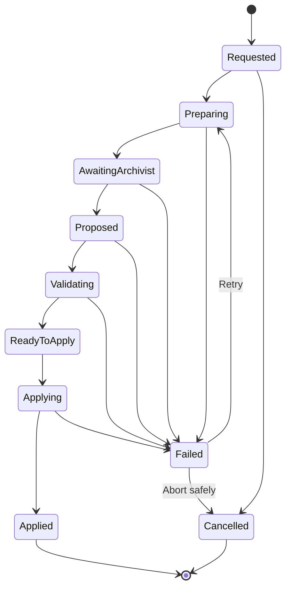

> **"The Session ends when play stops. It becomes part of the Chronicle only when what was lived is preserved."**

# Campaign Finalization and Archivist Workflow

## Abstract

This RFC defines the Session finalization workflow and the role of the Archivist.

It specifies how Chronicle transforms completed play into validated, persistent Campaign changes, including Memories, progression, Relationships, Character Knowledge, Character State, unresolved consequences, Narrative Plan revisions, and Session summaries.

The Archivist proposes meaning.

Chronicle validates and persists truth.

## 1. Purpose

A Session transcript alone is not enough to continue a long Campaign.

At the end of play, Chronicle MUST determine:

- what changed;
- what remains true;
- what should be remembered;
- who learned what;
- which Relationships evolved;
- whether Characters progressed;
- which consequences remain unresolved;
- whether the Narrative Plan must adapt.

Session finalization exists to preserve those changes safely and exactly once.

## 2. Scope

This RFC defines:

- Session finalization initiation;
- Session finalization states;
- finalization input;
- Archivist responsibilities;
- Archivist proposal;
- validation;
- deterministic changes;
- Memories;
- Character progression;
- Character State changes;
- Relationship changes;
- Character Knowledge changes;
- Secret revelation;
- Narrative Plan revision requests;
- Session summary;
- idempotency;
- atomic persistence;
- retries;
- recovery;
- failure handling;
- player review boundaries.

This RFC does not define:

- exact provider prompt;
- exact structured schema;
- UI design;
- specific experience formulas;
- specific Rule Set progression;
- exact Memory relevance formula;
- complete correction workflows.

## 3. Finalization Definition

`Session Finalization` is the controlled workflow that converts a played Session into permanent Campaign consequences.

The workflow begins only through an explicit application command.

```text
Active or Interrupted Session
        ↓
Finalization Requested
        ↓
Session Evidence Assembled
        ↓
Archivist Proposal
        ↓
Validation
        ↓
Accepted Changes Applied
        ↓
Session Completed
```

## 4. Finalization Is Not Summarization

A summary describes the Session.

Finalization changes the Campaign.

The workflow MAY produce a summary, but its primary responsibilities are:

- validate state transitions;
- persist durable consequences;
- preserve Memories;
- apply progression;
- advance lifecycle state;
- ensure future continuity.

A generated summary alone MUST NOT complete a Session.

## 5. Finalization Preconditions

A Session MAY enter finalization only when:

- it belongs to the active Campaign;
- it is not already completed;
- no different finalization operation is applied;
- its persisted Messages and Dice Rolls are internally consistent;
- any pending Dice Roll is resolved, cancelled, or handled through an explicit recovery rule;
- its active Scene is completed or can be interrupted safely;
- its active Act is completed or can be interrupted safely;
- Campaign version is known;
- Rule Set version remains available.

## 6. Pending Roll Rule

The MVP SHOULD NOT allow normal finalization with an unresolved Dice Roll.

The user SHOULD be asked to:

- resolve the Roll;
- cancel it through an approved recovery flow;
- or interrupt the Session without finalizing.

Chronicle MUST NOT silently discard the Roll Request.

## 7. Finalization States

Canonical finalization states are:

```text
Requested
Preparing
AwaitingArchivist
Proposed
Validating
ReadyToApply
Applying
Applied
Failed
Cancelled
```

### Requested

The player or application requested finalization.

### Preparing

Chronicle is assembling authoritative evidence.

### AwaitingArchivist

The structured request was sent to the Archivist.

### Proposed

A structured Archivist proposal was received.

### Validating

Chronicle is validating the proposal.

### ReadyToApply

The accepted change set is complete.

### Applying

Chronicle is applying changes atomically.

### Applied

The changes were persisted and the Session completed.

### Failed

The workflow failed and requires retry or recovery.

### Cancelled

Finalization was cancelled before any accepted changes were applied.

## 8. Finalization State Transitions



## 9. Session Status Interaction

The Session enters:

```text
Finalizing
```

when finalization begins.

It becomes:

```text
Completed
```

only after finalization reaches `Applied`.

On recoverable failure, the Session SHOULD remain `Finalizing` or transition to `Interrupted`, depending on whether normal play can safely resume.

## 10. Finalization Operation Identifier

Each finalization MUST have a unique operation identifier.

The same logical finalization retry MUST reuse that identifier.

The operation identifier protects against:

- duplicate clicks;
- application restart;
- provider retry;
- persistence retry;
- repeated application of progression;
- repeated Memory aging;
- duplicate Relationship changes.

## 11. Finalization Input

Chronicle assembles a structured `SessionFinalizationContext`.

It SHOULD include:

- Campaign identifier and version;
- Session identifier and sequence;
- Session status;
- Rule Set identifier and version;
- Player Character snapshot before the Session;
- relevant NPC snapshots;
- executed Acts;
- executed Scenes;
- Scene participants;
- accepted Narrative Messages;
- resolved Dice Rolls;
- applied immediate state changes;
- existing relevant Campaign Memories;
- existing Relationships;
- existing Character Knowledge;
- active Secrets;
- Campaign Preferences;
- active Narrative Plan version;
- unresolved objectives;
- contract version;
- operation identifier.

## 12. Evidence Boundary

The Archivist MUST receive accepted evidence.

It MUST NOT rely on:

- rejected provider responses;
- unpersisted Messages;
- stale Roll Requests;
- invalid Narrative Events;
- hidden debug notes;
- speculative future plan content unless explicitly marked as planning context.

The finalization context is curated by Chronicle.

## 13. Pre-Session Snapshot

Chronicle SHOULD preserve a pre-Session snapshot or equivalent baseline for relevant entities.

This enables the workflow to distinguish:

```text
What already existed
```

from:

```text
What changed during this Session
```

Relevant baselines MAY include:

- Character Sheet;
- Character State;
- Relationships;
- Character Knowledge;
- Campaign Memories;
- active objectives;
- Narrative Plan version.

## 14. Immediate Changes

Some changes may already have been applied during play.

Examples:

- wound applied after a Dice Roll;
- item lost;
- Secret revealed;
- knowledge needed immediately;
- Scene participant status changed.

The Archivist MUST be told which changes are already authoritative.

It MUST NOT propose applying them again.

## 15. Deferred Changes

Other changes MAY be deferred until finalization.

Examples:

- experience awards;
- long-term Relationship adjustment;
- Campaign Memories;
- relevance changes;
- long-term Character State interpretation;
- Session summary;
- Narrative Plan revision.

The finalization context SHOULD distinguish immediate and deferred changes.

## 16. Archivist Classification

The Archivist is a replaceable application-facing role backed by Narrative Intelligence or another future implementation.

It is not a persistent entity.

It is not the source of Campaign truth.

## 17. Archivist Responsibilities

The Archivist MAY propose:

- new Campaign Memories;
- updates to existing Memories;
- Memory importance;
- Memory relevance;
- Memory lifetime;
- Character progression;
- Character State changes;
- Relationship changes;
- Character Knowledge changes;
- Secret revelation or correction;
- unresolved consequences;
- Narrative Plan revision request;
- Session summary.

## 18. Archivist Prohibitions

The Archivist MUST NOT:

- persist directly;
- change raw Dice Roll values;
- reinterpret Rule Set results contrary to the Rule Set;
- duplicate already applied changes;
- rewrite completed Messages;
- invent unsupported Character Sheet fields;
- create cross-Campaign references;
- expose hidden information to the player;
- complete the Session by itself;
- age Memories authoritatively.

## 19. Archivist Proposal

The Archivist returns a structured `ArchivistProposal`.

It SHOULD include:

- contract version;
- operation identifier;
- Session identifier;
- proposal confidence;
- Session summary;
- Memory proposals;
- Memory update proposals;
- Character progression proposals;
- Character State proposals;
- Relationship proposals;
- Character Knowledge proposals;
- Secret proposals;
- unresolved consequence proposals;
- Narrative Plan revision proposal;
- warnings;
- evidence references.

## 20. Proposal Is Not Truth

The proposal is untrusted input.

Chronicle MUST validate:

- structure;
- references;
- evidence;
- compatibility with current versions;
- Rule Set mechanics;
- hidden-information boundaries;
- duplicate application;
- internal contradictions.

No proposal field becomes authoritative merely because the Archivist returned it.

## 21. Finalization Change Set

After validation, Chronicle creates an internal `FinalizationChangeSet`.

The Change Set contains only accepted changes.

It SHOULD include:

- final Session summary;
- accepted Memory creations;
- accepted Memory updates;
- deterministic Memory aging;
- accepted Character progression;
- accepted Character State changes;
- accepted Relationship changes;
- accepted Knowledge changes;
- accepted Secret changes;
- accepted unresolved consequences;
- accepted Narrative Plan revision request;
- lifecycle transitions;
- expected Campaign version.

The Change Set is the unit applied atomically.

## 22. Memory Creation

The Archivist MAY propose Memories from:

- meaningful choices;
- victories;
- failures;
- promises;
- betrayals;
- discoveries;
- losses;
- Relationship changes;
- identity revelations;
- obligations;
- unresolved threats.

Chronicle validates them under RFC-0008.

Not every Message or Roll becomes a Memory.

## 23. Memory Update

The Archivist MAY propose:

- relevance increase;
- relevance decrease;
- importance correction;
- status change;
- supersession;
- merge;
- new remembered-by relation;
- changed emotional meaning.

Lifetime decrement and age increment remain deterministic Chronicle behavior.

## 24. Memory Aging

Memory aging occurs once during successful finalization.

For each eligible Memory:

- age increments once;
- permanent Memory remains permanent;
- temporary Memory lifetime decrements once;
- expiration policy runs;
- status may transition to dormant or archived;
- operation application is recorded.

The Archivist MAY recommend relevance changes.

It MUST NOT control authoritative aging.

## 25. Character Progression

Progression MAY include:

- experience earned;
- available experience;
- milestone;
- newly unlocked option;
- Rule Set-specific advancement proposal.

The Rule Set MUST validate progression.

Chronicle MUST prevent duplicate award on retry.

## 26. Experience Evidence

Experience proposals SHOULD reference:

- completed objectives;
- important choices;
- Rule Set progression criteria;
- significant risks;
- Session completion;
- Campaign milestones.

Narrative quality alone SHOULD NOT produce arbitrary mechanical progression.

## 27. Character Sheet Changes

A Character Sheet change during finalization MUST:

- reference valid field keys;
- preserve Rule Set version;
- pass structural validation;
- pass Rule Set validation;
- identify source;
- preserve prior values;
- increment Character revision.

The Archivist MUST NOT write unrestricted sheet blobs.

## 28. Character State Changes

The Archivist MAY propose long-term state changes such as:

- persistent wound;
- emotional condition;
- status change;
- unresolved effect;
- location at Session end;
- new objective.

Immediate state already applied during play MUST NOT be duplicated.

## 29. Relationship Changes

Relationship changes MUST be directional.

A proposal SHOULD include:

- source Character;
- target Character;
- affected dimensions;
- proposed delta or value;
- reason;
- evidence;
- associated Memory;
- visibility.

Chronicle validates range, evidence, ownership, and idempotency.

## 30. Character Knowledge Changes

Knowledge proposals MAY include:

- learned fact;
- confirmed belief;
- new suspicion;
- disproven belief;
- forgotten knowledge;
- corrected misconception.

Chronicle MUST preserve the distinction between Campaign Truth and Character perspective.

## 31. Secret Changes

The Archivist MAY propose:

- partial reveal;
- full reveal;
- changed known-by set;
- obsolete Secret;
- corrected interpretation.

The proposal MUST identify:

- affected Secret;
- affected Characters;
- evidence;
- visibility;
- exact revealed portion.

## 32. Unresolved Consequences

The finalization result SHOULD preserve unresolved consequences.

Examples:

- enemy escaped;
- promise remains unpaid;
- wound requires treatment;
- threat remains active;
- Character is missing;
- location is compromised;
- faction is suspicious.

An unresolved consequence MAY become:

- Campaign State;
- Campaign Memory;
- active objective;
- Narrative Plan revision trigger.

## 33. Narrative Plan Revision Request

The Archivist MAY identify that the Narrative Plan no longer fits accepted history.

It MAY propose a revision request containing:

- reason;
- triggering occurrences;
- obsolete planned content;
- new conflict direction;
- NPC role changes;
- Secret changes;
- objective changes.

The Archivist SHOULD NOT rewrite the Plan directly.

A dedicated plan revision workflow validates and applies the revision.

## 34. Session Summary

The Session summary SHOULD capture:

- executed Acts;
- important Scenes;
- major choices;
- resolved Tests;
- victories and failures;
- consequences;
- unresolved threads;
- major new Memories.

The summary is historical narrative.

It is not the source of individual state transitions.

## 35. Summary Visibility

The player-facing summary MUST exclude:

- hidden NPC roles;
- unrevealed Secrets;
- future plan content;
- private Character knowledge;
- internal confidence and validation metadata.

Chronicle MAY preserve a richer internal finalization record separately.

## 36. Validation Layers

Finalization validation SHOULD occur in layers:

```text
Contract Validation
        ↓
Reference Validation
        ↓
Evidence Validation
        ↓
Domain Validation
        ↓
Rule Set Validation
        ↓
Conflict and Duplicate Validation
        ↓
Visibility Validation
        ↓
Change Set Construction
```

## 37. Contract Validation

Contract validation checks:

- required fields;
- data types;
- contract version;
- operation identifier;
- allowed enum values;
- valid structural nesting;
- size limits.

## 38. Reference Validation

Reference validation checks:

- Campaign ownership;
- Session ownership;
- Character existence;
- Relationship existence;
- Memory existence;
- Secret existence;
- Rule Set identity;
- Scene and Roll references.

## 39. Evidence Validation

Evidence validation checks whether a proposed change is supported by:

- accepted Messages;
- resolved Dice Rolls;
- existing Campaign State;
- immediate changes;
- executed Scene structure;
- accepted Narrative Events.

Unsupported proposals MUST be rejected or repaired.

## 40. Domain Validation

Domain validation checks:

- lifecycle transitions;
- ownership;
- visibility;
- directional Relationship semantics;
- Character Knowledge state;
- Memory invariants;
- Campaign status;
- active hierarchy.

## 41. Rule Set Validation

The Rule Set validates:

- experience;
- progression;
- Character Sheet changes;
- resource changes;
- wound or condition mechanics;
- system-specific consequences.

## 42. Duplicate Validation

Chronicle MUST detect:

- duplicate Memory;
- repeated progression;
- repeated Relationship delta;
- repeated Knowledge acquisition;
- repeated Secret reveal;
- repeated state transition;
- repeated Plan revision request.

## 43. Partial Acceptance

Chronicle MAY accept part of an Archivist proposal and reject other parts.

Example:

```text
Accepted:
Session summary
Two Memories
One Relationship change

Rejected:
Invalid experience award
Unsupported Secret reveal
```

The resulting Change Set MUST be internally consistent.

Critical rejection MAY require proposal repair before application.

## 44. Critical and Noncritical Changes

Changes SHOULD be classified.

### Critical

Examples:

- Session lifecycle;
- experience;
- Character Sheet;
- Character death;
- Secret revelation;
- Campaign State;
- Memory aging.

Critical validation failure MAY block finalization.

### Noncritical

Examples:

- summary wording;
- optional emotional tag;
- optional Memory description.

Noncritical failure MAY allow finalization with omission or fallback.

## 45. Deterministic Fallback

Chronicle SHOULD support deterministic fallback when the Archivist is unavailable.

A fallback MAY:

- preserve the Session transcript;
- persist resolved Dice Rolls;
- preserve immediate state changes;
- age Memories deterministically;
- complete with a minimal Session summary marker;
- defer semantic Memory and Relationship proposals.

The exact MVP fallback policy remains open.

Chronicle MUST NOT fabricate semantic changes without evidence.

## 46. Player Review

The official application MAY show finalization results to the player.

The player MAY review:

- Session summary;
- visible new Memories;
- progression;
- visible Character changes;
- visible Relationship changes;
- unresolved objectives.

The player MUST NOT see hidden changes.

## 47. Player Approval Boundary

The MVP MAY either:

```text
Apply automatically after validation
```

or:

```text
Show a review step before application
```

This RFC does not finalize that product decision.

Regardless of UX, Chronicle validation remains mandatory.

The player MUST NOT be able to approve structurally invalid state.

## 48. Player Correction

A future workflow MAY allow the player to flag:

- incorrect summary;
- incorrect Memory;
- missing event;
- inappropriate relevance;
- incorrect progression interpretation.

Corrections MUST preserve audit history.

The MVP does not require a complete correction system.

## 49. Atomic Application

The Finalization Change Set MUST be applied atomically where consistency requires it.

The transaction SHOULD include:

- Memory creation and update;
- Memory aging;
- progression;
- Character State;
- Relationships;
- Knowledge;
- Secrets;
- Session summary;
- Session completion;
- Campaign State transition;
- finalization status;
- operation result.

Chronicle MUST NOT complete the Session while only part of the accepted Change Set is persisted.

## 50. External Calls and Transactions

The Archivist call MUST occur outside a long-running database transaction.

Recommended sequence:

1. load and snapshot evidence;
2. persist finalization operation state;
3. invoke Archivist;
4. validate proposal;
5. reload Campaign version;
6. detect stale context;
7. build Change Set;
8. open short transaction;
9. apply changes;
10. mark finalization applied;
11. commit.

## 51. Stale Finalization

A finalization proposal becomes stale when:

- Session content changed;
- a Roll was added or corrected;
- Character State changed;
- Campaign version changed materially;
- another finalization was applied;
- Rule Set version changed.

A stale proposal MUST NOT be applied.

Chronicle SHOULD regenerate or revalidate from current evidence.

## 52. Idempotency

Finalization MUST be idempotent.

Repeated execution with the same operation identifier MUST:

- return the existing applied result;
- resume the incomplete workflow;
- or fail safely on conflicting input.

It MUST NOT:

- create duplicate Memories;
- age Memories twice;
- award progression twice;
- apply Relationship deltas twice;
- reveal a Secret twice;
- complete the Session twice.

## 53. Request Fingerprint

Chronicle SHOULD compute a finalization request fingerprint based on authoritative evidence.

The fingerprint MAY include:

- Campaign version;
- Session revision;
- last Message sequence;
- resolved Roll identifiers;
- immediate change version;
- Rule Set version.

The same operation identifier with a different fingerprint MUST fail explicitly.

## 54. Concurrency

Finalization MUST use optimistic concurrency.

Before application, Chronicle verifies:

- Campaign version;
- Session version;
- relevant Character versions;
- Memory versions;
- Relationship versions;
- Plan version.

Conflicts MUST be resolved before applying the Change Set.

## 55. Recovery Model

### 55.1 Failure During Preparation

No Campaign changes are applied.

The workflow may restart.

### 55.2 Failure During Archivist Call

The Session remains in finalization or interrupted recovery state.

The call may be retried.

### 55.3 Failure After Proposal

The proposal MAY be retained for validation retry.

It MUST be rechecked for staleness.

### 55.4 Failure During Validation

No accepted changes are applied.

Repair or fallback MAY occur.

### 55.5 Failure During Transaction

The transaction rolls back.

No partial finalization result is accepted.

### 55.6 Failure After Commit Before UI Confirmation

The client retries with the same operation identifier.

Chronicle returns the persisted result.

## 56. Cancellation

Finalization MAY be cancelled only before accepted changes are applied.

Cancellation MUST preserve:

- Session content;
- existing immediate changes;
- operation history;
- reason.

After `Applied`, cancellation is not allowed.

Correction requires a separate workflow.

## 57. Operation Record

A persisted finalization record SHOULD include:

- finalization identifier;
- operation identifier;
- Campaign identifier;
- Session identifier;
- request fingerprint;
- current state;
- Archivist contract version;
- proposal reference;
- validation result;
- accepted Change Set;
- rejected proposal items;
- applied Campaign version;
- timestamps;
- retry count;
- failure details.

## 58. Auditability

Chronicle SHOULD be able to answer:

- which Session produced a Memory;
- which evidence supported progression;
- why a Relationship changed;
- when a Secret was revealed;
- whether a change was immediate or finalization-applied;
- which proposal items were rejected;
- which Rule Set version validated progression;
- whether the operation was retried.

## 59. Provider Neutrality

The Archivist MUST be accessed through a provider-neutral port.

The Domain and Application MUST NOT depend on:

- provider threads;
- assistant identifiers;
- model names;
- provider file stores;
- provider-specific response types.

Provider metadata MAY be recorded operationally.

## 60. Structured Contract

The Archivist request and proposal MUST be structured and versioned.

Free-form prose MAY exist in:

- Session summary;
- Memory description;
- Relationship summary;
- warning explanation.

Persistent references, values, visibility, and state transitions MUST remain machine-readable.

## 61. Context Budget

The Archivist MAY require more context than the Narrator.

The request SHOULD still be curated.

Chronicle SHOULD prefer:

- executed Session content;
- relevant pre-Session state;
- resolved Dice Rolls;
- affected Characters;
- relevant Memories;
- relevant Relationships;
- relevant Rule Set guidance.

It SHOULD NOT include the entire Campaign by default.

## 62. Large Session Handling

For long Sessions, Chronicle MAY use staged processing:

```text
Scene Summaries
      ↓
Act Summaries
      ↓
Session Finalization
```

Intermediate summaries MUST remain evidence aids.

They MUST NOT become authoritative state without validation.

The MVP MAY use direct Session finalization while preserving staged expansion capability.

## 63. Finalization Profiles

Different Rule Sets MAY require different finalization profiles.

A profile MAY define:

- progression rules;
- required evidence;
- Memory recommendations;
- state transitions;
- summary expectations;
- Rule Set-specific fields.

The generic workflow remains stable.

## 64. Observability

Chronicle SHOULD record:

- finalization duration;
- provider duration;
- token usage;
- validation failures;
- rejected items;
- accepted changes;
- retry count;
- concurrency conflicts;
- transaction failures;
- fallback usage.

Logs MUST protect hidden and private Campaign data.

## 65. UI Behavioral Requirements

The official application SHOULD show:

- that finalization is in progress;
- whether retry is safe;
- whether changes were applied;
- visible summary;
- visible progression;
- visible new Memories;
- recoverable error state.

The UI MUST NOT show success before the atomic commit completes.

## 66. Read Models

Recommended read models include:

```text
SessionFinalizationProgressView
SessionFinalizationResultView
SessionSummaryView
ProgressionResultView
NewCampaignMemoryView
RelationshipChangeView
UnresolvedConsequenceView
```

Hidden changes MUST be excluded from player-facing models.

## 67. Testing Strategy

### Domain Tests

Test:

- Memory aging;
- progression rules;
- Relationship transitions;
- knowledge transitions;
- lifecycle transitions.

### Application Tests

Test:

- context assembly;
- proposal validation;
- partial acceptance;
- atomic Change Set;
- idempotency;
- stale proposal rejection;
- retry;
- fallback.

### Contract Tests

Test:

- Archivist request;
- Archivist proposal;
- schema versions;
- invalid references;
- oversized content.

### Integration Tests

Test:

- persistence;
- provider adapter;
- application restart;
- transaction rollback;
- concurrency conflict.

## 68. Required Test Cases

Tests MUST cover:

- successful finalization;
- repeated finalization click;
- provider timeout;
- invalid proposal;
- partial acceptance;
- unsupported experience;
- duplicate Memory;
- Memory aging exactly once;
- Relationship change exactly once;
- Secret reveal;
- immediate change not duplicated;
- stale Session evidence;
- persistence failure;
- retry after commit;
- restart during finalization;
- unresolved Roll precondition;
- hidden result filtering;
- deterministic fallback.

## 69. Prohibited Patterns

### 69.1 Summary Equals Finalization

A Session MUST NOT complete merely because a summary exists.

### 69.2 Archivist Owns Truth

Archivist output MUST NOT be persisted without validation.

### 69.3 Duplicate Progression

Retries MUST NOT award progression twice.

### 69.4 Duplicate Memory Aging

A Session MUST NOT age Memories more than once.

### 69.5 Full Campaign Dump

The entire Campaign MUST NOT be sent to the Archivist by default.

### 69.6 Rewrite Transcript

The Archivist MUST NOT rewrite completed Messages.

### 69.7 Apply Before Validation

No persistent change may be applied before the Change Set is validated.

### 69.8 Partial Commit

Session completion MUST NOT coexist with partially applied accepted changes.

### 69.9 Hidden Result Leakage

Player-facing finalization output MUST NOT expose hidden Secrets or NPC state.

## 70. Current Delivery Decision

The MVP adopts:

- explicit finalization command;
- provider-neutral Archivist role;
- structured finalization context;
- structured Archivist proposal;
- Chronicle validation;
- atomic Change Set;
- deterministic Memory aging;
- Rule Set-validated progression;
- Relationship and Knowledge proposals;
- Session summary;
- operation-level idempotency;
- optimistic concurrency;
- resumable finalization;
- no automatic completion on application close;
- no unresolved Roll during normal finalization;
- no full player correction workflow in the initial delivery.

## 71. Architecture Horizon

Future evolution MAY include:

- player review and approval;
- collaborative group finalization;
- automated highlights;
- multimedia Session recap;
- advanced correction workflow;
- finalization across multiple parallel Scenes;
- background Archivist processing;
- local Archivist models;
- contributor-defined finalization profiles;
- Campaign analytics.

The MVP MUST NOT implement these capabilities without a later milestone.

## 72. Open Questions

The following remain open:

- Should finalization apply automatically after validation or require player confirmation?
- What deterministic fallback is required for the MVP?
- Which progression details belong in the Archivist proposal versus Rule Set calculation?
- Should Memory creation happen only at finalization or also during play?
- How should long Sessions be summarized before Archivist submission?
- Which changes are critical enough to block completion?
- Should Relationship deltas be proposed or final values?
- How should rejected proposal items be surfaced for debugging?
- How much finalization history should the player see?
- Should the Session remain `Finalizing` across application restart?
- Can an interrupted Act be finalized without completion?
- Should plan revision execute immediately or become a queued follow-up?
- What exact evidence references should contracts use?
- How should provider cost and context limits affect the workflow?

These questions require the Archivist Contract, Rule Set, UI, and technology RFCs.

## 73. Compliance Checklist

An implementation complies when:

- finalization is explicit;
- Session evidence is authoritative;
- the Archivist only proposes;
- Chronicle validates all changes;
- Rule Set validates progression;
- Memory aging is deterministic;
- immediate changes are not duplicated;
- accepted changes apply atomically;
- retries are idempotent;
- stale proposals are rejected;
- hidden changes remain hidden;
- Session completes only after commit;
- finalization survives recoverable failure;
- provider-specific behavior remains outside the Domain.

## 74. Final Principle

The Archivist decides what the Session may mean.

Chronicle decides what the Campaign will remember.
