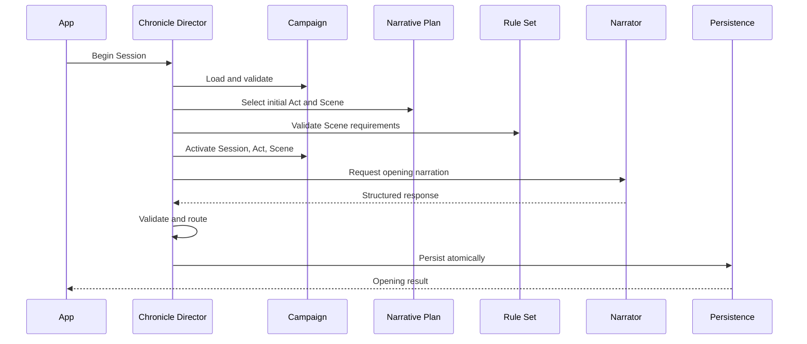
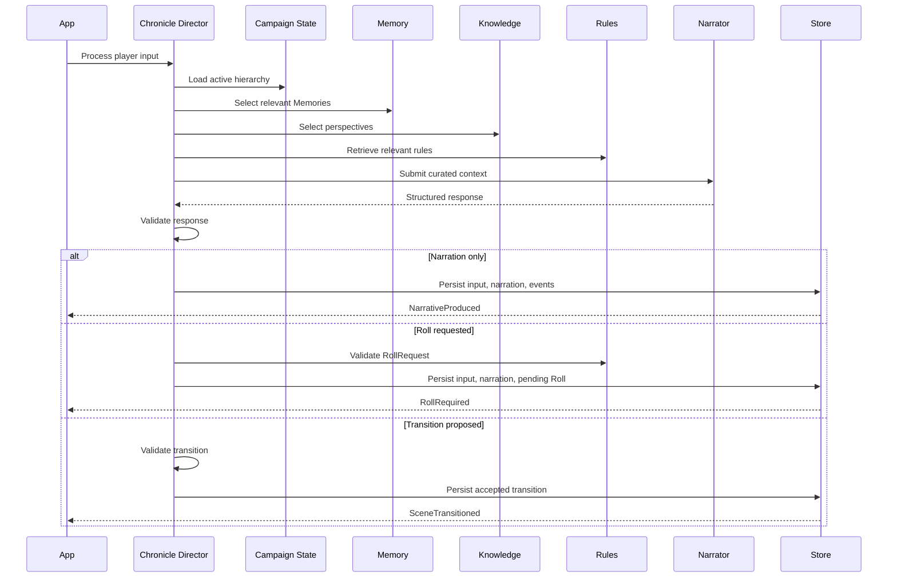

> **"The Chronicle Director does not tell the story. It makes sure the right story can be told now."**

# Chronicle Director

## Abstract

This RFC defines the Chronicle Director.

The Chronicle Director is the central application orchestration role responsible for preparing, coordinating, and advancing the active Campaign experience.

It selects the active narrative boundary, assembles relevant context, coordinates Rule Set behavior, invokes the Narrator, processes structured results, pauses for Dice Rolls, validates transitions, and preserves consistency across the Campaign.

The Chronicle Director is not a Narrator, a Rule Set, a persistence layer, or an autonomous agent.

## 1. Purpose

Chronicle separates responsibilities that are commonly collapsed into one prompt or one AI agent.

The Chronicle Director exists to coordinate those responsibilities without owning them.

It answers operational questions such as:

- Which Session is active?
- Which Act is active?
- Which Scene is active?
- Who is present?
- What is the immediate objective?
- Which Character State matters?
- Which Memories are relevant?
- What does each Character know?
- Which rules are needed?
- Is the narrative waiting for a Roll?
- May the Scene transition?
- Does the Narrative Plan need revision?

The Chronicle Director provides direction.

It does not replace the modules it coordinates.

## 2. Scope

This RFC defines:

- Chronicle Director classification;
- responsibilities;
- prohibited responsibilities;
- orchestration inputs;
- orchestration outputs;
- turn processing;
- context selection;
- Scene preparation;
- Narrator invocation;
- structured response processing;
- Dice Roll coordination;
- post-roll continuation;
- Scene and Act transitions;
- Narrative Plan interaction;
- stale-response detection;
- concurrency;
- idempotency;
- recovery;
- observability;
- testing.

This RFC does not define:

- exact application interfaces;
- exact provider contracts;
- exact prompt templates;
- exact UI behavior;
- Rule Set mechanics;
- database implementation;
- autonomous background simulation.

## 3. Classification

The Chronicle Director is an application-level orchestration service with domain-aware policies.

It MAY coordinate domain services and application ports.

It is not:

- a persistent entity;
- an Aggregate Root;
- a provider-specific agent;
- a generic service locator;
- a state machine replacing the Session model;
- the source of Campaign truth.

## 4. Canonical Name

The canonical architectural name is:

```text
Chronicle Director
```

The canonical code identifier is:

```text
ChronicleDirector
```

The approved Portuguese product name is:

```text
Diretor da Crônica
```

The abbreviated term `Director` MAY appear in local implementation context when unambiguous.

## 5. Core Responsibility

The Chronicle Director coordinates one active narrative operation at a time.

Its primary responsibility is:

> Prepare the smallest complete and authoritative context required for the next valid narrative step.

The Director MUST use Chronicle state rather than asking Narrative Intelligence to infer the Campaign.

## 6. Responsibilities

The Chronicle Director MUST coordinate:

- Campaign loading;
- active Session resolution;
- active Act resolution;
- active Scene resolution;
- Scene participant selection;
- immediate objective;
- local conflict;
- Character snapshots;
- Relationship selection;
- Character Knowledge selection;
- Secret filtering;
- Campaign Memory selection;
- Rule Set knowledge requests;
- Campaign Preferences;
- Narrative Plan guidance;
- Prompt Builder input;
- Narrator invocation;
- response validation;
- Narrative Event routing;
- Roll Request creation;
- continuation after Roll;
- Scene transition;
- Act transition;
- plan revision request;
- operation persistence and recovery.

## 7. Prohibited Responsibilities

The Chronicle Director MUST NOT:

- write player-facing narrative prose;
- generate random values;
- interpret raw dice independently from the Rule Set;
- directly mutate Character Sheets without domain operations;
- own Campaign Memory storage;
- become the persistence implementation;
- query provider-specific conversation history as truth;
- define Rule Set mechanics;
- replace the Archivist;
- expose hidden Campaign data;
- bypass application use cases;
- create permanent facts from unvalidated prose;
- act as an unrestricted autonomous agent.

## 8. Orchestration Principle

The Director follows:

```text
Load
    ↓
Validate
    ↓
Select
    ↓
Assemble
    ↓
Invoke
    ↓
Validate
    ↓
Route
    ↓
Persist
```

At no point may provider output skip validation and mutate persistent state directly.

## 9. Director Inputs

A Director operation MAY receive:

- Campaign identifier;
- operation identifier;
- expected Campaign version;
- player input;
- active Session identifier;
- continuation reason;
- resolved Roll identifier;
- requested transition;
- operation profile;
- cancellation or recovery instruction.

The Director MUST load authoritative state from Chronicle.

The caller MUST NOT provide authoritative domain snapshots as trusted truth.

## 10. Director Outputs

A Director operation SHOULD return a structured application result.

Possible result categories:

```text
NarrativeProduced
RollRequired
SceneTransitioned
ActTransitioned
SessionInterrupted
PlanRevisionRequired
NoAction
RecoverableFailure
TerminalFailure
```

The result MAY include:

- player-visible Messages;
- pending Roll view;
- updated active hierarchy;
- recoverable action;
- operation metadata;
- safe error information.

## 11. Operation Profiles

The Chronicle Director SHOULD support explicit operation profiles.

Initial profiles MAY include:

```text
BeginSession
NarrateScene
ProcessPlayerInput
ContinueAfterRoll
PrepareNextScene
ResumeSession
RequestPlanRevision
```

Each profile determines:

- required context;
- allowed outputs;
- Memory budget;
- Rule knowledge needs;
- transition permissions;
- validation rules.

## 12. Active Hierarchy Resolution

Before narrative work, the Director MUST resolve:

```text
Campaign
    ↓
Session
    ↓
Act
    ↓
Scene
```

The active path MUST be explicit and valid.

If the hierarchy is inconsistent, the Director MUST stop and return a recoverable or terminal failure.

It MUST NOT ask the Narrator to repair domain state.

## 13. Session Preconditions

For normal player input, the Director MUST verify:

- Campaign is playable;
- Session is active;
- Session is not finalizing;
- no unresolved Roll blocks input;
- Rule Set is available;
- Campaign version is known;
- active Act exists;
- active Scene exists;
- Player Character is valid.

## 14. Scene Preconditions

The Director MUST verify:

- Scene belongs to the active Act;
- Scene status permits the operation;
- Player Character is a participant;
- participant references are valid;
- context version is current;
- hidden-information rules are available;
- no conflicting transition exists;
- no unresolved Roll exists unless the profile is `ContinueAfterRoll`.

## 15. Context Assembly Ownership

The Chronicle Director owns context selection policy.

The Prompt Builder owns provider-ready request construction.

These responsibilities MUST remain separate.

```text
Chronicle Director:
What context is relevant?

Prompt Builder:
How is that context represented for the provider?
```

## 16. Context Components

A narrative context MAY include:

- Campaign public summary;
- Campaign Preferences;
- active Session;
- active Act;
- active Scene;
- immediate objective;
- active conflict;
- location;
- Scene participants;
- Character snapshots;
- Relationships;
- Character Knowledge;
- visible Secrets;
- Campaign Memories;
- recent Scene Messages;
- Rule Set terminology;
- relevant rule knowledge;
- Narrative Plan guidance;
- pending or resolved Roll information;
- prohibited reveal instructions;
- contract version;
- context version.

## 17. Minimal Context Rule

The Director MUST select only the context required for the active operation.

It MUST NOT include:

- every Character;
- every Memory;
- every Session;
- every Secret;
- the complete Rule Set;
- unrelated future Plan content;
- provider credentials;
- debug metadata;
- raw persistence records.

## 18. Scene as Primary Boundary

The active Scene is the primary context boundary.

The Director SHOULD begin selection from:

- Scene participants;
- Scene objective;
- Scene location;
- Scene conflict;
- Scene-local state.

Campaign-wide context is added only when relevant.

## 19. Participant Selection

Participants MUST come from explicit `SceneParticipant` records.

The Director MUST NOT infer participation from:

- recent mentions;
- Act membership;
- Narrative Plan role;
- proximity in prior Scene;
- provider suggestion.

A provider MAY propose an NPC entry.

Chronicle validates and updates Scene participation before treating the Character as present.

## 20. Character Snapshot Selection

For each participant, the Director SHOULD request an operation-specific snapshot.

A Narrator snapshot MAY include:

- identity;
- visible appearance;
- current state;
- relevant Narrative Profile;
- local objective;
- relevant Relationships;
- relevant Knowledge;
- relevant Memories;
- permitted Secrets;
- portrayal guidance.

The complete Character entity SHOULD NOT be sent by default.

## 21. Relationship Selection

The Director SHOULD select Relationships when they affect:

- participant behavior;
- social tension;
- immediate objective;
- prior promise;
- active conflict;
- expected reaction.

It SHOULD preserve directionality.

Example:

```text
Jonas → Player
```

is distinct from:

```text
Player → Jonas
```

## 22. Character Knowledge Selection

The Director MUST distinguish:

- Campaign Truth visible in the Scene;
- what each Character knows;
- what each Character believes;
- what each Character suspects;
- what each Character misunderstands;
- what the player may know.

The Narrator request SHOULD make those perspectives explicit.

## 23. Secret Filtering

Secrets MUST be filtered before context crosses a provider or presentation boundary.

The Director MAY include a Secret only when:

- the active operation requires it;
- the recipient role is authorized;
- reveal restrictions are explicit;
- player-visible output can be safely constrained.

## 24. Memory Selection

The Director requests relevant Memories from the Campaign Memory selector.

Selection SHOULD consider:

- active Scene;
- participants;
- objective;
- conflict;
- location;
- Relationships;
- Character Knowledge;
- active plan;
- current state;
- relevance;
- importance;
- age;
- context budget.

## 25. Rule Knowledge Selection

The Director requests only relevant Rule Set knowledge.

The request MAY use:

- operation key;
- player intent;
- Character fields;
- active Scene conditions;
- Campaign Preferences;
- language;
- result budget.

The Director MUST NOT know whether retrieval uses RAG.

## 26. Narrative Plan Selection

The Director MAY receive hidden Plan guidance such as:

- current Act purpose;
- available planned Scenes;
- relevant NPC roles;
- pending mystery;
- possible transition;
- pacing recommendation.

It MUST NOT treat planned content as completed truth.

## 27. Recent Message Window

The Director MAY include recent Scene Messages for immediate continuity.

The message window MUST be bounded.

Older relevant meaning SHOULD come from Campaign Memories and explicit state.

The complete Campaign transcript MUST NOT be sent on every turn.

## 28. Context Budget

Every Director operation SHOULD have a context budget.

The budget MAY govern:

- maximum Characters;
- maximum Memories;
- maximum Messages;
- maximum rule knowledge;
- token estimate;
- structured payload size.

When the budget is exceeded, the Director SHOULD prioritize:

1. active Scene truth;
2. Player Character state;
3. participant state;
4. unresolved Roll information;
5. critical Knowledge and Secrets;
6. high-relevance Memories;
7. Rule Set knowledge;
8. recent Messages;
9. Narrative Plan guidance.

## 29. Begin Session Workflow



## 30. Process Player Input Workflow



## 31. Player Input Validation

Before invoking the Narrator, the Director SHOULD validate:

- input is nonempty where required;
- Session accepts input;
- no Roll is pending;
- input size is allowed;
- operation identifier is valid;
- request is not a duplicate;
- active context version is current.

The Director does not need to mechanically validate every fictional action before narration.

It MUST validate state-changing mechanical intent before application.

## 32. Narrator Invocation

The Director invokes the Narrator through a provider-neutral port.

The request MUST include:

- operation identifier;
- contract version;
- Campaign version;
- Scene context version;
- operation profile;
- allowed output types;
- curated context;
- hidden-information constraints;
- continuation rules.

## 33. Narrator Response Categories

A Narrator response MAY contain:

- narrative prose;
- multiple narrative blocks;
- Roll Request;
- Narrative Events;
- Character entry proposal;
- Character exit proposal;
- Scene completion proposal;
- Scene transition proposal;
- warning or inability result.

The response MUST be structured.

## 34. Response Validation

The Director coordinates validation of:

- contract version;
- operation identifier;
- Campaign version;
- Scene context version;
- allowed event types;
- Character references;
- visibility;
- Roll Request;
- transition proposal;
- response size;
- prohibited hidden information.

Invalid responses MUST NOT alter persistent state.

## 35. Narrative Persistence

Accepted player input and Narrator output SHOULD be persisted atomically with accepted Narrative Events for the turn.

The application MUST NOT display a successful committed turn if persistence failed.

## 36. Narrative Event Routing

The Director routes validated Narrative Events to the responsible modules.

Examples:

```text
RollRequested → Dice module
CharacterEntryProposed → Session/Scene module
RelationshipChangeProposed → validation workflow
KnowledgeAcquiredProposed → knowledge workflow
SceneTransitionProposed → lifecycle workflow
```

The Director MUST NOT implement every event internally.

## 37. Immediate and Deferred Changes

The Director MUST classify changes as:

```text
Immediate
Deferred
Rejected
```

### Immediate

Required before the next narrative step.

Examples:

- pending Roll;
- Character enters Scene;
- Character learns a door code;
- wound applied from resolved Roll.

### Deferred

May wait for finalization.

Examples:

- long-term trust change;
- Session Memory proposal;
- experience award.

### Rejected

Invalid, unsupported, contradictory, or unauthorized.

## 38. Roll Request Coordination

When a valid Roll Request is accepted, the Director MUST:

1. stop normal narration at the interruption point;
2. create the Dice Roll entity;
3. persist the request;
4. mark Scene and Session as `AwaitingRoll`;
5. return a `RollRequired` result;
6. prevent additional narrative input.

## 39. Continue After Roll

After the Dice module resolves a Roll, the Director receives:

- Dice Roll identifier;
- authoritative result;
- applied immediate consequences;
- expected Scene context version;
- continuation operation identifier.

The Director MUST verify:

- Roll belongs to active Scene;
- Roll is resolved;
- continuation was not already applied;
- Scene remains valid;
- Session is not finalizing;
- result version matches Rule Set.

## 40. Post-Roll Context

The continuation context SHOULD prioritize:

- original interrupted action;
- Roll Request;
- Roll Result;
- applied consequences;
- immediate Character reactions;
- active Scene;
- relevant Knowledge;
- permitted Secrets;
- transition constraints.

The Narrator MUST continue from the interrupted moment.

## 41. Continuation Failure

If Narrator continuation fails:

- the Roll remains resolved;
- the Scene remains blocked in a recoverable continuation state;
- no reroll occurs;
- the continuation operation may retry;
- the UI must distinguish continuation failure from Roll failure.

## 42. Scene Completion Proposal

The Narrator MAY propose Scene completion.

The Director validates:

- Scene objective state;
- unresolved Roll absence;
- unresolved immediate consequence;
- participant exits;
- Campaign State changes;
- next Scene availability;
- player action;
- Narrative Plan compatibility.

The provider proposal alone does not complete the Scene.

## 43. Scene Transition Decision

The Director MAY transition to:

- planned next Scene;
- dynamically created Scene;
- interrupted state;
- Act completion;
- Session finalization boundary.

A transition MUST preserve:

- completed Scene history;
- participant isolation;
- local consequences;
- active hierarchy invariants;
- context versioning.

## 44. Character Entry

A Character entry proposal MUST be validated.

The Director verifies:

- Character exists;
- Character belongs to Campaign;
- visibility permits entry;
- location and Plan allow it;
- hidden information is protected;
- Scene participant membership is updated atomically.

Mentioning a Character in prose does not add them to the Scene.

## 45. Character Exit

A Character exit proposal SHOULD define:

- Character;
- reason;
- exit state;
- destination when known;
- immediate consequence.

The Character remains persistent after leaving the Scene.

## 46. Act Transition

The Director MAY complete or interrupt an Act when:

- its dramatic objective resolves;
- remaining planned Scenes become obsolete;
- player action changes direction;
- Session reaches a valid stopping point;
- a new Act is prepared.

Only one Act may be active in the MVP.

## 47. Session Resume

When resuming, the Director MUST determine whether the Session is:

```text
ReadyForInput
AwaitingRoll
AwaitingContinuation
RecoveringTransition
Finalizing
```

It MUST return the matching application state.

It MUST NOT invoke the Narrator automatically when user action is still required.

## 48. Narrative Plan Revision Trigger

The Director MAY request plan revision when:

- planned next Scenes are invalid;
- major NPC status changed;
- Secret was revealed early;
- the central objective changed;
- player choice invalidated future structure;
- the current Plan version no longer supports coherent continuation.

The Director SHOULD provide a structured reason and evidence.

## 49. Plan Revision Boundary

The Director does not directly rewrite the Narrative Plan through ad hoc mutation.

It invokes a plan revision use case.

The Campaign continues only when:

- current Scene remains playable without revision;
- or the revision is validated and applied.

## 50. Operation State

Long-running Director operations SHOULD persist operational state.

Possible statuses:

```text
Requested
Loading
PreparingContext
AwaitingProvider
ValidatingResponse
ReadyToCommit
Committed
Failed
Cancelled
```

Operational state supports recovery.

It is not Campaign truth.

## 51. Idempotency

Director operations that may retry MUST be idempotent.

Examples:

- begin Session;
- process player input;
- apply Narrator response;
- create Roll Request;
- continue after Roll;
- transition Scene;
- request plan revision.

The same operation identifier MUST NOT append duplicate Messages or apply duplicate events.

## 52. Request Fingerprint

A request fingerprint SHOULD include:

- operation profile;
- Campaign identifier;
- Campaign version;
- Session identifier;
- Scene identifier;
- Scene context version;
- player input or Roll identifier.

The same operation identifier with conflicting content MUST fail explicitly.

## 53. Optimistic Concurrency

Before commit, the Director MUST revalidate:

- Campaign version;
- Session version;
- Act version;
- Scene version;
- context version;
- pending Roll state;
- relevant Character versions where required.

Stale provider output MUST NOT be applied.

## 54. Stale Response

A Narrator response is stale when:

- Campaign changed;
- active Scene changed;
- Scene context version changed;
- participant set changed;
- pending Roll changed;
- operation already completed;
- Session began finalization.

The Director MUST reject or regenerate stale responses.

## 55. External Calls and Transactions

The Director MUST NOT hold a long database transaction during provider calls.

Recommended workflow:

1. load state;
2. validate preconditions;
3. persist operation intent when needed;
4. assemble context;
5. invoke provider;
6. validate response;
7. reload versions;
8. commit accepted changes atomically.

## 56. Recovery

### 56.1 Failure Before Provider Call

No narrative result is accepted.

The operation may retry.

### 56.2 Failure During Provider Call

Campaign remains at prior checkpoint.

The operation remains pending or failed.

### 56.3 Failure After Provider Response

The response MAY be retained temporarily.

It MUST be revalidated before commit.

### 56.4 Failure During Commit

The transaction rolls back.

The response may retry if still current.

### 56.5 Failure After Commit

The same operation identifier returns the committed result.

## 57. Error Categories

Director errors SHOULD include:

```text
InvalidCampaignState
InvalidSessionState
InvalidSceneState
PendingRollConflict
ContextAssemblyFailure
RuleKnowledgeFailure
NarratorFailure
ContractValidationFailure
StaleResponse
ConcurrencyConflict
PersistenceFailure
PlanRevisionRequired
RecoveryRequired
```

The UI receives safe product-level errors.

## 58. Degraded Behavior

The Director MAY use degraded behavior when noncritical dependencies fail.

Examples:

- omit optional low-relevance Memories;
- use deterministic Rule Set logic without retrieval;
- return a recoverable provider failure;
- preserve player input for retry.

It MUST NOT:

- invent rules;
- fabricate persisted narrative;
- bypass hidden-information filtering;
- pretend the turn committed.

## 59. Observability

The Director SHOULD record:

- operation profile;
- context size;
- selected Memory count;
- selected Character count;
- rule knowledge count;
- provider latency;
- validation failures;
- stale responses;
- Roll requests;
- transitions;
- retries;
- persistence duration;
- final result category.

Logs MUST avoid unnecessary hidden Campaign content.

## 60. Explainability

For debugging, Chronicle SHOULD be able to explain operationally:

- why a Character was included;
- why a Memory was selected;
- why a Roll was requested;
- why a transition was rejected;
- why a response was stale;
- why plan revision was required.

This explainability is internal and structured.

It is not provider chain-of-thought.

## 61. Testing Strategy

### Unit Tests

Test:

- precondition policies;
- context selection;
- participant isolation;
- Memory prioritization;
- response routing;
- transition decisions;
- stale response detection.

### Application Tests

Test full Director workflows using test doubles for:

- Narrator;
- repositories;
- Rule knowledge;
- Memory selector;
- Rule Set;
- persistence.

### Contract Tests

Test request and response compatibility with the Narrator adapter.

### Integration Tests

Test:

- provider adapter;
- persistence;
- retries;
- recovery;
- application restart.

## 62. Required Test Cases

Tests MUST cover:

- valid player turn;
- invalid active hierarchy;
- pending Roll blocking input;
- explicit Scene participant selection;
- hidden Secret filtering;
- Character-specific Knowledge context;
- context budget enforcement;
- Narrator response with narration only;
- valid Roll Request;
- invalid Roll Request;
- duplicate response application;
- stale response;
- post-roll continuation;
- continuation failure;
- Scene transition;
- Character entry;
- dynamic Scene creation;
- plan revision trigger;
- concurrency conflict;
- provider timeout;
- commit retry;
- application restart recovery.

## 63. Performance Expectations

The Director SHOULD avoid loading the complete Campaign.

A normal player turn SHOULD load only:

- active hierarchy;
- active Scene participants;
- relevant Character state;
- selected Relationships;
- selected Knowledge;
- selected Memories;
- recent Scene Messages;
- relevant rules;
- bounded Plan guidance.

The active operation SHOULD remain predictable as Campaign history grows.

## 64. Security Boundaries

The Director MUST enforce:

- least-context provider access;
- hidden-information filtering;
- no provider repository access;
- no secret credentials in context;
- untrusted response validation;
- safe logging;
- operation authorization when future multi-user support exists.

## 65. Generic Service Locator Prohibition

The Chronicle Director MUST NOT become an object that exposes every module arbitrarily.

Its dependencies SHOULD be explicit.

Examples:

```text
CampaignRepository
SessionRepository
CampaignMemorySelector
CharacterContextService
RuleSetRegistry
RuleKnowledgePort
Narrator
ResponseValidator
UnitOfWork
```

The final interface set will be refined later.

## 66. Autonomous Agent Prohibition

The MVP Chronicle Director MUST NOT run indefinitely or take unrestricted actions without player or application-triggered use cases.

It operates within bounded workflows.

Future background planning MAY be introduced only through explicit schedules, permissions, limits, and RFCs.

## 67. Current Delivery Decision

The MVP adopts:

- one Chronicle Director;
- bounded application workflows;
- one active narrative operation at a time;
- Scene-first context selection;
- explicit participants;
- bounded Memory and Message context;
- provider-neutral Narrator port;
- structured response validation;
- Chronicle-controlled Roll interruption;
- validated Scene and Act transitions;
- plan revision triggers;
- operation-level idempotency;
- optimistic concurrency;
- no autonomous world simulation;
- no multiple competing Directors;
- no provider-side persistent thread as Campaign truth.

## 68. Architecture Horizon

Future evolution MAY include:

- multiplayer coordination;
- parallel Scenes;
- multiple narrative channels;
- background Campaign planning;
- specialist Directors;
- streaming coordination;
- spectator context;
- voice orchestration;
- multimedia timing;
- remote distributed execution.

The MVP MUST NOT implement these capabilities without a later milestone.

## 69. Open Questions

The following remain open:

- Which Director methods or use cases should be public?
- Should context selection live entirely inside the Director or in dedicated policies?
- How should operation profiles be serialized?
- What exact context budget should each profile use?
- Should the Director invoke plan revision synchronously?
- How should provider response repair be coordinated?
- Which Narrative Events are permitted during normal narration?
- How should immediate Relationship changes be classified?
- Should the Director persist an internal decision trace?
- How should local-first application shutdown mark interruption?
- Which dependencies belong directly to the Director versus use-case services?
- Should Begin Session narration use the same Narrator contract as normal turns?
- How should dynamic NPC promotion be coordinated?
- What is the minimum fallback when rule knowledge retrieval fails?

These questions require RFC-0016, RFC-0020, RFC-0021, RFC-0024, RFC-0025, and technology ADRs.

## 70. Compliance Checklist

A Chronicle Director implementation complies when:

- it orchestrates rather than owns all behavior;
- active hierarchy is explicit;
- Scene is the primary context boundary;
- participants are explicit;
- hidden information is filtered;
- Character Knowledge is perspective-specific;
- context is bounded;
- rules are requested through Rule Set boundaries;
- Narrator output is structured and validated;
- pending Rolls block input;
- Roll results are preserved;
- transitions are validated;
- stale responses are rejected;
- retries are idempotent;
- provider calls do not hold long transactions;
- provider-specific behavior remains outside the Application core.

## 71. Final Principle

The Chronicle Director is not the author of the Campaign.

It is the discipline that keeps every author, rule, memory, and consequence in the right place.
