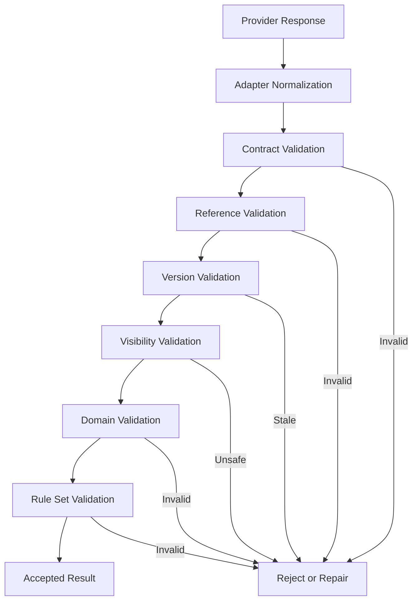

> **"Narrative Intelligence may imagine possibilities. Chronicle decides which possibilities become part of the Campaign."**

# Narrative Intelligence Architecture

## Abstract

This RFC defines Chronicle's Narrative Intelligence architecture.

Narrative Intelligence is the provider-neutral capability used to generate narrative prose, Campaign proposals, Session finalization proposals, plan revisions, and other structured narrative outputs.

It is intentionally nondeterministic and replaceable.

Chronicle remains authoritative for domain state, mechanical rules, randomness, persistence, validation, visibility, and lifecycle transitions.

The architecture defined here prevents provider SDKs, conversation threads, model-specific behavior, and prompt implementation details from becoming part of Chronicle's core domain.

## 1. Purpose

Chronicle needs generative capabilities for:

- Scene narration;
- Character portrayal;
- reactions to player input;
- Campaign generation;
- NPC generation;
- Campaign finalization proposals;
- Memory proposals;
- Relationship proposals;
- Character Knowledge proposals;
- Narrative Plan revision;
- structured repair of invalid output.

These capabilities may be implemented by:

- a remote large language model;
- a local model;
- a deterministic test double;
- a future specialized narrative engine;
- a hybrid system.

Chronicle MUST remain functional as an architecture when one implementation is replaced by another.

## 2. Scope

This RFC defines:

- Narrative Intelligence as an architectural boundary;
- capability-specific ports;
- operation profiles;
- provider adapters;
- request and response contracts;
- structured output;
- validation;
- repair;
- provider metadata;
- context boundaries;
- model selection;
- provider configuration;
- failure isolation;
- privacy;
- observability;
- testing;
- replacement and fallback.

This RFC does not define:

- exact prompts;
- exact JSON schemas;
- exact provider SDKs;
- exact model names;
- pricing strategy;
- provider account setup;
- token-counting implementation;
- concrete local-model runtime;
- full moderation policy.

## 3. Narrative Intelligence Definition

`NarrativeIntelligence` is a family of replaceable application-facing capabilities that transform curated context into structured narrative proposals.

The general model is:

```text
Curated Chronicle Context
        ↓
Narrative Intelligence Capability
        ↓
Structured Untrusted Proposal
        ↓
Chronicle Validation
        ↓
Accepted Result or Rejection
```

Narrative Intelligence never becomes the source of Campaign truth.

## 4. Provider Neutrality

Chronicle Core MUST NOT depend on:

- model names;
- provider SDK classes;
- provider thread identifiers;
- provider assistant identifiers;
- provider file stores;
- provider-specific tool-call formats;
- provider-specific retry headers;
- provider-specific conversation history.

These details belong in infrastructure adapters.

## 5. Capability-Oriented Design

Chronicle SHOULD define separate capability ports rather than one unrestricted general-purpose AI service.

Initial capabilities include:

```text
Narrator
CampaignGenerator
Archivist
PlanReviser
StructuredOutputRepairer
```

Future capabilities MAY include:

```text
CharacterPortrayalEvaluator
CampaignSummarizer
LocalizationAssistant
MediaPromptGenerator
```

A capability port defines purpose, inputs, allowed outputs, and constraints.

## 6. Narrator Capability

The `Narrator` produces the immediate player-facing narrative for an active Scene.

It MAY:

- narrate;
- portray Characters;
- react to player input;
- propose a Dice Roll;
- propose Narrative Events;
- propose Scene transition;
- propose participant entry or exit.

It MUST NOT:

- generate authoritative randomness;
- persist state;
- invent unsupported mechanics;
- expose hidden information;
- continue beyond an unresolved Roll;
- finalize a Session;
- mutate the Narrative Plan directly.

## 7. Campaign Generator Capability

The `CampaignGenerator` proposes:

- Campaign premise;
- tone;
- themes;
- central conflict;
- Acts;
- planned Scenes;
- NPCs;
- Relationships;
- Secrets;
- mysteries;
- possible outcomes.

Its proposal is validated under RFC-0011.

## 8. Archivist Capability

The `Archivist` proposes durable meaning from a played Session.

It MAY propose:

- Session summary;
- Campaign Memories;
- Character progression evidence;
- Relationship changes;
- Character Knowledge changes;
- Secret revelation;
- unresolved consequences;
- Narrative Plan revision request.

It does not apply those changes.

## 9. Plan Reviser Capability

The `PlanReviser` proposes a new Narrative Plan version after Campaign divergence.

It receives:

- current Plan;
- accepted Campaign State;
- relevant Memories;
- triggering evidence;
- constraints.

It MUST preserve completed history.

## 10. Structured Output Repairer

A `StructuredOutputRepairer` MAY repair malformed provider output.

It receives:

- invalid structured output;
- validation errors;
- target contract version;
- bounded original context when required.

It returns a corrected proposal.

Repair remains untrusted and must be validated again.

## 11. Capability Port Shape

Each capability port SHOULD expose a narrow operation.

Conceptually:

```text
NarrativeCapability<TRequest, TResponse>
```

A capability request SHOULD include:

- Chronicle OperationId;
- contract version;
- operation profile;
- locale;
- curated context;
- constraints;
- context version;
- expected output schema identifier.

A response SHOULD include:

- provider-independent structured proposal;
- response metadata;
- warnings;
- completion status.

## 12. Operation Profile

An operation profile tells Narrative Intelligence what bounded task it is performing.

Examples:

```text
OpenScene
ContinueScene
ReactToPlayerInput
ContinueAfterRoll
GenerateCampaign
FinalizeSession
RevisePlan
RepairStructuredOutput
```

Profiles SHOULD define:

- allowed inputs;
- allowed outputs;
- context budget;
- prose expectations;
- hidden-information constraints;
- whether a Roll Request is permitted;
- whether transition proposals are permitted;
- output schema.

## 13. Request Identity

Every request MUST include Chronicle's OperationId or a stable child operation identifier.

Provider request identifiers MAY be recorded.

Chronicle identity remains authoritative for:

- retries;
- deduplication;
- response matching;
- recovery;
- diagnostics.

## 14. Contract Versioning

Every capability request and response MUST reference a contract version.

Contract versioning protects Chronicle from:

- stale adapters;
- incompatible structured output;
- renamed fields;
- changed event types;
- changed validation semantics.

Unsupported contract versions MUST fail explicitly.

## 15. Structured Output Requirement

State-relevant output MUST be structured.

Free-form prose is allowed only in explicitly designated fields.

Examples of structured fields:

- Roll Request;
- Character reference;
- Narrative Event;
- Scene transition proposal;
- Memory proposal;
- Relationship proposal;
- Knowledge proposal;
- Plan revision operation.

Chronicle MUST NOT infer persistent mutations from arbitrary prose.

## 16. Narrative Prose

Narrative prose is player-facing generated text.

It SHOULD be associated with:

- OperationId;
- Session;
- Scene;
- speaker role;
- ordering metadata;
- visibility;
- contract response.

Narrative prose remains untrusted until the response is accepted.

## 17. Response Envelope

A provider-neutral response envelope SHOULD contain:

```text
NarrativeResponse
├── OperationId
├── ContractVersion
├── CampaignVersion
├── ContextVersion
├── CompletionStatus
├── NarrativeBlocks
├── StructuredEvents
├── Warnings
└── ProviderMetadata
```

Provider metadata MUST remain separate from domain content.

## 18. Completion Status

Suggested completion statuses:

```text
Completed
Partial
Refused
Unable
Invalid
```

### Completed

The requested capability returned a complete candidate.

### Partial

Some valid content exists, but required output may be missing.

### Refused

The provider declined the request.

### Unable

The provider could not complete the task.

### Invalid

The adapter detected unusable output.

Chronicle decides whether repair or retry is appropriate.

## 19. Provider Metadata

Provider metadata MAY include:

- provider key;
- model key;
- provider request identifier;
- response timestamp;
- latency;
- usage information;
- finish reason;
- adapter version.

It MUST NOT enter Domain entities as business meaning.

Historical operation diagnostics MAY retain it according to policy.

## 20. Provider Adapter

A Provider Adapter translates between Chronicle contracts and one provider implementation.

It is responsible for:

- authentication;
- provider request format;
- model selection;
- prompt transport;
- structured-output feature mapping;
- provider-specific tool mapping;
- timeout handling;
- provider errors;
- usage metadata;
- response normalization.

It MUST NOT decide Domain acceptance.

## 21. Adapter Boundary


The Application sees Chronicle contracts.

Only the adapter sees provider-specific contracts.

## 22. Provider Registry

Infrastructure MAY provide a `NarrativeProviderRegistry`.

The registry MAY resolve:

- configured provider;
- available capabilities;
- model profile;
- locale support;
- structured-output support;
- health state.

The registry is not a Domain concept.

## 23. Capability Configuration

Configuration SHOULD be capability-specific.

Example:

```text
Narrator:
    provider = A
    modelProfile = interactive

Archivist:
    provider = A
    modelProfile = analytical

CampaignGenerator:
    provider = B
    modelProfile = long-context
```

The MVP MAY use one provider and one model for all capabilities.

The architecture SHOULD not require that.

## 24. Model Profile

Chronicle SHOULD use stable model profiles rather than model names in Application code.

Examples:

```text
InteractiveNarration
StructuredGeneration
DeepFinalization
LowCostRepair
LocalFallback
```

Infrastructure maps each profile to a concrete model.

## 25. Model Selection

Model selection MAY consider:

- capability;
- context size;
- structured-output reliability;
- latency;
- configured cost limit;
- language;
- local availability;
- privacy preference.

Model selection MUST NOT alter Domain rules.

## 26. Prompt Builder Boundary

The Prompt Builder converts Chronicle's curated capability context into provider-facing instructions and content.

The Chronicle Director decides:

```text
What context is relevant
```

The Prompt Builder decides:

```text
How that context is represented
```

The Provider Adapter decides:

```text
How it is sent to this provider
```

These responsibilities MUST remain separate.

## 27. Prompt Template Ownership

Prompt templates belong to the Application or Infrastructure boundary, depending on implementation.

They MUST be:

- versioned;
- testable;
- capability-specific;
- independent from Domain entities;
- free from embedded secrets;
- aligned with structured contracts.

Prompts are implementation assets, not authoritative rules.

## 28. System Instructions

Capability prompts SHOULD define:

- role;
- purpose;
- allowed outputs;
- prohibited behavior;
- hidden-information rules;
- structured response format;
- interruption rules;
- Rule Set terminology expectations;
- uncertainty behavior.

The provider's compliance is not trusted without output validation.

## 29. Context Assembly

Narrative Intelligence MUST receive curated context.

The Application SHOULD provide:

- active operation profile;
- relevant Campaign State;
- active Scene;
- explicit participants;
- relevant Character snapshots;
- relevant Relationships;
- Character Knowledge;
- permitted Secrets;
- selected Campaign Memories;
- recent Messages;
- relevant Narrative Plan guidance;
- relevant Rule Set knowledge;
- Campaign Preferences;
- output constraints.

## 30. Context Exclusions

Requests MUST NOT include by default:

- full Campaign history;
- all Characters;
- all Secrets;
- full Narrative Plan;
- complete Rule Set;
- irrelevant Memories;
- provider credentials;
- persistence metadata;
- sourcebook text unrelated to the operation.

## 31. Context Budget

Each capability MUST have an explicit budget.

A budget MAY limit:

- estimated input tokens;
- maximum Memories;
- maximum Messages;
- maximum Character snapshots;
- maximum rule knowledge items;
- maximum output size.

The Application selects and prioritizes content before provider invocation.

## 32. Budget Overflow

When context exceeds the budget, Chronicle SHOULD:

1. preserve required active state;
2. preserve hidden-information constraints;
3. preserve unresolved Roll information;
4. retain highest-value Memories;
5. retain relevant Character Knowledge;
6. reduce recent Message window;
7. reduce optional descriptive content;
8. fail explicitly if required context still does not fit.

It MUST NOT silently omit a critical rule or participant.

## 33. Context Compression

Context MAY be compressed through:

- structured summaries;
- Character snapshots;
- Scene summaries;
- Act summaries;
- Memory selection;
- field filtering;
- rule summaries.

Compression output is contextual input.

It MUST NOT become authoritative Campaign truth without validation.

## 34. Provider Conversation State

Provider-side conversation state MUST NOT be authoritative.

Chronicle MAY use stateless calls.

If provider threads are used for optimization:

- thread identity remains infrastructure metadata;
- Chronicle still sends sufficient authoritative context;
- thread loss must be recoverable;
- thread contents must not replace persistence;
- stale thread state must not override current Campaign versions.

## 35. Stateless Preference

The MVP SHOULD prefer stateless or Chronicle-reconstructable interactions.

This simplifies:

- provider replacement;
- recovery;
- testing;
- stale-state control;
- local model support;
- privacy.

## 36. Knowledge Retrieval

Rule knowledge and Campaign Memory retrieval occur before Narrative Intelligence invocation.

The provider MAY request clarification or report missing knowledge.

It MUST NOT directly query repositories, vector databases, or Campaign storage.

## 37. Tool Use

A provider MAY support provider-side tools.

Chronicle SHOULD avoid exposing unrestricted tools.

Allowed tool-like interactions, if used, MUST be:

- capability-specific;
- bounded;
- read-only unless routed through validated application commands;
- audited;
- independent from provider-specific semantics at the Application boundary.

The MVP does not require provider-side tool calling.

## 38. No Direct Persistence Tool

Narrative Intelligence MUST NOT receive a tool that writes directly to Chronicle persistence.

All mutations pass through structured proposals and application validation.

## 39. Narrative Events

Narrator output MAY include structured Narrative Events.

Examples:

```text
RollRequested
CharacterEntryProposed
CharacterExitProposed
KnowledgeAcquisitionProposed
SceneCompletionProposed
PlanRevisionSuggested
```

Allowed event types depend on operation profile.

Unknown or disallowed events MUST be rejected.

## 40. Event Confidence

A proposal MAY include confidence.

Confidence is advisory.

A high-confidence provider proposal does not bypass validation.

## 41. Validation Pipeline



## 42. Contract Validation

Contract validation checks:

- schema;
- required fields;
- enum values;
- response size;
- operation identity;
- contract version;
- allowed event shape.

## 43. Reference Validation

Reference validation checks:

- Campaign ownership;
- Session;
- Act;
- Scene;
- Character identifiers;
- Memory identifiers;
- Secret identifiers;
- Rule Set operation keys.

The provider MUST NOT create persistent identifiers.

## 44. Version Validation

The response MUST match:

- expected Campaign version;
- expected Session or Scene version;
- context version;
- Narrative Plan version where relevant;
- Rule Set version.

Stale output MUST not apply.

## 45. Visibility Validation

Chronicle SHOULD detect prohibited exposure of:

- hidden Secrets;
- private Relationships;
- unknown Character Knowledge;
- future Narrative Plan content;
- hidden NPC identity.

Automated detection may be imperfect.

The architecture SHOULD minimize exposure by excluding unauthorized data from context.

## 46. Domain Validation

Domain validation checks:

- lifecycle transitions;
- participant membership;
- ownership;
- Memory invariants;
- Character state transitions;
- Relationship directionality;
- knowledge state;
- allowed operation profile outputs.

## 47. Rule Set Validation

Rule Set validation checks:

- operation key;
- dice request;
- modifiers;
- difficulty;
- Character field changes;
- progression;
- Rule Set terminology where mechanically meaningful.

## 48. Deterministic Repair

Chronicle MAY repair output deterministically when meaning is unchanged.

Examples:

- normalize enum casing;
- remove duplicate whitespace;
- reorder fields;
- map a known alias;
- fill provider metadata from request context.

Deterministic repair MUST NOT invent missing domain meaning.

## 49. Provider-Assisted Repair

When semantic repair is needed, Chronicle MAY invoke the Structured Output Repairer.

The repair request SHOULD include:

- target schema;
- validation errors;
- invalid output;
- minimal required context;
- explicit prohibition against adding unsupported events.

The repaired result is validated from the beginning.

## 50. Repair Limits

Repair attempts MUST be bounded.

Chronicle SHOULD avoid loops such as:

```text
Generate
    ↓
Repair
    ↓
Repair Again
    ↓
Repair Again Forever
```

After the configured limit, the workflow fails recoverably.

## 51. Regeneration

Chronicle SHOULD regenerate instead of repair when:

- context became stale;
- core meaning is missing;
- references are invalid;
- hidden information leaked;
- the output contradicts authoritative state;
- the wrong operation profile was followed.

## 52. Partial Output

Partial output MAY be accepted only when:

- accepted fields are independently valid;
- omitted fields are noncritical;
- the resulting application state remains coherent;
- operation policy permits partial acceptance.

Player-facing narrative turns SHOULD generally commit as one coherent response.

Finalization proposals MAY allow item-level partial acceptance.

## 53. Refusal

A provider refusal MUST be handled explicitly.

Chronicle MAY:

- retry with corrected context;
- select another configured model;
- use a bounded fallback;
- return a recoverable failure.

It MUST NOT fabricate provider output.

## 54. Provider Failure Isolation

A provider outage MUST NOT corrupt Campaign state.

The Application SHOULD preserve:

- last checkpoint;
- pending OperationId;
- context version;
- retry status;
- player-safe recovery information.

## 55. Timeout

Every provider request MUST have a bounded timeout.

Timeout policy MAY differ by capability.

After timeout:

- Chronicle records the attempt;
- commit status remains unchanged;
- retry safety is evaluated;
- context freshness is rechecked.

## 56. Rate Limits

Provider adapters SHOULD map provider rate limits to Chronicle's External Dependency error model.

Retry guidance SHOULD remain provider-neutral at the Application boundary.

## 57. Authentication Failure

Authentication failure requires configuration repair.

Chronicle SHOULD not repeatedly retry invalid credentials.

Credentials MUST be stored and handled outside prompts and logs.

## 58. Provider Fallback

A capability MAY define fallback order.

Example:

```text
Primary Remote Provider
    ↓
Secondary Remote Provider
    ↓
Local Provider
    ↓
Recoverable Failure
```

Fallback MUST preserve:

- same Chronicle contract;
- same validation;
- same context boundaries;
- same OperationId semantics.

## 59. Semantic Variation Across Providers

Different providers may produce different valid narrative output.

Chronicle does not require identical prose.

It requires invariant preservation:

- no unsupported state;
- no hidden-information exposure;
- valid structured events;
- Rule Set compliance;
- lifecycle compliance.

## 60. Deterministic Test Provider

Chronicle MUST support a deterministic or scripted test implementation for Narrative Intelligence capabilities.

The test provider SHOULD support:

- fixed responses;
- contract failures;
- timeouts;
- stale responses;
- Roll Requests;
- transition proposals;
- partial finalization proposals;
- repair scenarios.

## 61. Local Provider

A local Narrative Intelligence provider MAY be supported.

It MUST use the same capability ports and validation pipeline.

Local execution does not become trusted merely because it runs on the same device.

## 62. Privacy Boundary

The Application MUST know what data is sent outside the device.

Provider requests MAY include sensitive Campaign content.

Chronicle SHOULD support policies for:

- remote provider allowed;
- local provider only;
- diagnostic payload retention;
- provider usage recording;
- content redaction.

Detailed privacy policy is defined later.

## 63. Data Minimization

Provider requests SHOULD include only necessary data.

This improves:

- privacy;
- cost;
- latency;
- context quality;
- hidden-information safety.

## 64. Secret Handling

Secrets and credentials MUST NOT be included in narrative context unless they are Campaign Secrets explicitly required for the operation.

Provider API credentials are never narrative context.

## 65. Proprietary Rule Content

Relevant Rule Set knowledge MAY be sent to a configured provider only according to legal and privacy policy.

Chronicle MUST avoid sending complete proprietary sourcebooks.

Retrieved rule content SHOULD be minimal and relevant.

## 66. Provider Retention Awareness

Infrastructure SHOULD expose whether a provider may retain submitted content where this information is available.

The application SHOULD present configuration implications clearly.

Provider policy details remain outside the Domain.

## 67. Cost and Usage

Provider adapters MAY return:

- input usage;
- output usage;
- cached usage;
- estimated cost;
- model profile.

Chronicle MAY aggregate usage operationally.

Cost MUST NOT affect Campaign truth.

## 68. Usage Limits

The Application MAY enforce:

- per-operation context limit;
- output limit;
- daily or Campaign budget;
- retry budget;
- capability restrictions.

The MVP SHOULD at least support technical request size limits.

## 69. Observability

Chronicle SHOULD record:

- capability;
- operation profile;
- provider key;
- model profile;
- adapter version;
- prompt template version;
- contract version;
- request size;
- response size;
- latency;
- usage;
- validation result;
- repair count;
- retry count;
- final operation result.

## 70. Prompt Logging

Raw prompt and response logging SHOULD be disabled by default or strongly redacted.

Operational metadata SHOULD be sufficient for normal diagnostics.

If raw logging is enabled, it MUST be explicit and protected.

## 71. Decision Trace

Chronicle MAY record an application decision trace such as:

- selected Memories;
- selected Characters;
- selected rule topics;
- validation failures;
- routed events;
- rejection reasons.

It MUST NOT require or store provider private chain-of-thought.

## 72. Capability Health

Infrastructure MAY expose capability health:

```text
Available
Degraded
Unavailable
Misconfigured
RateLimited
```

The Application MAY use health to select provider or present recovery actions.

## 73. Configuration

Narrative Intelligence configuration SHOULD include:

- provider;
- model profile mapping;
- credentials reference;
- timeout;
- retry policy;
- context limits;
- output limits;
- local versus remote policy;
- optional cost controls.

Configuration MUST remain outside Campaign narrative data.

## 74. Configuration Versioning

Operational configuration MAY change over time.

Historical operations SHOULD record the adapter and model profile used.

A Campaign does not need to remain permanently tied to one provider.

## 75. Provider Replacement

Replacing a provider MUST NOT require:

- Campaign migration;
- Character migration;
- Memory migration;
- Rule Set migration;
- Session history rewrite.

Only infrastructure configuration and adapter behavior should change.

## 76. Capability Degradation

If one capability is unavailable:

- other capabilities MAY remain available;
- the application SHOULD expose bounded effects;
- normal play may be blocked only when the missing capability is required.

Example:

```text
Archivist unavailable:
Current active Scene may continue.
Session finalization cannot complete normally.
```

## 77. Narrator Unavailable

When the Narrator is unavailable:

- the active Campaign state remains intact;
- player input is not falsely committed as a completed turn;
- pending Roll state remains intact;
- retry or provider reconfiguration is offered.

## 78. Archivist Unavailable

When the Archivist is unavailable:

- Session finalization remains pending;
- deterministic fallback MAY be offered;
- completed play evidence remains preserved;
- no semantic finalization changes are fabricated.

## 79. Campaign Generator Unavailable

When the Campaign Generator is unavailable:

- Campaign remains `Draft`;
- Character remains preserved;
- generation may retry or be cancelled;
- no partial Campaign becomes playable.

## 80. Plan Reviser Unavailable

When the Plan Reviser is unavailable:

- current valid Scene MAY continue;
- invalid future Plan content is not used;
- play blocks only when no coherent next Scene can be prepared.

## 81. Security

Provider adapters MUST treat provider output as untrusted input.

Adapters and builders MUST defend against:

- oversized output;
- malformed structured data;
- unknown event types;
- prompt injection from retrieved content;
- hidden-information leakage;
- arbitrary tool invocation;
- unsafe URLs or executable payloads.

## 82. Prompt Injection Boundary

Campaign text, uploaded Rule Set content, Character biographies, and provider-returned text may contain hostile instructions.

Chronicle SHOULD:

- separate instructions from data;
- clearly delimit retrieved content;
- restrict allowed output contracts;
- avoid unrestricted provider tools;
- validate every state-relevant output;
- treat retrieved instructions as content, not authority.

## 83. Output Size

Provider output MUST have configured limits.

Oversized output SHOULD be:

- rejected;
- truncated only when safe for prose-only output;
- repaired;
- regenerated with stricter limits.

Structured output MUST not be partially truncated into invalid state.

## 84. Unicode and Text Safety

Adapters SHOULD normalize text safely.

They MUST preserve valid player language while protecting:

- storage;
- rendering;
- structured parsing;
- log boundaries.

The exact normalization policy is an implementation detail.

## 85. Testing Strategy

### 85.1 Port Contract Tests

Test each capability with:

- valid request;
- valid response;
- unsupported contract;
- refusal;
- timeout;
- partial output;
- invalid structure.

### 85.2 Adapter Tests

Test:

- provider request mapping;
- provider response normalization;
- error mapping;
- usage metadata;
- timeout;
- rate limit;
- authentication failure.

### 85.3 Validation Tests

Test:

- invalid references;
- stale versions;
- hidden information;
- unsupported Roll Request;
- invalid transition;
- unknown events.

### 85.4 Integration Tests

Test at least one concrete provider adapter behind the provider-neutral contract.

## 86. Required Test Cases

Tests MUST cover:

- Narrator prose-only response;
- Narrator valid Roll Request;
- Narrator attempts to generate dice result;
- stale Scene response;
- invalid Character reference;
- hidden Secret leakage;
- provider timeout;
- provider refusal;
- rate limit;
- authentication failure;
- structured repair success;
- repair limit reached;
- Campaign generation partial proposal;
- Archivist invalid progression proposal;
- Plan revision preserving completed history;
- provider replacement;
- stateless recovery;
- deterministic test provider;
- local provider compatibility;
- oversized output;
- prompt injection inside retrieved content.

## 87. Prohibited Patterns

### 87.1 One Generic AI Service

Chronicle MUST NOT expose one unrestricted method such as:

```text
AskAI(prompt)
```

as the primary Application contract.

### 87.2 Provider SDK in Domain

Provider-specific types MUST NOT enter Domain entities or services.

### 87.3 Provider Thread as Campaign State

Provider conversation state MUST NOT replace Chronicle persistence.

### 87.4 Prose-to-State Guessing

Chronicle MUST NOT infer authoritative mutations from arbitrary prose.

### 87.5 Provider-Generated Randomness

Narrative Intelligence MUST NOT produce authoritative dice values.

### 87.6 Direct Repository Tools

Providers MUST NOT receive unrestricted persistence access.

### 87.7 Unlimited Repair Loop

Output repair and retry MUST be bounded.

### 87.8 Full Context Dump

The entire Campaign and Rule Set MUST NOT be sent by default.

### 87.9 Trust Local Model Automatically

Local provider output remains untrusted.

### 87.10 Model Name in Business Logic

Domain and Application rules MUST NOT branch on concrete model names.

## 88. Current Delivery Decision

The MVP adopts:

- capability-specific Narrative Intelligence ports;
- Narrator;
- Campaign Generator;
- Archivist;
- Plan Reviser;
- optional Structured Output Repairer;
- one concrete provider implementation initially;
- provider-neutral contracts;
- versioned structured output;
- stateless or reconstructable requests;
- curated context;
- bounded prompts and output;
- Chronicle validation;
- deterministic test provider;
- no direct provider persistence tools;
- no authoritative provider conversation memory;
- no unbounded autonomous agent;
- no requirement for multiple providers in the first release.

## 89. Architecture Horizon

Future evolution MAY include:

- multiple providers per capability;
- local and remote hybrid routing;
- specialized Character portrayal models;
- offline fallback;
- model evaluation framework;
- adaptive cost routing;
- streaming output;
- voice generation;
- multimodal Scene generation;
- community provider adapters;
- capability plug-ins;
- privacy-preserving local inference.

The MVP MUST NOT implement these capabilities without a later milestone.

## 90. Open Questions

The following remain open:

- Which provider will be used first?
- Which model profiles are required for MVP?
- Will Narrator output stream to the UI?
- What exact structured-output mechanism will be used?
- Should repair use the same provider or a separate profile?
- How much provider metadata should be persisted?
- Should provider threads be prohibited entirely in the first implementation?
- What context budget applies to each capability?
- How should token estimates be calculated provider-neutrally?
- Which provider failures trigger fallback?
- Is local inference part of the initial delivery?
- How should prompt templates be versioned and packaged?
- Which Narrative Events belong in the first Narrator contract?
- How should hidden-information leakage be tested?
- What privacy options must be visible to the player?
- Should Campaign generation and finalization use different providers?
- How will prompt-injection resistance be evaluated?

These questions require RFC-0021 through RFC-0026, privacy RFCs, and technology ADRs.

## 91. Compliance Checklist

An implementation complies when:

- Narrative Intelligence is provider-neutral;
- capabilities have narrow contracts;
- provider SDK types remain in adapters;
- state-relevant output is structured;
- provider output is untrusted;
- Chronicle validates every mutation proposal;
- requests include operation and version identity;
- stale responses are rejected;
- hidden information is filtered;
- context is bounded;
- retries and repairs are bounded;
- provider threads do not become truth;
- randomness remains Chronicle-controlled;
- deterministic test providers are supported;
- replacing a provider does not migrate Campaign data.

## 92. Final Principle

Narrative Intelligence supplies imagination.

Chronicle supplies memory, rules, boundaries, and truth.

The architecture succeeds only while those responsibilities remain separate.
